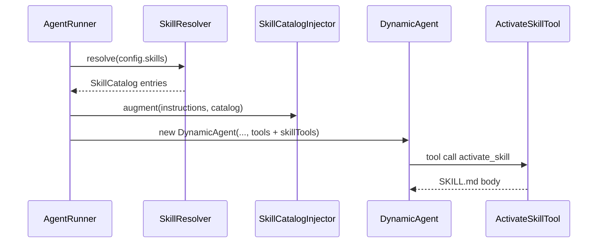

# Agent Skills — Design

## Data model

```
skill_definitions
  id, tenant_id, tenant_scope, slug, description, license, compatibility,
  metadata JSON, body LONGTEXT, resources JSON, timestamps
  UNIQUE (tenant_scope, slug)

agent_definitions.skills JSON  -- [{ "ref": "skill:db:1" }, ...]
```

## Runtime flow



## Canvas

- Node type `skill` with `data.skill_ref`.
- Edge: skill --default--> agent:skills (violet handle).
- `GraphContext::skillBindingsFor()` mirrors `toolBindingsFor()`.

## Codegen

- Export writes `skills/{slug}/SKILL.md` + `references/*` next to agent PHP.
- Stub registers skill tools + catalog injector inline.

## Key files

| Area | Path |
|------|------|
| Model | `src/Models/SkillDefinition.php` |
| Runtime | `src/Runtime/Skills/*` |
| CRUD | `src/Http/Livewire/Skills/*` |
| Canvas | `resources/js/studio-canvas/*` |
