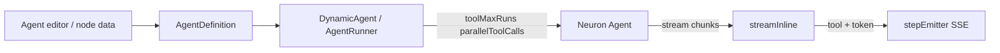

# Agent Tool Controls Design

**Spec**: [spec.md](./spec.md)  
**Context**: [m6-runtime-agent/context.md](../m6-runtime-agent/context.md)  
**Status**: Approved

---

## Architecture Overview



---

## Discretion locked

| Topic | Decision |
| ----- | -------- |
| Persistence | Columns `tool_max_runs` (nullable int), `parallel_tool_calls` (nullable bool) on `agent_definitions` |
| Node override | `data.tool_max_runs`, `data.parallel_tool_calls` on agent node |
| Resolution | node override → agent definition → Neuron default |
| Live SSE | In `streamInline`, map tool-related chunks to `tool_call`/`tool_result`; keep post-history emit with dedupe by `(name,id,content hash)` |
| Blocking path | After `chat()`, emit from history (unchanged) — live mid-block not required if Neuron does not yield |

---

## Components

### 1. Migration + model

- Add nullable columns; cast `parallel_tool_calls` bool, `tool_max_runs` int.
- Fillable on `AgentDefinition`.

### 2. `AgentRunner` / `DynamicAgent`

- After constructing agent, apply:
  ```php
  if ($max !== null) { $agent->toolMaxRuns($max); }
  if ($parallel !== null) { $agent->parallelToolCalls($parallel); }
  ```
- Resolve from definition + optional overrides passed from `AgentNodeExecutor`.

### 3. Live tool SSE

- Inspect Neuron stream chunk types (ToolCallChunk / ToolResultChunk or equivalent).
- Emit via `$state->emitStep` with same payload as `emitToolEvents`.
- Track emitted keys in a `SplObjectStorage`/array for dedupe when post-history runs.

### 4. UI

- Agent Livewire form: number input + checkbox.
- Canvas agent node inspector: optional override fields.
- Rebuild studio bundles if inspector is React.

### 5. Codegen

- `AgentNodeCodeGenerator` / agent class generator emit calls when non-null.

---

## Files

| File | Change |
| ---- | ------ |
| `database/migrations/*_add_tool_controls_to_agent_definitions.php` | new |
| `src/Models/AgentDefinition.php` | fillable/casts |
| `src/Runtime/AgentRunner.php` | apply knobs + live tool map |
| `src/Runtime/NodeExecutors/AgentNodeExecutor.php` | pass overrides; dedupe |
| `src/Http/Livewire/*Agent*` | form fields |
| `resources/js/**` agent inspector | overrides |
| `src/Codegen/**` | emit knobs |
| `tests/Runtime/AgentToolControlsTest.php` | new |

---

## Risks

- Chunk class names differ across Neuron versions — detect via interfaces/`instanceof` carefully.
- Parallel tool calls + tool approval interaction — keep approval middleware behavior unchanged.
