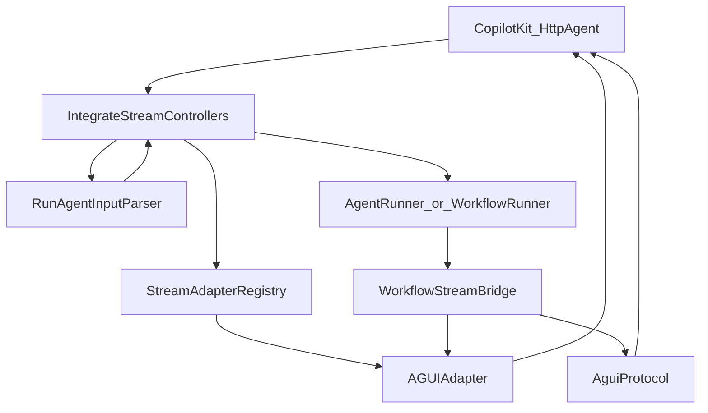

# AG-UI Native Protocol Design

**Spec**: `.specs/features/agui-native-protocol/spec.md`  
**Status**: Approved

---

## Architecture Overview

Integrate controllers stay the only HTTP surface. A parser normalizes AG-UI vs Studio bodies **only** for `protocol=agui`. `AGUIAdapter` still formats text/tool lifecycle. Studio emits snapshots, state deltas, CUSTOM, and interrupt `RUN_FINISHED` as extra SSE `data:` lines (same out-of-band pattern as M4 CUSTOM).



Vercel path: parser skipped; existing `{ message, thread_id uuid }` validation unchanged.

---

## Code Reuse Analysis

| Component | Location | How to use |
| --------- | -------- | ---------- |
| `AGUIAdapter` | neuron-ai | `start()`/`transform()`/`end()`; pass `$threadId` **and** `$runId` |
| `WorkflowStreamBridge` | `src/Integration/WorkflowStreamBridge.php` | Inject snapshots; STATE_DELTA on `step_completed`; interrupt end |
| `ChatThreadLoader` | `src/Services/ChatThreadLoader.php` | History for `MESSAGES_SNAPSHOT`; add stable `id` |
| `ValidatesChatAttachments` | integrate + playground | Playground untouched; integrate agui uses parser instead |
| `WorkflowRunner::resume` | `src/Runtime/WorkflowRunner.php` | Canonical `resume[]` and old URL both call this |
| CUSTOM awaiting_input | `WorkflowStreamBridge::awaitingSignal` | Keep; add interrupt `RUN_FINISHED` after |

---

## Components

### `RunAgentInputParser`

**Where:** `src/Integration/RunAgentInputParser.php`

**Detect RunAgentInput:** body has `messages` (array) or `threadId` or `runId` or `resume`.

**Normalize to runner payload:**

| Field | Source |
| ----- | ------ |
| `thread_id` | `threadId` ?? `thread_id` (string, max 191, not uuid-validated on agui) |
| `run_id` | `runId` ?? generated uuid |
| `message` | last user in `messages[]` ?? `message` |
| `state` | object `state` if associative array; else `{}`. Do **not** treat AG-UI `context[]` items as workflow state |
| `resume` | `resume` array if present |
| `attachments` | existing Studio attachments if present |

User content: string, or join `content[].text` / `content[].content` for part arrays.

`resume` present → `requireContent` false. `status: cancelled` → 422.

### `AguiProtocol`

**Where:** `src/Integration/AguiProtocol.php`

Formats SSE lines (`data: {json}\n\n`):

- `messagesSnapshot(array $messages)`
- `stateSnapshot(array $state)`
- `stateDelta(array $ops)`
- `runFinishedInterrupt(string $threadId, string $runId, array $interrupts)`

Does not replace `AGUIAdapter` for text/tools.

### `JsonPatch` + `ClientFacingState`

**Where:** `src/Integration/JsonPatch.php`, `src/Integration/ClientFacingState.php`

- `ClientFacingState::of(array $state): array` — drop keys whose name starts with `__`.
- `JsonPatch::diff(array $from, array $to): list<array>` — RFC 6902 `add`/`replace`/`remove` on nested arrays/objects. Empty → `[]`.

### `StreamAdapterRegistry::resolve`

Signature: `resolve(string $protocol, ?string $threadId = null, ?string $runId = null)`.

`agui` → `new AGUIAdapter($threadId, $runId)`.

### Agent controller

1. Parse via `RunAgentInputParser` when protocol is `agui`.
2. Resolve adapter with thread + run ids.
3. `streamHandler` + `events($adapter)`.
4. After the first chunk containing `RUN_STARTED`, emit `MESSAGES_SNAPSHOT` + `STATE_SNAPSHOT` `{}`.

### Workflow controller

1. Parse (agui) or existing validation (vercel).
2. If `resume` non-empty: load `StudioRun` by `interruptId`, assert workflow ownership + awaiting status, `WorkflowStreamBridge` + `WorkflowRunner::resume`.
3. Else: existing `run()` path with mapped `message`/`state`/`thread_id`.
4. Pass `run_id` into registry.

### WorkflowStreamBridge

Constructor gains optional snapshot context: messages loader callback, initial client state, thread/run ids (from adapter or explicit).

`run()`:

1. `adapter->start()`
2. `MESSAGES_SNAPSHOT` + `STATE_SNAPSHOT` (agui only)
3. Convert events; on `step_completed` if `state` in payload → patch vs last client state → `STATE_DELTA`
4. On pause: prompt text as today; `MESSAGES_SNAPSHOT`; `STATE_SNAPSHOT`; CUSTOM; **do not** call vanilla `end()`; emit interrupt `RUN_FINISHED`
5. On success: `adapter->end()` as today

### State on `step_completed`

`BuilderWorkflowState::emitStep` and `StudioTraceMiddleware::after` include `'state' => $state->all()` on `step_completed` so the bridge can diff without extra runner changes.

### Resume URL (M4)

`WorkflowIntegrateResumeController` resolves adapter with **public** thread id (`ChatThreadKey::publicId`) and a generated (or body) `runId` — stop passing `$runModel->id` as threadId.

---

## Event order (workflow HITL)

```
RUN_STARTED
MESSAGES_SNAPSHOT
STATE_SNAPSHOT
TEXT_MESSAGE_* (human prompt if any)
STATE_DELTA* (optional, per completed step)
MESSAGES_SNAPSHOT
STATE_SNAPSHOT
CUSTOM awaiting_input
RUN_FINISHED outcome.interrupt
```

---

## Testing

- Unit: `RunAgentInputParser`, `JsonPatch`, `ClientFacingState`.
- Integration: existing vercel/agui tests + RunAgentInput echo IDs, fallback `{ message }`, snapshots, interrupt outcome, `resume[]` on stream, old resume URL, playground untouched (no new playground tests if existing suite still passes).
