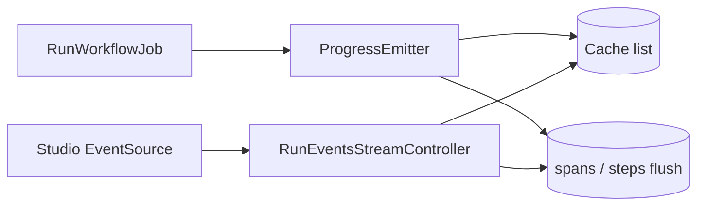

# Async Run Progress Design

**Spec**: [spec.md](./spec.md)  
**Context**: [m6-runtime-agent/context.md](../m6-runtime-agent/context.md)  
**Status**: Approved

---

## Architecture Overview

---

## Discretion locked

| Topic | Decision |
| ----- | -------- |
| Store | `Cache::store()` default; key `neuronai-studio:run-progress:{runId}` → list of JSON events |
| Seq | Monotonic int starting at 1 |
| SSE route | `GET studio/workflows/runs/{run}/events/stream` under Studio middleware |
| Terminal | Append `run_terminal` with status; SSE exits after sending |
| Disable | `async_progress.enabled=false` → jobs keep `emitter: null` |
| TTL | Default 3600s |
| Poll interval in SSE | `async_progress.poll_ms` default 200 |

---

## Components

### 1. `ProgressBuffer`

- `append(string $runId, string $event, array $data): int` → seq
- `readAfter(string $runId, int $afterSeq): array`
- `clear(string $runId): void`

### 2. `ProgressEmitter`

- Callable-compatible: `__invoke(string $event, array $data)`
- Also implements optional flush hook every N events / on step_completed

### 3. Job wiring

- `RunWorkflowJob` / `ResumeWorkflowJob`: if enabled, create emitter and pass to runner.

### 4. `RunEventsStreamController`

- StreamedResponse SSE loop: readAfter, sleep poll_ms, check run status.

### 5. Incremental flush

- On `step_completed` / `branch_completed`, persist pending node span if runner supports mid-run write; else append to run metadata `__steps` JSON column if present.

---

## Files

| File | Change |
| ---- | ------ |
| `config/neuronai-studio.php` | `async_progress` |
| `src/Runtime/Progress/ProgressBuffer.php` | new |
| `src/Runtime/Progress/ProgressEmitter.php` | new |
| `src/Jobs/RunWorkflowJob.php` | wire emitter |
| `src/Jobs/ResumeWorkflowJob.php` | wire emitter |
| `src/Http/Controllers/RunEventsStreamController.php` | new |
| `routes/web.php` or studio routes | register |
| `tests/Runtime/AsyncRunProgressTest.php` | new |

---

## Risks

- Cache list size for token-heavy streams — consider truncating token payloads in buffer or sampling; MVP stores as-is with TTL.
- Multi-server SSE requires shared cache (Redis); document.
