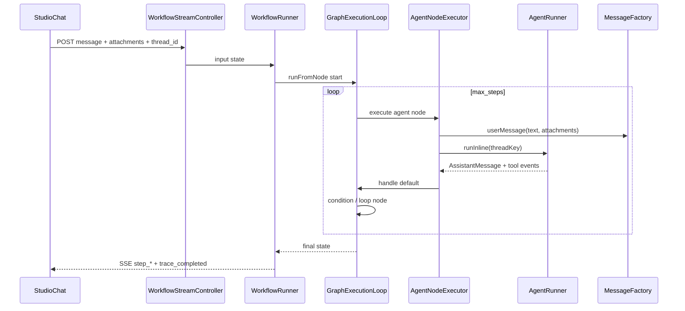

# Agentes Multimodais Autônomos — Design

## Visão de arquitetura



## Componentes backend (PHP)

| Componente | Caminho | Mudança |
|------------|---------|---------|
| `WorkflowRunner::buildInitialState` | `src/Runtime/WorkflowRunner.php` | Injetar `attachments`, `__studio_thread_id` do payload |
| `AgentNodeExecutor` | `src/Runtime/NodeExecutors/AgentNodeExecutor.php` | Thread por nó opcional; emitir tool events no state |
| `LlmNodeExecutor` | `src/Runtime/NodeExecutors/LlmNodeExecutor.php` | Paridade attachments via `MessageFactory` |
| `MessageFactory` | `src/Runtime/MessageFactory.php` | Sem mudança estrutural; reuso |
| `AgentRunner` | `src/Runtime/AgentRunner.php` | `runInline` com memory + tools; expor tool events para workflow emitter |
| `BuilderWorkflowState` | `src/Runtime/BuilderWorkflowState.php` | `emitToolCall`, `emitAssistantDelta` hooks |
| `ValidatesChatAttachments` | `src/Http/Controllers/Concerns/ValidatesChatAttachments.php` | Já usado por `WorkflowStreamController` |

### Propagação de estado

```php
// buildInitialState (extensão)
$state->set('attachments', $input['attachments'] ?? []);
$state->set('__studio_thread_id', ChatThreadKey::forWorkflow($traceId, $input['thread_id']));
// Opcional por agent node:
$state->set('__agent_threads', []); // nodeId => threadKey
```

### Autonomia do agent

- `AgentRunner::runInline` já resolve tools via `ToolResolver` + `McpToolResolver`.
- Para autonomia **multi-turn dentro de um nó**: fora de escopo inicial — cada visita ao nó agent é uma chamada `chat()`. Multi-turn **entre iterações do loop** é o padrão alvo via thread compartilhada.
- `memory_config` do `AgentDefinition` aplicado em `DynamicAgent` (existente).

## Componentes frontend

| Componente | Caminho |
|------------|---------|
| `WorkflowSessionAdapter` | `resources/js/studio-chat/adapters/WorkflowSessionAdapter.js` — mapear `step_*` + tool events |
| `StudioChat.jsx` | Bolhas tool/workflow durante run |
| Template seed | `resources/js/studio-canvas/templates/autonomous-lead-qualification.json` |

## Migrações de banco

Opcional: `workflow_traces.thread_id` (UUID) para consulta; hoje pode viver em `input` JSON do trace.

## API / eventos SSE

| Evento | Payload |
|--------|---------|
| `thread` | `{ thread_id }` — existente |
| `step_started` / `step_completed` | + `attachments_count` |
| `tool_call` | `{ node_id, tool, input, output }` — novo, espelha agent stream |
| `assistant_message` | `{ node_id, content }` — consolidado após step agent |

Endpoints: `POST /workflows/{id}/run/stream`, `POST /workflows/runs/{run}/resume/stream`, `POST /studio/attachments`.

## Impacto em codegen

- `AgentNodeCodeGenerator` — incluir comentário/thread key quando exportado em workflow com loop.
- Template registrado em `neuronai-studio.php` templates.
- Sem mudança em `NativeWorkflowExporter` além do template e metadados `attachments` no state inicial exportado.

## Integração NeuronAI

- **neuron-agent-builder**: `Agent::chat()` com `UserMessage` multimodal; tools via middleware; memory para thread persistence.
- **neuron-workflow-architect**: loop + agent nodes como composição event-driven; autonomia = múltiplas passagens pelo agent com state compartilhado.
- **MessageFactory** alinha com content blocks `ImageContent`, `AudioContent`, `VideoContent`, `FileContent`.

## Plano de documentação

| Arquivo | Outline |
|---------|---------|
| `guides/workflows/overview.md` | `## Agentes autônomos` → `### Multimodal` → `### Ciclos` |
| `guides/workflows/node-types/ai-nodes.md` | `## Agent em workflow` — attachments, thread, tools |
| `guides/agents/attachments.md` | `## Workflows` — mesmo pipeline de upload |
| `guides/agents/playground-and-threads.md` | `## Thread em workflows` |
| `guides/workflows/runtime-and-traces.md` | `## Tool events no harness` |
| `guides/templates.md` | `## Autonomous Lead Qualification` |
| `getting-started/quickstart-first-workflow.md` | Passo a passo com anexo |

## Dependências

| Feature | Tipo |
|---------|------|
| `workflow-cyclic-graphs` | **Obrigatória** — padrão de loop |
| `studio-test-harness` | **Existente** — chat + attachments |
| `workflow-rag` | Opcional — enriquecer contexto antes do agent |
| `workflow-token-streaming` | Opcional — UX em tempo real |
| `workflow-tool-approval` | Opcional — HITL em tools dentro do loop |
