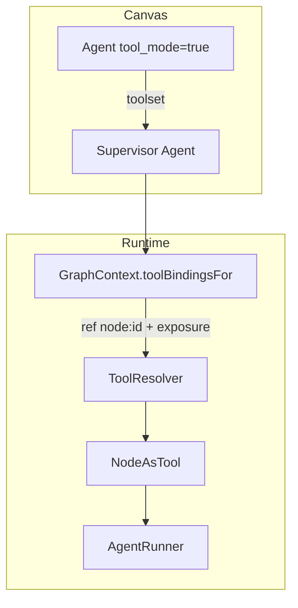
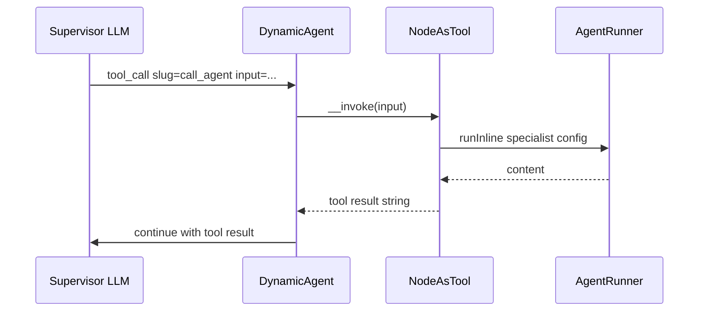

# Canvas Tool Mode — Design

**Spec**: [spec.md](./spec.md)  
**Context**: [context.md](./context.md)  
**Status**: Draft

---

## Architecture Overview

Tool Mode flips a `toolable` node from a **control-flow step** into a **tool binding source**. Runtime reuses the existing agent←tools binding path, extended to accept `toolset` sources and resolve them to Neuron `Tool` instances.





---

## Code Reuse Analysis

| Component | Location | How to use |
| --------- | -------- | ---------- |
| Tools binding edges | `GraphContext::toolBindingsFor`, `isToolBindingEdge` | Extend source types + handle `toolset`; keep excluded from control-flow |
| Agent `config_mode` handle gating | `WorkflowNode.jsx`, `nodeUtils.js` | Same pattern for `tool_mode` UI/handles |
| `ToolResolver` | `src/Runtime/ToolResolver.php` | New ref prefix `node:` |
| Nested metering | `AgentNodeExecutor` / `AgentRunner` parent_run_id | Reuse for specialist visit |
| `Tool` base | `NeuronAI\Tools\Tool` | `NodeAsTool` extends / fluent builder |
| GraphValidator tool edges | `validateToolBindingEdges` | Allow agent+tool_mode sources |

---

## Meta & data model

### Node type meta (`config/neuronai-studio.php` + `registerNode`)

```php
'agent' => [
    'label' => 'Agent',
    'icon' => 'bot',
    'category' => 'ai',
    'toolable' => true,
    'tool_exposure' => [
        'slug_prefix' => 'call_agent',
        'default_description' => 'Delegate a task to this specialized agent.',
    ],
],
```

`NodeTypeRegistry::forCanvas()` MUST surface `toolable` + `tool_exposure` defaults to the frontend.

### Node `data` (Agent)

```json
{
  "tool_mode": false,
  "tool_exposure": {
    "slug": "call_agent",
    "description": "…",
    "parameters": {
      "input": { "controlled_by": "caller", "description": "Task for the specialist" }
    }
  }
}
```

When `tool_mode: true`, ignore `message` for control-flow (field hidden). Specialist still uses its provider/model/instructions/`agent_id` as today.

---

## Components

### Frontend

| Piece | Responsibility |
| ----- | -------------- |
| Tool Mode toggle | Chrome or inspector; writes `data.tool_mode` |
| `NodeHandles` | Step: `default` in/out (+ `tools` in). Tool Mode: **no** `default` out/in for CF; source **`toolset`**; optional keep visual Tools in if specialist also has tools (v1: keep tools target for inline specialists) |
| Actions button + modal | Edit `tool_exposure` (slug, description, param labels) |
| `isValidConnection` | `toolset` → Agent `tools` only; reject CF edges to/from tool-mode nodes |
| Strip on toggle | Enter Tool Mode → remove CF edges; leave Tool Mode → remove toolset edges |

**Supervisor tools handle (D8):** Show cyan `tools` target for Agent in **both** `inline` and `existing` modes. Existing mode: definition tools + canvas bindings merge at runtime.

### Backend

| Piece | Responsibility |
| ----- | -------------- |
| `GraphValidator` | Validate tool_mode nodes; unique slug per supervisor; toolset edge rules; exclude from CF |
| `GraphContext::toolBindingsFor` | Also collect edges with `sourceHandle === 'toolset'` → `{ ref: "node:{id}", exposure }` |
| `ToolResolver` | Resolve `node:` → `NodeAsTool` |
| `NodeAsTool` / `AgentAsTool` | Neuron Tool; `__invoke(string $input): string` runs specialist |
| `AgentNodeExecutor` | If somehow visited in CF with tool_mode → no-op error (should not happen if validator solid) |
| Codegen | Bake tools into supervisor; omit tool-mode agents from linear nodes list |

### `NodeAsTool` interface (sketch)

```php
final class NodeAsTool extends Tool
{
    public function __construct(
        string $slug,
        string $description,
        protected array $agentConfig, // provider/model/instructions/tools or agent_id resolution
        protected ?int $parentRunId = null,
    ) {
        parent::__construct(name: $slug, description: $description);
    }

    protected function properties(): array { /* input string required */ }

    public function __invoke(string $input): string
    {
        // AgentRunner::runInline(...); return content
    }
}
```

---

## Edge classification

| Edge | Control-flow? | Purpose |
| ---- | ------------- | ------- |
| `* → tools` from tool/mcp | No | Existing toolkit bindings |
| `toolset → tools` from tool-mode agent | No | NodeAsTool bindings |
| `default → default` | Yes | Step orchestration |

Update `graph.js` `isToolBindingEdge` to treat `sourceHandle === 'toolset'` OR `targetHandle === 'tools'` as binding (confirm current helper; extend as needed).

---

## Codegen

1. Transpiler skips nodes with `tool_mode: true` as workflow Nodes.
2. For each supervisor, collect toolset sources → emit tool construction in agent bootstrap (or inject into `tools` array in `runInline` config).
3. Prefer generating a small private class or inline `Tool::make(...)->setCallable` that calls `AgentRunner` with specialist snapshot config (avoid fragile canvas id at runtime in exported PHP — **snapshot** provider/instructions/tools into the generated tool at export time).

**Export decision (locked):** Codegen **snapshots** specialist config into the generated Tool (portable PHP). Interpreted runtime keeps `node:{id}` live resolution against the graph.

---

## Testing

| Layer | Cases |
| ----- | ----- |
| Unit | `ToolResolver` `node:` → NodeAsTool; slug validation; GraphContext collects toolset |
| Unit | GraphValidator: unique slug, reject CF on tool_mode, allow toolset→tools |
| Feature | Interpreted run: supervisor tool-call invokes specialist (Fake provider) |
| Feature | Nested parent_run_id on specialist |
| Codegen | Export omits specialist Node; supervisor contains tool |

Gate: existing PHPUnit suite patterns under `tests/`.

---

## Docs plan

| File | Change |
| ---- | ------ |
| `guides/workflows/node-types/ai-nodes.md` | Tool Mode section |
| `guides/workflows/canvas-editor.md` | Toolset wiring |
| `docs/extending/custom-node-types.md` | `toolable` meta |
| `guides/templates.md` | New template entry |

---

## Dependencies

- M9 canvas tool bindings (tools pin) — **done**
- AgentNodeExecutor / AgentRunner / nested metering — **done**
- Neuron `Tool` — vendor

---

## Open implementation notes (non-blocking)

- Actions modal: Livewire vs pure React portal — prefer React in canvas chrome (parity with other canvas modals if any; else new `ToolExposureModal.jsx`).
- Whether inline Tool Mode specialists may still bind tool/mcp on their own `tools` pin: **yes** (nested agent tools).
