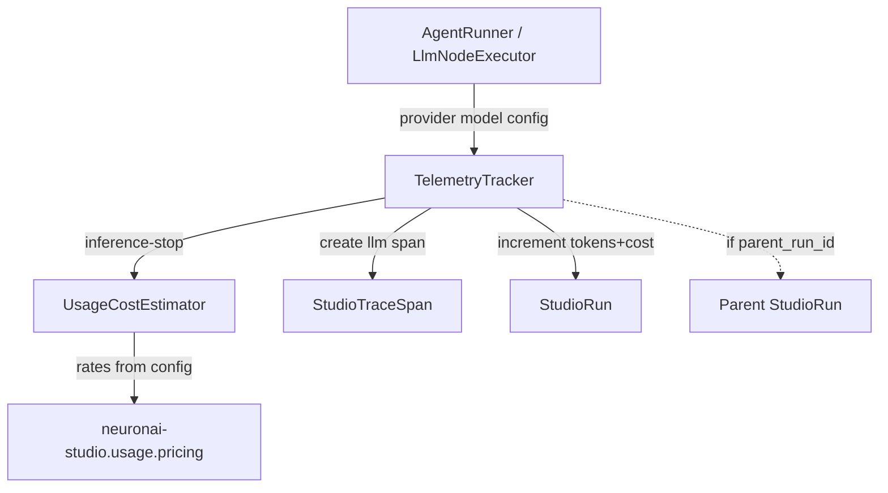

# Cost Estimation Design

**Spec**: [.specs/features/cost-estimation/spec.md](./spec.md)  
**Context**: [.specs/features/m5-analytics-billing/context.md](../m5-analytics-billing/context.md)  
**Status**: Approved  
**Blocks**: `usage-export-api`, `usage-analytics`

---

## Architecture Overview

Metering stays on the unified runs/traces model. At each LLM completion we (1) attribute `provider`/`model`, (2) compute **estimated** cost from config pricing, (3) persist cost on the span and increment the run. Nested agent/LLM work inside a workflow also rolls tokens/cost up to the parent workflow run so Debugger and per-run export stay meaningful.



---

## Discretion locked

| Topic | Decision |
| ----- | -------- |
| Cost storage | Denormalize `estimated_cost` (`decimal(12,6)`) on **span** and **run** at write time |
| Currency | Single install currency: `usage.currency` default `USD` |
| Pricing key | Exact match `provider` → `model` in config; missing → cost `0` |
| Nested workflow usage | `parent_run_id` on child runs; tracker increments parent tokens/cost too |
| Run-level model | No primary model column on run (span-level only) |
| Malformed rates | Coerce to `0` (no exception on hot path) |

---

## Code Reuse Analysis

| Component | Location | How to Use |
| --------- | -------- | ---------- |
| `TelemetryTracker` | `src/Runtime/TelemetryTracker.php` | Extend ctor + inference-stop persist path |
| `AgentRunner` | `src/Runtime/AgentRunner.php` | Pass provider/model (+ parent run) into tracker; wire missing stream paths |
| `WorkflowRunner` | `src/Runtime/WorkflowRunner.php` | Already sets `__studio_run_id` / `__studio_thread_id` in state |
| `LlmNodeExecutor` | `src/Runtime/NodeExecutors/LlmNodeExecutor.php` | Today bypasses metering on chat/stream — route through recorder |
| Config publish | `config/neuronai-studio.php` | Add `usage` tree |
| Stream adapter gate | `NeuronAIStudioServiceProvider::registerRoutes` | Pattern reused by export (UE), not CE |

---

## Gap: where meters today

| Path | Metered? | CE change |
| ---- | -------- | --------- |
| `AgentRunner::runInline` / `streamInline` / resume / `structuredInline` | Yes (tracker) | Pass provider/model; optional parent run |
| `AgentRunner::stream` / `streamHandler` (playground + integrate) | **No** | Attach tracker like inline paths |
| `AgentNodeExecutor` | Yes via inline | Pass `__studio_run_id` as parent |
| `LlmNodeExecutor` chat/stream direct provider | **No** | Record into parent run/trace via shared recorder; structured already uses `structuredInline` — pass thread + parent |
| Workflow-level `TelemetryTracker(trackNodes:false)` | Rarely sees LLM spans (nested runs own them) | Relies on parent rollup |

---

## Components

### 1. `UsageCostEstimator`

- **Purpose**: Pure cost math from config (no I/O).
- **Location**: `src/Usage/UsageCostEstimator.php`
- **Interfaces**:
  - `currency(): string`
  - `estimate(?string $provider, ?string $model, int $promptTokens, int $completionTokens): string` — decimal string with scale 6; `0` if unpriced/invalid
  - `rate(?string $provider, ?string $model): ?array{prompt_per_1k: float, completion_per_1k: float}`
- **Formula**: `(prompt/1000)*prompt_per_1k + (completion/1000)*completion_per_1k`
- **Dependencies**: `config('neuronai-studio.usage')`

### 2. `TelemetryTracker` (extended)

- **Purpose**: Persist LLM spans with attribution + cost; roll up to run(s).
- **Ctor** (new args, defaults null/false kept BC-friendly):

```php
public function __construct(
    StudioRun $run,
    StudioTrace $trace,
    bool $trackNodes = true,
    ?string $provider = null,
    ?string $model = null,
    ?StudioRun $parentRun = null,
)
```

- **On `inference-stop`**:
  1. Read usage tokens (existing).
  2. Resolve provider/model from ctor (nullable).
  3. `estimated_cost = estimator->estimate(...)`.
  4. Create span with tokens + provider + model + estimated_cost.
  5. Increment child run: tokens + `estimated_cost`.
  6. If `parentRun` set: same increments on parent (no duplicate span on parent trace in v1 — parent totals only).

### 3. `UsageRecorder` (thin helper, optional name)

- **Purpose**: Allow `LlmNodeExecutor` (and non-observe paths) to write one LLM span onto an existing run/trace without constructing a full Observer.
- **Location**: `src/Usage/UsageRecorder.php`
- **Interface**: `recordLlmSpan(StudioRun $run, StudioTrace $trace, string $provider, string $model, int $prompt, int $completion, ?StudioRun $parentRun = null): StudioTraceSpan`
- **Reuse**: Same persist/increment logic as tracker (extract private shared method or call recorder from tracker).

### 4. Config: `usage` tree

```php
'usage' => [
    'currency' => env('NEURONAI_STUDIO_USAGE_CURRENCY', 'USD'),
    'pricing' => [
        'openai' => [
            'gpt-4o-mini' => ['prompt_per_1k' => 0.15, 'completion_per_1k' => 0.60],
            'gpt-4o' => ['prompt_per_1k' => 2.50, 'completion_per_1k' => 10.00],
            // … catalog models, approximate public list prices
        ],
        'anthropic' => [ /* … */ ],
        'gemini' => [ /* … */ ],
        'ollama' => [
            // local — default 0
            'llama3.2' => ['prompt_per_1k' => 0, 'completion_per_1k' => 0],
        ],
    ],
    // export/events keys owned by usage-export-api design but live in same tree
],
```

Defaults are **estimates**; docs must say so. Host overrides via published config.

---

## Data Models

### Migration (new)

`database/migrations/2024_01_01_000018_add_usage_cost_columns_to_runs_and_spans.php` (timestamp at implement time).

**`trace_spans`**

| Column | Type | Notes |
| ------ | ---- | ----- |
| `provider` | `string` nullable | |
| `model` | `string` nullable | index `(provider, model)` optional |
| `estimated_cost` | `decimal(12,6)` default `0` | |

**`runs`**

| Column | Type | Notes |
| ------ | ---- | ----- |
| `estimated_cost` | `decimal(12,6)` default `0` | Sum of LLM span costs (+ parent rollup increments) |
| `parent_run_id` | `uuid` nullable, FK → runs, nullOnDelete | Nested inline under workflow |

### Models

- Update `StudioTraceSpan` / `StudioRun` fillable + casts (`estimated_cost` → `decimal:6`).
- `StudioRun::parent()` / `children()` relations.

### Indexes (recommended)

- `runs(started_at)` if missing — for Dashboard/export windows.
- `runs(parent_run_id)`.

---

## AgentRunner / executor wiring

1. **All tracker construction sites**: pass `$config['provider']`, `$config['model']`.
2. **`runInline` / `streamInline` / `structuredInline` / resume**: accept optional `?StudioRun $parentRun = null` **or** resolve from a new optional `$context['parent_run_id']`. Prefer explicit param from executors reading `$state->get('__studio_run_id')`.
3. **`stream` / `streamHandler`**: create execution session + observe tracker (parity with inline) so playground/integrate meter.
4. **`AgentNodeExecutor`**: pass parent run id from state into AgentRunner.
5. **`LlmNodeExecutor`**:
   - Structured: pass `threadKey` + parent run into `structuredInline`.
   - Chat/stream: after provider call, load parent run/trace from `__studio_run_id` / `__studio_trace_id` and `UsageRecorder::recordLlmSpan` using `$response->getUsage()` (0 if null). If parent ids missing, skip quietly (or create orphan — prefer skip + log).

---

## Error Handling

- Never fail the agent/workflow because pricing/config is wrong.
- Null usage → 0 tokens / 0 cost.
- Missing parent run uuid → no rollup.
- Duplicate finalize SUM on WorkflowRunner: keep current token SUM overwrite for **that** run’s own spans; parent rollup uses increments from children — WorkflowRunner finalize must **not** zero out rolled-up tokens that live only on parent without local LLM spans. **Rule:** finalize SUM should be `max(sum(own spans), current run totals)` **or** only SUM own spans into token columns while **preserving** `estimated_cost`/tokens already rolled from children. Cleaner: finalize sets tokens/cost from `own_spans_sum + children_runs_sum` when `children()` exist; else own spans only.

**Finalize algorithm (WorkflowRunner / AgentRunner terminal):**

```
own = aggregate(spans of this run)
children = aggregate(child runs where parent_run_id = this)
run.tokens = own.tokens + children.tokens
run.estimated_cost = own.cost + children.cost
```

Prefer this on complete/fail instead of increment-only drift.

---

## Testing Strategy

| Area | Approach |
| ---- | -------- |
| `UsageCostEstimator` | Unit: priced, unpriced, zero tokens, bad rates |
| Tracker / recorder | Feature: inference creates span with provider/model/cost; parent incremented |
| `LlmNodeExecutor` | Feature: chat path writes span on parent workflow run |
| Nested agent node | Feature: child run + parent totals after workflow |
| Config override | Feature: custom price reflected in cost |

---

## Requirement mapping

| ID | Design coverage |
| -- | --------------- |
| CE-01 | Tracker + migration provider/model |
| CE-02 | `usage.pricing` + estimator |
| CE-03 | Span/run `estimated_cost` + finalize aggregate |
| CE-04 | Seed defaults for catalog models |

---

## Documentation

- `docs/guides/analytics/costs.md` (new, CE-04 caveat)
- `docs/reference/configuration.md` — `usage` section
- `docs/reference/database-schema.md` — replace legacy `workflow_*` with threads/runs/traces/spans + new columns
