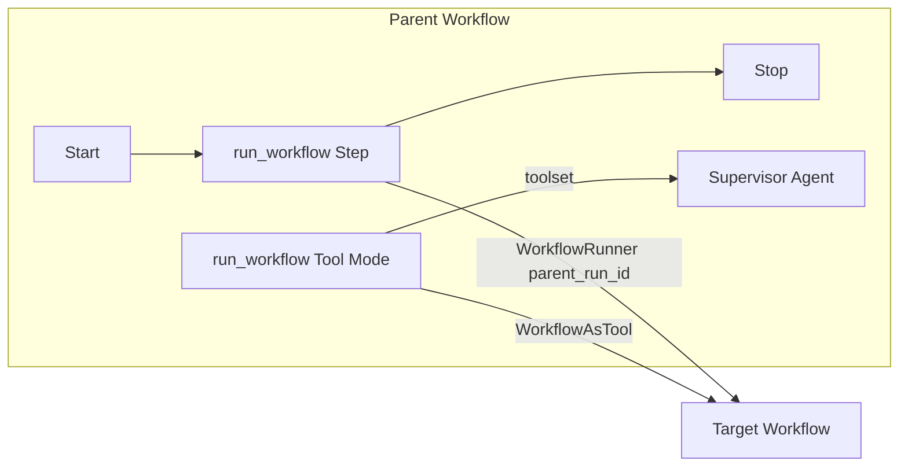
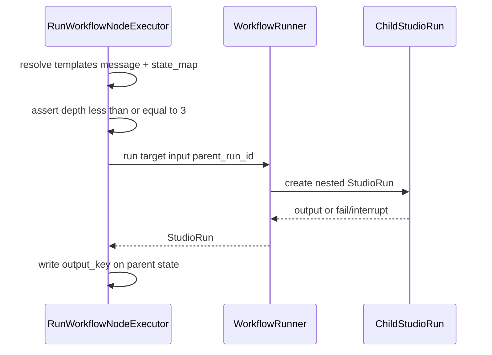

# Execute Workflow — Design

**Spec**: [spec.md](./spec.md)  
**Context**: [context.md](./context.md)  
**Status**: Ready for tasks

---

## Architecture Overview

`run_workflow` is a first-class Studio node. In **Step Mode** it is a control-flow visit that calls `WorkflowRunner` on a target definition. In **Tool Mode** it becomes a `toolset` binding resolved to a Neuron `Tool` (`WorkflowAsTool`) that runs the same target under the supervisor’s tool loop.





---

## Code Reuse Analysis

| Component | Location | How to use |
| --------- | -------- | ---------- |
| Toolable meta + Tool Mode UI | `canvas-tool-mode` (Agent) | Same `tool_mode`, Actions modal, `toolset` handle for `run_workflow` |
| Agent Combobox pattern | `NodeConfigForm.jsx` + `combobox.jsx` | Duplicate for workflows list from Editor |
| Editor canvas payload | `Http/Livewire/Workflows/Editor.php` | Add `workflowsForCanvas` (id, name, slug) like agents |
| `WorkflowRunner::run` | `src/Runtime/WorkflowRunner.php` | Child execution; extend create path for `parent_run_id` |
| Nested metering | `StudioRun.parent_run_id`, AgentRunner | Set on child workflow run |
| `GraphContext::toolBindingsFor` | `GraphContext.php` | Include `run_workflow` + `tool_mode` sources on `toolset` |
| `ToolResolver` / `NodeAsTool` | `src/Runtime/` | Add `WorkflowAsTool` branch for `run_workflow` node type |
| Template resolution | existing agent/set_state template helpers | Resolve `message` and each `state_map.value` |
| GraphValidator tool rules | `GraphValidator.php` | Extend self-ref + workflow exists + reuse slug uniqueness |
| i18n registry labels | M12 `NodeTypeRegistry::forCanvas` | EN + pt_BR for type label |

---

## Meta & data model

### Node type meta (`config/neuronai-studio.php`)

```php
'run_workflow' => [
    'label' => 'Run Workflow', // i18n override: Executar Workflow
    'icon' => 'workflow', // or 'git-branch' / existing icon set
    'category' => 'logic',
    'toolable' => true,
    'tool_exposure' => [
        'slug_prefix' => 'run_workflow',
        'default_description' => 'Execute another workflow in this project.',
    ],
],
```

Register executor class in `NeuronAIStudioServiceProvider` alongside other built-ins.

### Node `data` shape

```json
{
  "workflow_id": "123",
  "message": "{{input}}",
  "state_map": [
    { "key": "lead_id", "value": "{{lead_id}}" }
  ],
  "output_key": "child_output",
  "tool_mode": false,
  "tool_exposure": {
    "slug": "run_pricing_flow",
    "description": "Run the pricing workflow.",
    "parameters": {
      "input": {
        "controlled_by": "caller",
        "description": "Message / task for the child workflow"
      }
    }
  }
}
```

Empty `state_map` keys are invalid at validate. Values support `{{stateKey}}` templates.

---

## Components

### Frontend

| Piece | Responsibility |
| ----- | -------------- |
| Palette entry | From registry meta |
| `NodeConfigForm` branch | Combobox workflows; Message textarea; State map rows (add/remove); `output_key`; Tool Mode toggle when `toolable` |
| `WorkflowNode` / handles | Step: `default` in/out. Tool Mode: `toolset` source; strip CF edges on toggle (same as Agent) |
| Actions / `ToolExposureModal` | Reuse existing modal for slug/description |
| Editor `workflowsForCanvas` | Query Studio workflows; exclude current definition id |

### Backend

| Piece | Responsibility |
| ----- | -------------- |
| `RunWorkflowNodeExecutor` | Step Mode: resolve target, depth check, build input, `WorkflowRunner::run`, write `output_key`, return `default` |
| `WorkflowAsTool` | Tool Mode: Neuron `Tool`; merge caller input + node defaults; run child; return string |
| `WorkflowRunner` | Accept/set `parent_run_id` when creating nested runs (may need optional arg or input key `__parent_run_id`) |
| Nesting depth | Stamp `__workflow_nesting_depth` on child input (parent depth + 1); reject when starting depth would be > 3. Parent top-level = 0 |
| `GraphValidator` | Require `workflow_id`; exists; ≠ current workflow id; Tool Mode rules; unique slug per supervisor |
| Codegen (P2) | Emit nested run helper / tool binding per export conventions |

### Nesting depth algorithm

1. Top-level workflow run: depth `0` (no stamp or stamp `0`).
2. Before starting a child: `next = currentDepth + 1`; if `next > 3` → fail.
3. Pass `__workflow_nesting_depth = next` into child input (internal key; not authored in UI).
4. Tool Mode uses the same counter from the enclosing workflow run.

### HITL / interrupt (D7)

If child `StudioRun` ends interrupted / waiting human / non-terminal success: executor and `WorkflowAsTool` throw/return error string describing that nested HITL is unsupported in v1.

### Child output mapping

- Prefer child run `output` field if string.
- If array/object → `json_encode`.
- Write to parent state `output_key` (Step) or return as tool result (Tool Mode).

---

## Data Flow

### Step Mode

1. Visit `run_workflow` node.
2. Resolve templates from parent `WorkflowState`.
3. Depth guard → `WorkflowRunner::run($target, $input, …)` with `parent_run_id`.
4. On success → `state->set(output_key, serializedOutput)`.
5. Next handle `default`.

### Tool Mode

1. Supervisor resolves bindings → `WorkflowAsTool` for `node:{id}`.
2. On invoke(input): message = non-empty caller input ?? node message (resolved); state from node `state_map` (resolve against parent workflow state available on binding context).
3. Same runner + depth + HITL rules.
4. Return string to tool loop.

---

## Error Handling

| Case | Behavior |
|------|----------|
| Missing `workflow_id` | Validate error |
| Self-reference | Validate error |
| Target not found | Validate + runtime error |
| Depth > 3 | Runtime error (clear message) |
| Child failed | Fail parent step / tool error string |
| Child HITL | Fail with “nested human interrupt not supported” |
| Invalid tool slug | Validate error |

---

## Testing Strategy

| Layer | Focus |
|-------|--------|
| Unit | Executor builds input; depth guard; output serialization; self-ref validator cases |
| Unit/Feature | `WorkflowAsTool` invokes runner with `parent_run_id` |
| Feature | GraphValidator accept/reject graphs |
| Manual | Canvas combobox + Tool Mode wiring smoke |

---

## P2 notes

- Codegen: follow Agent Tool Mode snapshot vs live-ref decision already in product for tools.
- Docs: `guides/workflows/canvas-editor.md`, node-types guide, `extending/custom-node-types.md`.
- Template: minimal parent/child pair under Studio templates.
