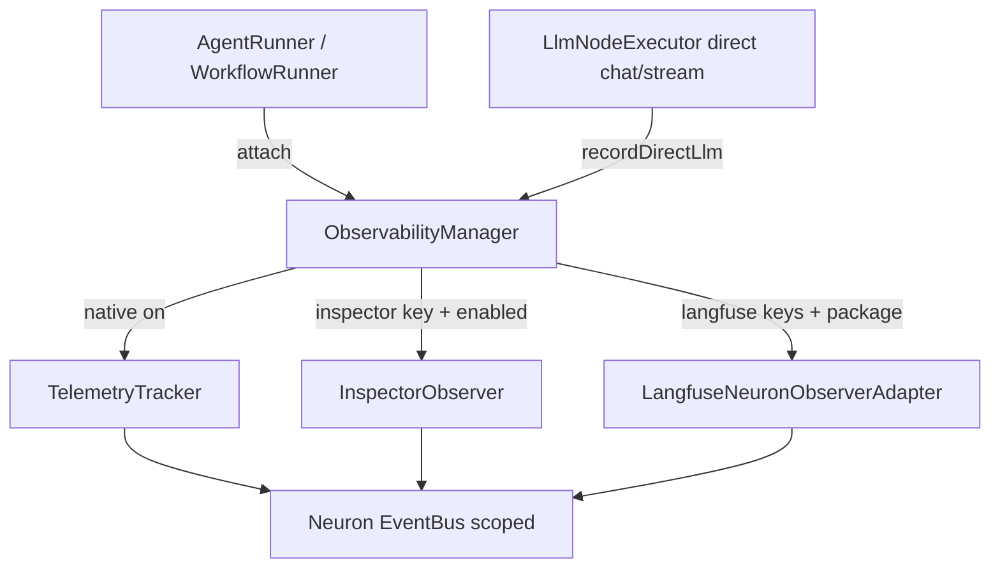

# External Observability Design

**Spec**: [spec.md](./spec.md)  
**Context**: [context.md](./context.md)  
**Status**: Approved  
**Linha**: `v0.8.x` (AD-020)

---

## Architecture Overview



Single attach point: runners call `ObservabilityManager::attach($target, $meta)` instead of `new TelemetryTracker` + scattered `observe` calls.

---

## Discretion locked (Design)

| Topic | Decision |
| ----- | -------- |
| Native off + no external | No observers attached; EventBus may still auto-attach Inspector on first emit if key set — Manager always attaches Inspector explicitly when our inspector toggle+key are active, and does **not** rely on EventBus default |
| Inspector default | `observability.inspector.enabled` defaults **true** (env-first: key present = on). `enabled=false` forces off even with key |
| Alias | Keep top-level `inspector_enabled` reading the same env; docs mark deprecated in favor of `observability.inspector.enabled` |
| Langfuse package | Optional `axyr/laravel-langfuse`. Manager uses `class_exists`; missing package → warn once + no-op |
| branchId adapter | `LangfuseNeuronObserverAdapter` implements full `ObserverInterface`; forwards to package observer, dropping `$branchId` if inner signature rejects it |
| LlmNodeExecutor (OBS-03.3) | After direct `chat`/`stream`, call `ObservabilityManager::recordDirectLlmGeneration(...)` (best-effort Langfuse generation via package facade if available) |
| Interpreted resume | No GraphInterpreterWorkflow instance — agent/LLM nodes still attach via AgentRunner. Native resume keeps `attach`. No forced EventBus scope on interpreted resume |
| Errors | Wrap each `observe` / flush in try/catch; log warning; never fail the run |

---

## Components

### 1. Config `neuronai-studio.observability`

```php
'observability' => [
    'native_tracing' => (bool) env('NEURONAI_STUDIO_NATIVE_TRACING', true),
    'inspector' => [
        'enabled' => (bool) env('NEURONAI_STUDIO_INSPECTOR_ENABLED', true),
    ],
    'langfuse' => [
        'enabled' => (bool) env('NEURONAI_STUDIO_LANGFUSE_ENABLED', true),
        'public_key' => env('LANGFUSE_PUBLIC_KEY'),
        'secret_key' => env('LANGFUSE_SECRET_KEY'),
        'base_url' => env('LANGFUSE_BASE_URL', env('LANGFUSE_HOST')),
    ],
    'metadata' => [],
    'tags' => [],
],
'inspector_enabled' => env('NEURONAI_STUDIO_INSPECTOR_ENABLED', true), // alias
```

### 2. `ObservabilityManager`

- **Location**: `src/Observability/ObservabilityManager.php`
- **Interfaces**:
  - `attach(object $target, array $meta = []): void` — `$target` must expose `observe(ObserverInterface)`
  - `isNativeTracingEnabled(): bool`
  - `isInspectorActive(): bool`
  - `isLangfuseActive(): bool`
  - `recordDirectLlmGeneration(array $payload): void`
- **Meta keys**: `run`, `trace`, `track_nodes` (bool), `provider`, `model`, `parent_run`
- **Order**: native tracker (if on) → Inspector → Langfuse

### 3. `LangfuseNeuronObserverAdapter`

- **Location**: `src/Observability/LangfuseNeuronObserverAdapter.php`
- Wraps `Axyr\Langfuse\NeuronAi\NeuronAiObserver` when present
- `make(): ?self` returns null if package/class missing

### 4. Runner wiring

Replace every `makeTelemetryTracker` + `observe($tracker)` / `new TelemetryTracker` + `observe` with:

```php
app(ObservabilityManager::class)->attach($agentOrWorkflow, [...]);
```

Sites: `AgentRunner` (all observe call sites), `WorkflowRunner` (`runInterpreted`, `runNative`, `resumeNative`).

### 5. Install command

`neuronai-studio:install-observability {driver=inspector|langfuse}` — prints env checklist + `composer require axyr/laravel-langfuse` for langfuse.

### 6. Docs

`docs/guides/observability/{native-tracing,inspector,langfuse}.md` + config/artisan/installation cross-links.

---

## Code Reuse

| Existing | Use |
| -------- | --- |
| `TelemetryTracker` | Unchanged; Manager constructs when native on |
| `Inspector\Neuron\InspectorObserver::instance()` | Explicit attach |
| `AgentRunner` / `WorkflowRunner` observe sites | Thin → Manager |
| `InstallCommand` pattern | New observability install command |
| `UsageRecorder` in `LlmNodeExecutor` | Keep native usage path; add Langfuse side-call |

---

## Error Handling

| Scenario | Handling |
| -------- | -------- |
| Inspector attach throws | Log + continue run |
| Langfuse package missing | Warn once per process; skip |
| Langfuse onEvent throws | Log; continue |
| Native off | Skip TelemetryTracker; runs still create StudioRun rows without spans |

---

## Files

| File | Change |
| ---- | ------ |
| `config/neuronai-studio.php` | `observability` + alias |
| `src/Observability/ObservabilityManager.php` | new |
| `src/Observability/LangfuseNeuronObserverAdapter.php` | new |
| `src/Runtime/AgentRunner.php` | attach via Manager |
| `src/Runtime/WorkflowRunner.php` | attach via Manager |
| `src/Runtime/NodeExecutors/LlmNodeExecutor.php` | direct LLM record |
| `src/Commands/InstallObservabilityCommand.php` | new |
| `src/NeuronAIStudioServiceProvider.php` | register command |
| `tests/Observability/*` | unit + runner wiring |
| `docs/guides/observability/*` | new |
| `docs/reference/configuration.md` | update |
| `docs/reference/artisan-commands.md` | update |
| `docs/getting-started/installation.md` | link |
| `docs/guides/workflows/runtime-and-traces.md` | link |
