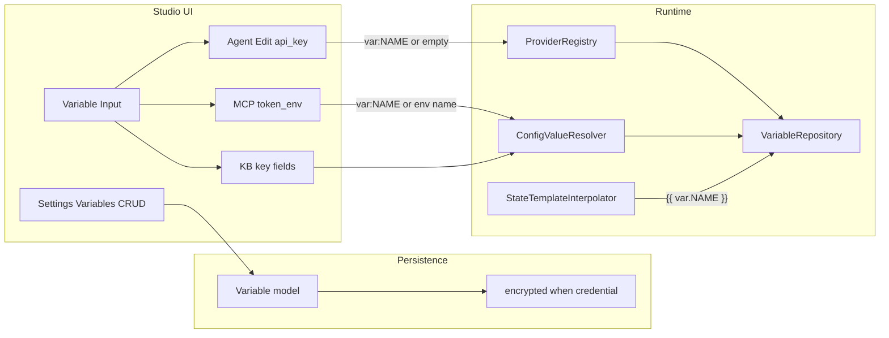

# Global Variables — Design

**Spec**: [spec.md](./spec.md)  
**Context**: [context.md](./context.md)  
**Status**: Approved  
**Line**: `v2.1.x` (AD-027 / ADR-028)

---

## Architecture Overview



---

## Discretion locked (Design)

| Topic | Decision |
|-------|----------|
| Wire format | `var:NAME` exact prefix; NAME = `^[A-Z][A-Z0-9_]*$` |
| Agent column | nullable `api_key` on `agent_definitions` |
| Provider override | `ProviderRegistry::resolve(..., ?string $keyOverride = null)` before assert |
| Env-name columns | If value starts with `var:` resolve vault; else if `env:` / `{{ env.}}` use resolver; else `env($name)` |
| Settings UX | Index + create/edit modal (not separate Edit route) |
| Credential edit | Blank value = keep; never prefill plaintext |
| Generic edit | Prefill plaintext; optional eye toggle |
| Prompt vars | `{{ var.NAME }}` in interpolator + instructions; state keys unchanged |
| Codegen | Keep `var:NAME` strings; agent empty key → `config('neuron.provider…')` |
| Multi-tenancy | No column; `VariableRepository::findByName` seam |
| Traces | Never put resolved Credential into span attributes / SSE payloads |

---

## Data model

### Table `{prefix}variables`

| Column | Type | Notes |
|--------|------|-------|
| id | bigint PK | |
| name | string unique | `^[A-Z][A-Z0-9_]*$` |
| type | string | `credential` \| `generic` |
| value | text | encrypted when credential |
| timestamps | | |

Register `variables` in `StudioTables::TABLES`.

### Model `Variable`

- Location: `src/Models/Variable.php`
- Custom cast or mutator: encrypt/decrypt only when `type === credential`
- Type flip: encrypt on save when becoming credential; decrypt to plaintext when becoming generic
- Hidden / accessors for list: `masked_value` accessor (`*****` vs raw generic)

### `VariableRepository`

```php
public function findByName(string $name): ?Variable;
public function allOrdered(): Collection;
```

No global singleton assumptions beyond app scope.

### Agent `api_key`

Migration add nullable `api_key` string to `agent_definitions`. Empty = use `config/neuron.php`.

---

## Components

### 1. `ConfigValueResolver`

- Location: `src/Runtime/ConfigValueResolver.php`
- Methods: `resolve(mixed $value): mixed`, `resolveMany(array $values): array`
- Order: non-string → passthrough; `var:NAME` → repo (throw if missing/empty credential); `env:` / `{{ env.VAR }}` → env; else literal
- Refactor `ToolResolver` + `McpRegistry` to delegate env cases here
- Helper for env-name fields: `resolveEnvNameOrVar(?string $stored): ?string`

### 2. Settings Livewire

- `src/Http/Livewire/Settings/Variables/Index.php` — list, delete, open modal
- Modal create/edit in same component or nested
- Routes under Studio auth: `settings/variables`
- Rail: Settings icon → variables (first Settings page)

### 3. Variable Input

- Blade component e.g. `resources/views/components/variable-input.blade.php` (+ Alpine picker)
- Props: `wireModel` / name, `sensitive` bool, optional `placeholder`
- Bound state stores `var:NAME`; unbound stores literal (or env name for legacy fields)

### 4. ProviderRegistry

- Accept optional `$keyOverride`
- If override is `var:…` or non-empty literal, set `$config['key']` after resolve
- Call sites: `AgentRunner::makeAgent` passes `$definition->api_key`

### 5. MCP / KB

- Forms use Variable Input on token/key fields
- `McpRegistry::resolveToken` / `VectorStoreFactory::resolveEnv` use `resolveEnvNameOrVar`

### 6. `StateTemplateInterpolator`

- Detect `var.NAME` path under `{{ }}` (e.g. key starting with `var.`) and resolve via repository
- Agent instructions: interpolate vars (state optional / empty state) before build

### 7. Codegen

- Do not resolve vault at export time for wired fields
- Preserve `var:NAME` in exported arrays/strings
- Provider expression: if `api_key` is `var:NAME`, emit runtime resolve; if empty, keep config()

### 8. Docs

- `docs/guides/variables/` (or single guide): vault vs env, security/`APP_KEY`, binding

---

## Code Reuse

| Existing | Use |
|----------|-----|
| `StudioTables` | Register + migrations |
| Tools/MCP Livewire Index patterns | Settings list |
| `ToolResolver::resolveConfigValue` | Move into ConfigValueResolver |
| `McpRegistry::resolveEnvValue` | Delegate |
| `StateTemplateInterpolator` | Extend for `var.` |
| `layouts/app.blade.php` rail | Settings link |
| Studio auth middleware | Gate routes |

---

## Error Handling

| Scenario | Handling |
|----------|----------|
| Missing `var:NAME` | Throw clear domain exception / runtime error |
| Empty Credential value | Error (misconfigured) |
| Decrypt fail (`APP_KEY`) | Surface clear error; document rotation |
| Delete variable still referenced | Allow delete (refs fail at runtime) — no cascade |

---

## Security

- List/index: never decrypt Credential for display
- Edit Credential: blank keep; no accidental HTML leak of secret
- Traces/SSE: scrub or omit resolved secrets
- Tests: assert no plaintext in log expectations

---

## Testing strategy

| Area | Tests |
|------|-------|
| Model encrypt + type flip | Unit |
| Repository findByName | Unit |
| ConfigValueResolver hit/miss/nested | Unit |
| ProviderRegistry override | Unit |
| Interpolator `{{ var.NAME }}` | Unit |
| Codegen keep ref | Unit |
| Livewire Settings CRUD | Feature (optional smoke) |
