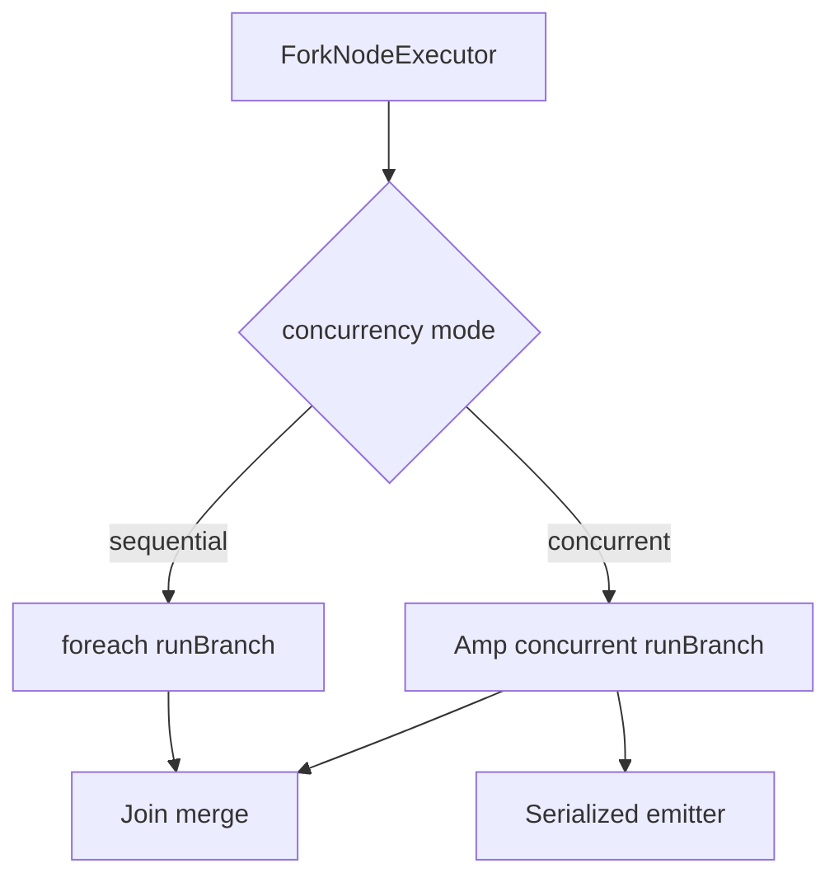

# Interpreted Parallel Concurrency Design

**Spec**: [spec.md](./spec.md)  
**Context**: [m6-runtime-agent/context.md](../m6-runtime-agent/context.md)  
**Status**: Approved

---

## Architecture Overview

---

## Discretion locked

| Topic | Decision |
| ----- | -------- |
| Engine | Amp (`Amp\Future` / `async` / `await`) — already transitive |
| Default | `concurrent` when Amp classes exist; else sequential |
| Config | `neuronai-studio.parallel.concurrency` = `sequential\|concurrent` |
| Fail-fast | On non-interrupt exception in any branch: cancel siblings, rethrow |
| Emitter | Wrap stepEmitter with mutex (`spl` lock or channel queue) so SSE lines never interleave mid-JSON |
| Single branch | Run inline (no Amp) |

---

## Components

### 1. `ConcurrentBranchScheduler`

- Input: list of branch callables returning `[results, outputs]`.
- Concurrent: `Future\await(array_map(async(...)))`.
- Catch `ParallelBranchInterruptException` from any future → cancel others → rethrow for resume path.

### 2. `ForkNodeExecutor` refactor

- Extract sequential loop body into `runBranch`.
- Choose scheduler based on config + Amp availability + branch count > 1.

### 3. `SerializingEmitter`

- Queue events; single writer flushes to real emitter (sync callable or ProgressEmitter).

---

## Files

| File | Change |
| ---- | ------ |
| `config/neuronai-studio.php` | `parallel.concurrency` |
| `src/Runtime/Parallel/ConcurrentBranchScheduler.php` | new |
| `src/Runtime/Parallel/SerializingEmitter.php` | new |
| `src/Runtime/NodeExecutors/ForkNodeExecutor.php` | use scheduler |
| `tests/Runtime/InterpretedParallelConcurrencyTest.php` | new + update existing PE tests |

---

## Risks

- Eloquent/DB not fork-safe across fibers — prefer Amp green threads in same process (OK) but avoid true process fork.
- Nested Amp loops if Neuron also uses Amp inside a branch — use `Future\await` carefully; document.
