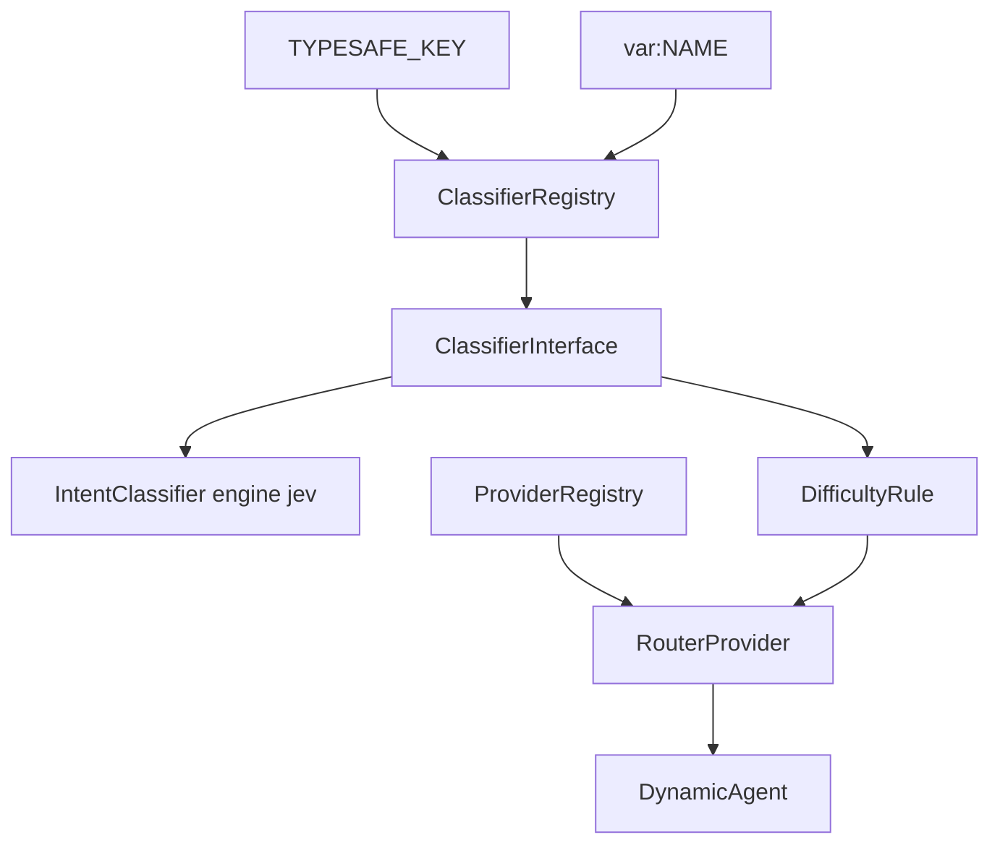

# JEV Classifier Design

**Spec:** `.specs/features/jev-classifier/spec.md`

## Dependency gate

- `neuron-core/neuron-ai` `^3.17` — `NeuronAI\Classifier\TypeSafeAI`, `NeuronAI\Testing\FakeClassifier` (tag `3.17.0`).
- `neuron-core/router` `1.x-dev#dbef16f7` — first commit whose `DifficultyRule` accepts `ClassifierInterface` and reclassifies every turn. Stable `1.2.2` still uses the old sticky `NeuronCore\Classifier` and must not be used. No stable tag contains the new rule yet.

Do not add `butochnikov/laravel-typesafe-jev` or `sanmai/typesafe-ai-php`.

## Components

| Piece | Role |
| --- | --- |
| `Registry\ClassifierRegistry` | Builds `TypeSafeAI` from `neuronai-studio.classifier` + vault override. If `ClassifierInterface` is bound (tests), return that. |
| `Runtime\Routing\RoutingConfig` | Normalizes the `routing_config` envelope. `null` when disabled. |
| `Runtime\Routing\RoutedProviderFactory` | `RouterProvider` + `DifficultyRule` + `ObservingRoutingRule`. |
| `Runtime\Routing\RoutingDecision` | Tier/provider/model observed on each `resolveProvider()` call. Score is not exposed by the router. |
| `IntentClassifierNodeExecutor` | `engine=jev` calls the registry; default `llm` unchanged. |
| `AgentRunner::makeAgent()` | Uses the factory when routing is enabled. |
| `TelemetryTracker` | On `inference-stop`, if the agent has a decision, record a `classifier` span and attribute the LLM span to the selected tier. |



## Data

`agent_definitions.routing_config` nullable JSON:

```json
{
  "enabled": true,
  "classifier_api_key": "var:TYPESAFE",
  "easy_max": 0.33,
  "medium_max": 0.70,
  "tiers": {
    "easy": {"provider": "openai", "model": "gpt-4o-mini", "api_key": null},
    "hard": {"provider": "openai", "model": "o3", "api_key": null}
  }
}
```

At least one of `easy` / `medium` / `hard`. `provider`/`model` on the agent stay the single-model path and the authoring default. `setDefaultProvider` uses the most capable configured tier (`hard`, else `medium`, else `easy`).

Canvas **Use existing** inherits `AgentDefinition.routing_config`. Canvas **inline** stores the same envelope on `node.data.routing`.

## Intent engine

- Options: intent id → non-empty description or name.
- Input: interpolated message, or `{message, history}` when memory is on (`StudioChatMessage` rows for `__studio_thread_id`).
- State: `output_key`, `{output_key}_name`, `{output_key}_probability`, `{output_key}_distribution`.
- Key: node `api_key` (`var:NAME`) else `TYPESAFE_KEY`.

## Reuse

`ProviderRegistry::resolve`, `ConfigValueResolver`, `CodegenContext::providerExpression`, agent form + `AgentNodeFields`, `IntentClassifierNodeCodeGenerator` branch returns.

## P2 not designed here

Generic classifier node, injection guard, tool-approval Boolean, TypeSafe price table.
