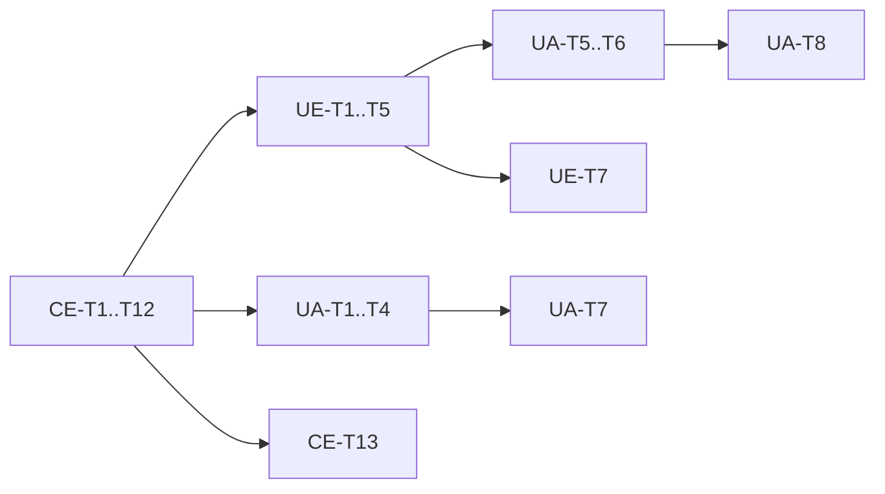

# M5 Analítica e Faturamento — Task Index

**Context**: [context.md](./context.md)  
**Status**: Partial — CE done; UE + UA **debt** (not Execute now, AD-015)  
**Linha**: `v0.3.x` → target `v0.4.0`

## Feature order

| # | Feature | Tasks | Count | Status |
|---|---------|-------|------:|--------|
| 1 | [`cost-estimation`](../cost-estimation/tasks.md) | CE-T1…T13 | 13 | ✅ done |
| 2 | [`usage-export-api`](../usage-export-api/tasks.md) | UE-T1…T7 | 7 | debt |
| 3 | [`usage-analytics`](../usage-analytics/tasks.md) | UA-T1…T8 | 8 | debt |

**Total**: 28 atomic tasks (13 done, 15 debt)

## Cross-feature critical path

## Parallelism notes

- After CE-T3: UA-T1 (JSON) and CE runtime can proceed; UA dashboard waits on UE-T2.
- UE-T6 (events P2) can trail UE-T5.
- Docs CE-T13 / UE-T7 / UA-T8 can run after their feature gates.

## Suggested first Execute slice

~~Ship CE foundation: **CE-T1 → CE-T13**~~ ✅. UE then UA when debt is pulled (AD-015).
