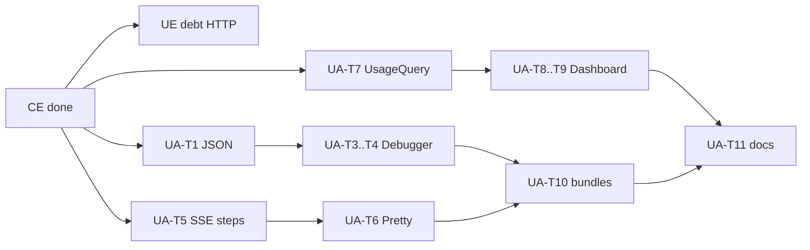

# M5 Analítica e Faturamento — Task Index

**Context**: [context.md](./context.md)  
**Status**: Partial — CE done; UE + UA **debt** (UA specs expanded for Test Pretty 2026-07-16)  
**Linha**: `v0.4.x` (CE in `v0.4.0`; UE + UA debt)

## Feature order

| # | Feature | Tasks | Count | Status |
|---|---------|-------|------:|--------|
| 1 | [`cost-estimation`](../cost-estimation/tasks.md) | CE-T1…T13 | 13 | ✅ done |
| 2 | [`usage-export-api`](../usage-export-api/tasks.md) | UE-T1…T7 | 7 | debt |
| 3 | [`usage-analytics`](../usage-analytics/tasks.md) | UA-T1…T11 | 11 | debt (Pretty + Dashboard + Debugger) |

**Total**: 31 atomic tasks (13 done, 18 debt)  
**Note**: UA-T7 extracts `UsageQuery::aggregate` only; full UE HTTP stays debt.

## Cross-feature critical path

## Parallelism notes

- UA no longer waits on full UE: Dashboard uses `UsageQuery::aggregate` (UA-T7).
- Pretty (T5→T6) and Debugger (T1→T4) and Dashboard (T7→T9) can proceed in parallel after CE.
- Docs/bundles after UI surfaces land.

## Suggested first Execute slice (when debt pulled)

UA: **T1∥T2∥T5∥T7** → Debugger (T3–T4) ∥ Pretty (T6) ∥ Dashboard (T8–T9) → T10 bundles → T11 docs.  
UE: still deferred (AD-015); UA-T7 is enough for Dashboard aggregates.
