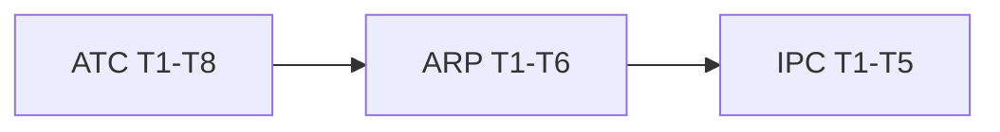

# M6 Runtime / Agent — Task Index

**Context**: [context.md](./context.md)  
**Status**: Done — Execute on `v0.7.x`  
**Linha**: `v0.7.x`

## Feature order

| # | Feature | Tasks | Count | Status |
|---|---------|-------|------:|--------|
| 1 | [`agent-tool-controls`](../agent-tool-controls/tasks.md) | ATC-T1…T8 | 8 | ✅ done |
| 2 | [`async-run-progress`](../async-run-progress/tasks.md) | ARP-T1…T6 | 6 | ✅ done |
| 3 | [`interpreted-parallel-concurrency`](../interpreted-parallel-concurrency/tasks.md) | IPC-T1…T5 | 5 | ✅ done |

**Total**: 19 atomic tasks (19 done)

## Cross-feature critical path

## Parallelism notes

- ATC is independent and should ship first (knobs + live tools).
- ARP introduces ProgressEmitter used by jobs; IPC SerializingEmitter should wrap any emitter including ProgressEmitter.
- IPC last: hardest concurrency surface.
