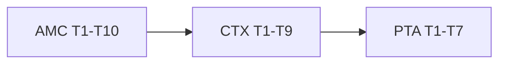

# M8 Performance, Memory & Context — Task Index

**Context**: [context.md](./context.md)  
**Status**: Specified — Execute on `v0.9.x` (line opens at Execute, AD-022)  
**Linha**: `v0.9.x` (patches → `v0.8.x`)  
**Design**: intentionally skipped — tasks derive directly from the specs; inline design decisions are noted per task.

## Feature order

| # | Feature | Priority | Tasks | Count | Status |
|---|---------|----------|-------|------:|--------|
| 1 | [`agent-memory-controls`](../agent-memory-controls/tasks.md) | P1 | AMC-T1…T10 | 10 | done |
| 2 | [`context-engineering`](../context-engineering/tasks.md) | P1 | CTX-T1…T9 | 9 | done |
| 3 | [`parallel-tool-approval`](../parallel-tool-approval/tasks.md) | P2 | PTA-T1…T7 | 7 | specified |

**Total**: 26 atomic tasks (19 done)

## Cross-feature critical path

## Ordering rationale

- **AMC first**: activates the `memory_config` envelope + per-node override resolution that CTX budgets reuse as their storage/resolution layer (CTX-T2 depends on AMC-T1/T2).
- **CTX second**: pure prompt-assembly layer on top of the envelope; independent of forks.
- **PTA last (P2)**: hardest concurrency surface; independent of AMC/CTX code but explicitly gated behind both P1 features per AD-022.
- Within each feature, backend tasks precede UI/codegen/docs; each feature closes with a docs task mapping to the M8 rows of the [ROADMAP documentation index](../../project/ROADMAP.md).
