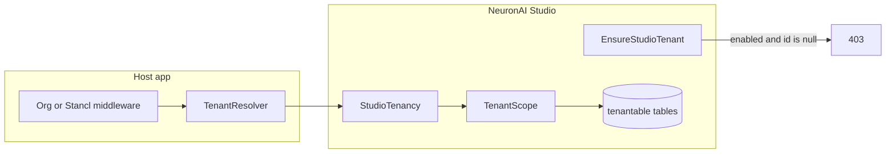

# Optional Multi-Tenancy Design

**Spec**: `.specs/features/optional-multi-tenancy/spec.md`  
**Status**: Approved

---

## Architecture Overview

Tenancy is a request/job context plus an Eloquent global scope. The host resolves the current tenant; Studio never owns a `tenants` table.



**TEN-01** Config + resolver. **TEN-02** Scope + stamp. **TEN-03** HTTP middleware. **TEN-04** Finder override + unique. **TEN-05** Jobs + RAG prefix. **TEN-06** `driver=database`.

---

## Code Reuse Analysis

### Existing Components to Leverage

| Component | Location | How to Use |
| --------- | -------- | ---------- |
| `StudioTables` | `src/Support/StudioTables.php` | Prefixed table names in the new migration |
| `ThreadOwner` | `src/Support/ThreadOwner.php` | Pattern for a focused value/context type; do not merge with tenant |
| `VariableRepository` | `src/Repositories/VariableRepository.php` | Name lookup becomes tenant-then-global |
| `EnsureNeuronAIStudioAuthorized` | `src/Http/Middleware/EnsureNeuronAIStudioAuthorized.php` | Sibling middleware; tenant runs after locale/auth |
| Queue jobs | `src/Jobs/*` | Restore tenant like progress emitter already keys off run id |
| `VectorStoreFactory` | `src/Runtime/Rag/VectorStoreFactory.php` | Namespace collection/index/file identifiers |

### Integration Points

| System | Integration Method |
| ------ | ------------------ |
| Routes | Always append `neuronai-studio.tenant` on web, integration, MCP, usage |
| Container | Bind `TenantResolver` from `neuronai-studio.tenancy.resolver` or `NullTenantResolver` |
| Models | `BelongsToTenant` on tenantable Eloquent models |
| Install / templates | CLI install stays global via `central()`; Livewire template install uses current tenant |

---

## Components

### StudioTenancy

- **Purpose**: Public API for enabled/driver/id/central/run and whether the shared `tenant_id` scope applies.
- **Location**: `src/Tenancy/StudioTenancy.php`
- **Interfaces**:
  - `enabled(): bool`
  - `driver(): string` — `shared` \| `database`
  - `scopesShared(): bool` — enabled and driver is `shared`
  - `id(): ?string`
  - `isCentral(): bool`
  - `hasTenant(): bool`
  - `run(?string $id, callable $callback): mixed` — null id = central
  - `central(callable $callback): mixed`
  - `withoutScope(callable $callback): mixed` — for job bootstrap lookups
- **Dependencies**: `TenantResolver`, config
- **Reuses**: Same nesting/restore style as a typical context stack

### TenantResolver / NullTenantResolver / StanclTenantResolver

- **Purpose**: Host plug-in for the current tenant id.
- **Location**: `src/Tenancy/`
- **Interfaces**: `id(): ?string`
- **Dependencies**: Stancl resolver must not import stancl types
- **Reuses**: Config class-string, same as stream adapter registry

### TenantScope + BelongsToTenant

- **Purpose**: Visibility filter + write stamp + unique helper + slug finder.
- **Location**: `src/Tenancy/TenantScope.php`, `src/Tenancy/BelongsToTenant.php`
- **Scope when `scopesShared()`**:
  - tenant context: `tenant_id = current OR tenant_id IS NULL`
  - central: `tenant_id IS NULL`
  - absent (enabled, no tenant, not central): `1 = 0` (fail-closed reads)
- **creating**: HTTP/tenant context forces `tenant_id = current`; central leaves null unless set; absent throws `TenantRequiredException`
- **saving**: `tenant_scope = tenant_id ?? ''`
- **Finder**: `findBySlug` / `findPreferred($column, $value)` orders tenant rows before globals (`CASE WHEN tenant_id IS NULL THEN 1 ELSE 0 END`)
- **Uniqueness helper**: `scopeInCurrentTenant` so slug generation does not skip a slug only because a global exists (allows override)

### EnsureStudioTenant

- **Purpose**: 403 when tenancy enabled and `StudioTenancy::id()` is null (including `driver=database`).
- **Location**: `src/Http/Middleware/EnsureStudioTenant.php`
- **No-op when disabled**

### RestoresStudioTenant (jobs)

- **Purpose**: Load root model without tenant scope, then `StudioTenancy::run($model->tenant_id, ...)`.
- **Location**: `src/Tenancy/RestoresStudioTenant.php` used by the three queue jobs

---

## Data Models

Tenantable tables (own `tenant_id` + `tenant_scope`):

- Authoring: `agent_definitions`, `workflow_definitions`, `knowledge_bases`, `tool_definitions`, `mcp_servers`, `mcp_endpoints`, `variables`
- Runtime: `threads`, `runs`, `traces`

Children (documents, messages, spans, evals, pivots) inherit via FK; no extra column.

```text
tenant_id: string|null   // host opaque id; null = global
tenant_scope: string     // denormalized unique key; '' when tenant_id is null
```

Unique indexes (short names, MySQL 64-char limit):

- Drop `{table}_slug_unique` (or `_name_unique` on variables)
- Add `unique(tenant_scope, slug|name)` e.g. `ns_agent_def_tenant_slug_uq`

Leave `workflow_definitions.class_path` globally unique.

---

## Error Handling Strategy

| Error Scenario | Handling | User Impact |
| -------------- | -------- | ----------- |
| HTTP, tenancy on, no tenant | Middleware abort 403 | Same shape as Studio auth 403 |
| Eloquent create without tenant | `TenantRequiredException` | CLI/jobs must use `run`/`central` |
| Lookup other tenant's id | Global scope → 404 / ModelNotFound | No leak |
| Worker without restore | Would see empty scope; jobs restore first | No silent global ingest |

---

## Tech Decisions

| Decision | Choice | Rationale |
| -------- | ------ | --------- |
| Unique key | `tenant_scope` column, not SQL generated | SQLite ALTER + Testbench portable |
| Resolver | Interface + config class-string | Package must not own header/subdomain |
| Stancl | Optional class, no composer require | Hosts already have stancl |
| RAG prefix | Model's `tenant_id`, not current context | Global KB used by a tenant keeps shared vectors |
| MCP slugs | Per-tenant unique like other slugs | Host resolver must identify tenant before MCP routes |
| Middleware append | Always append alias, even if host overrides `middleware` | Fail-closed if host forgets |

---

## RAG namespacing

`VectorStoreFactory::namespaced(KnowledgeBase $kb, string $name): string` prefixes with sanitized `tenant_id` when `scopesShared()` and KB has a tenant. Applied to file store name, pinecone namespace, chroma/weaviate/typesense collection, meilisearch indexUid, elasticsearch/opensearch index, mariadb table, phpvector path suffix. Do not rewrite Qdrant `collection_url` (absolute URL).
