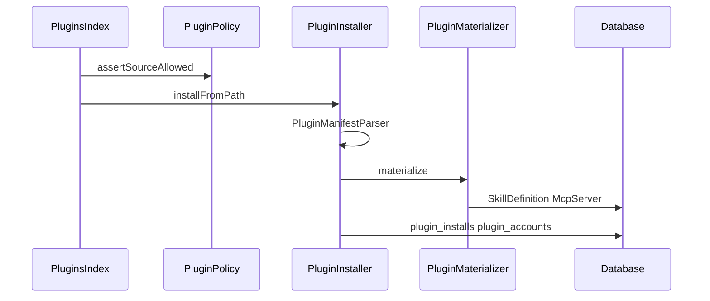

# Plugin System — Design

## Data model

```
plugin_installs
  id, tenant_id, tenant_scope, slug, name, version, description,
  manifest JSON, source, source_url, source_path, status,
  materialized JSON { skill_ids, mcp_slugs }, timestamps
  UNIQUE (tenant_scope, slug)

plugin_accounts
  id, plugin_install_id, label, auth_status, credential_map JSON, timestamps
  UNIQUE (plugin_install_id, label)

agent_plugin_bindings
  id, agent_definition_id, plugin_install_id, plugin_account_id, timestamps
  UNIQUE (agent_definition_id, plugin_install_id)
```

Materialized rows carry `source_meta.plugin_install_id` on `SkillDefinition` and `metadata.plugin_install_id` on `McpServer`.

## Catalog

Config `neuronai-studio.plugins` + package `resources/plugins/marketplace.json` scanned by `PluginCatalogRegistry`. No remote fetch in P1.

## Install flow



## Runtime gate

`PluginMcpGate` used by `McpToolResolver`: skip MCP bindings whose server belongs to a plugin install bound to the agent with `needs_auth` account.

## Key files

| Area | Path |
|------|------|
| Policy | `src/Plugins/PluginPolicy.php` |
| Catalog | `src/Registry/PluginCatalogRegistry.php` |
| Parser | `src/Plugins/PluginManifestParser.php` |
| Install | `src/Plugins/PluginInstaller.php` |
| Materialize | `src/Plugins/PluginMaterializer.php` |
| Gate | `src/Plugins/PluginMcpGate.php` |
| UI | `src/Http/Livewire/Plugins/*` |
| Example | `resources/plugins/demo-assistant/` |
