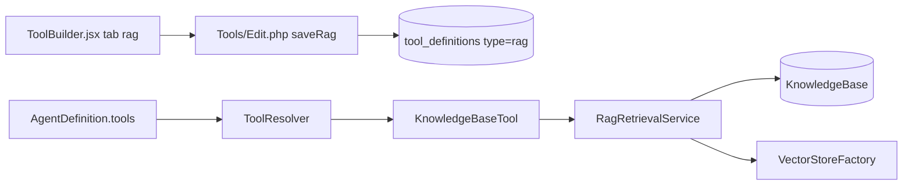

# RAG Knowledge Base Tool — Design

**Status:** implementado (v0.2.x)

## Arquitetura



## Componentes

| Componente | Caminho | Status |
|------------|---------|--------|
| `KnowledgeBaseTool` | `src/Tools/KnowledgeBaseTool.php` | done |
| `ToolResolver` branch `type === 'rag'` | `src/Runtime/ToolResolver.php` | done |
| Livewire save/load | `src/Http/Livewire/Tools/Edit.php` | done |
| React tab | `resources/js/studio-forms/ToolBuilder.jsx` | done |
| Show page | `resources/views/livewire/tools/show.blade.php` | done |

## ToolDefinition (tipo `rag`)

```php
[
    'type' => 'rag',
    'input_schema' => [
        ['name' => 'query', 'type' => 'string', 'description' => '...', 'required' => true],
    ],
    'config' => [
        'tool_name' => 'search_support_kb',
        'knowledge_base_id' => 1,
        'top_k' => 5,       // optional override
        'threshold' => 0.7, // optional override
    ],
]
```

## KnowledgeBaseTool runtime

- Nome da função: `config.tool_name` (snake_case).
- Callback: `RagRetrievalService::search($kb, $query, options)` → `formatContext()` com `[source_name]` por trecho.
- Erros graciosos: KB ausente, query vazia, zero resultados.

## UI (tools/create)

- Tab **RAG - Knowledge Base** ao lado de PHP Class Builder e Webhook.
- Campos: Display Name, Tool Name, Description, Knowledge Base (select), Top K, Threshold.
- Entrada `query` é fixa (não editável no builder) — gerada no `saveRag()`.
- Header action: **New RAG Tool** (`?kind=rag`).

## Agent integration

Sem mudança no registry: `ToolRegistry::databaseEntries()` já expõe `tool:db:{id}`. O agent picker lista tools `category: studio` incluindo `type: rag`.

## Fora de escopo (v1)

- `return_format: json` com scores/metadata no retorno da tool.
- Codegen/export para classe PHP (`ToolExporter` não roda para `type: rag`).
- Remoção de vetores ao deletar documento da KB.
