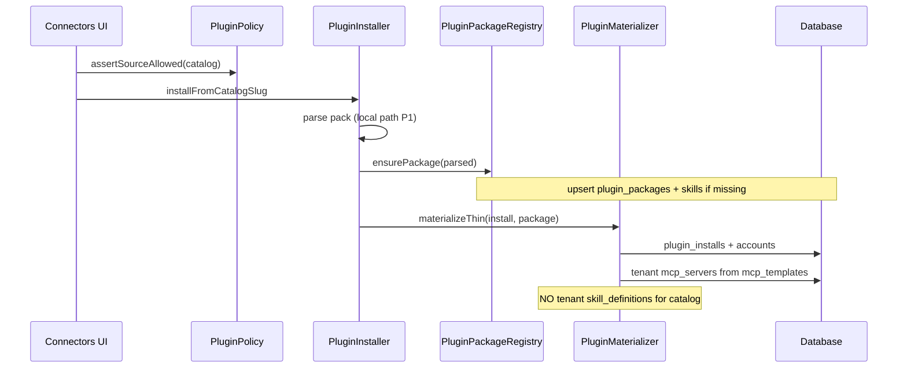
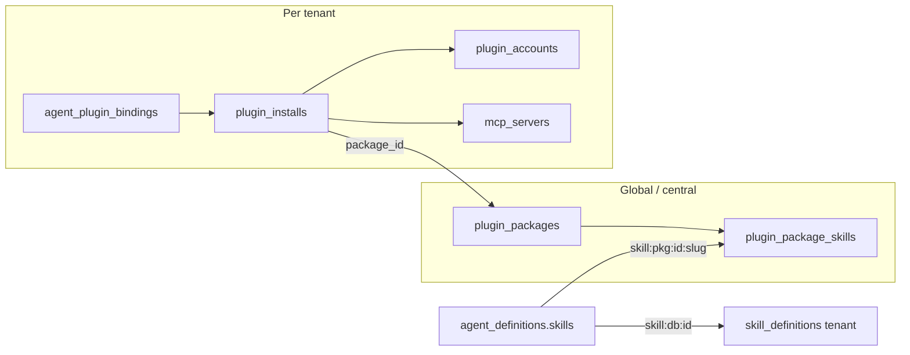

# Shared Plugin Packages — Design

**Spec:** `.specs/features/shared-plugin-packages/spec.md`  
**Context:** `.specs/features/shared-plugin-packages/context.md`  
**Status:** Approved

---

## Architecture Overview

Catalog install stops writing tenant `SkillDefinition` rows. A **global package** is upserted once per `(slug, version)`; skill bodies live in `plugin_package_skills`. The tenant gets a thin `plugin_installs` row pointing at `package_id`, plus accounts and per-tenant MCP servers (copied from package templates). Agent bindings attach `skill:pkg:{packageId}:{skillSlug}` refs; runtime resolves them through an extended `SkillRepository`.





---

## Code Reuse Analysis

| Component | Location | How to use |
|-----------|----------|------------|
| `PluginInstaller` | `src/Plugins/PluginInstaller.php` | Branch catalog path → `ensurePackage` + thin materialize; keep `installFromPath`/`GitHub`/`zip` for allowlist as today |
| `PluginManifestParser` / `ParsedPlugin` | `src/Plugins/` | Unchanged input to package upsert |
| `PluginMaterializer` | `src/Plugins/PluginMaterializer.php` | Split: `materializeCatalog` (no skill import) vs `materializeOwned` (legacy allowlist) |
| `PluginAgentBinder` | `src/Plugins/PluginAgentBinder.php` | Sync `skill:pkg:…` from package skills instead of `materialized.skill_ids` db clones |
| `SkillRepository` / `SkillResolver` | `src/Runtime/Skills/` | Resolve `skill:pkg:` → package skill content |
| `SkillArchiveImporter` | — | **Not** used for catalog P1 installs |
| `StudioTenancy` / `BelongsToTenant` | — | Packages: no tenant scope (central). Installs/MCP/accounts: unchanged |
| `StudioTables` | — | New migrations follow prefix |

---

## Components

### PluginPackageRegistry

- **Purpose:** Upsert and load global packages + skills; content-hash short-circuit.
- **Location:** `src/Plugins/PluginPackageRegistry.php`
- **Interfaces:**
  - `ensureFromParsed(ParsedPlugin $parsed, array $sourceMeta): PluginPackage` — create/find by slug+version; write skills if new
  - `find(int $id): ?PluginPackage`
  - `findBySlugVersion(string $slug, string $version): ?PluginPackage`
- **Dependencies:** `PluginPackage`, `PluginPackageSkill` models
- **Reuses:** Parser output; hash = sha256 of canonical skill bodies + mcp template JSON

### PluginMaterializer (extended)

- **Purpose:** Catalog path writes install + MCP only; allowlist path keeps owned skills.
- **Interfaces:**
  - `materializeCatalog(PluginInstall $install, PluginPackage $package, ParsedPlugin $parsed): array` → `{ package_id, skill_refs[], mcp_slugs[] }`
  - `materializeOwned(...)` — current behavior (rename of today’s `materialize`)
  - `dematerialize` — delete tenant MCP + clear install; **never** delete `plugin_packages` / package skills

### SkillContent (contract)

- **Purpose:** Uniform access for activate/read tools.
- **Location:** `src/Runtime/Skills/SkillContent.php` (interface)
- **Methods:** `slug()`, `description()`, `body()`, `files(): array`
- **Implementors:** `SkillDefinition` (adapter methods or existing API), `PluginPackageSkill`

### SkillCatalogEntry (adjusted)

- **Purpose:** Hold any `SkillContent`, not only `SkillDefinition`.
- **Change:** `public readonly SkillContent $definition` (or rename to `$content` with BC alias if needed)

### SkillRepository (extended)

- **Purpose:** Resolve refs for runtime.
- **New:** `skill:pkg:{packageId}:{skillSlug}` → `PluginPackageSkill`
- **Unchanged:** `skill:db:{id}`, legacy `skill:{slug}` for tenant definitions

### PluginAgentBinder (extended)

- **Purpose:** When syncing plugin skills, push `skill:pkg:{package_id}:{slug}` for each package skill; strip stale pkg refs when unbound.
- **Detection:** refs starting with `skill:pkg:` tied to install’s `package_id`

### PluginCatalogRegistry

- **P1:** unchanged (local paths).
- **P2 hook:** accept `source: { type: github, url, ref, path }` listings without local dir (out of P1 tasks).

---

## Data Models

### plugin_packages (global)

```
id
slug                  string
version               string
content_hash          string  // sha256
name                  string
description           text nullable
manifest              json
mcp_templates         json    // map connectorKey => mcp config (pre-credential)
source                string  // catalog|github|…
source_url            string nullable
source_path           string nullable
timestamps
UNIQUE(slug, version)  → ns_plugin_pkg_slug_ver_uq
INDEX(content_hash)
```

No `tenant_id` / `tenant_scope` — always shared.

### plugin_package_skills (global)

```
id
plugin_package_id     FK cascade
slug                  string
description           text
body                  longText nullable
resources             json nullable
metadata              json nullable
timestamps
UNIQUE(plugin_package_id, slug)  → ns_plugin_pkg_skill_uq
```

### plugin_installs (delta)

```
+ package_id          FK nullable → plugin_packages (null = legacy/owned install)
materialized JSON shape (catalog):
  {
    "package_id": 1,
    "skill_refs": ["skill:pkg:1:linear", ...],
    "mcp_slugs": ["linear-linear", ...]
  }
```

Legacy installs keep `materialized.skill_ids` until P2 migration.

### mcp_servers / plugin_accounts / bindings

Unchanged schema. MCP `metadata` still carries `plugin_install_id`, `plugin_slug`, `connector_key`, `credential_hints`.

---

## Install algorithms

### Catalog (P1)

1. Policy: catalog slug allowed.
2. Resolve listing path → `ParsedPlugin`.
3. `version` from manifest (fallback `0.0.0` + hash suffix if empty).
4. `PluginPackageRegistry::ensureFromParsed` — if `(slug,version)` exists and hash matches, reuse; if hash differs, treat as conflict → bump stored version to `{version}+{hash8}` **or** reject install with clear error (prefer **reject** in P1 for determinism).
5. Create/update `plugin_installs` with `package_id`, thin `materialized`.
6. Upsert tenant MCP from `mcp_templates` (same as today’s materializer env→`var:` mapping).
7. Default account.

### Allowlist zip / GitHub URL (P1)

- Keep **owned** materialization (`SkillDefinition` per tenant) so arbitrary third-party packs are not injected into the global store without host catalog curation.

### Uninstall

- Dematerialize tenant MCP; delete accounts/bindings; mark install uninstalled.
- Do **not** delete package rows (other tenants / future installs).

---

## Runtime

1. Binder writes `skill:pkg:…` onto `agent.skills`.
2. `SkillResolver` → `SkillRepository::findByRef`.
3. `ActivateSkillTool` / `ReadSkillResourceTool` use `SkillContent::body()` / `files()`.
4. `PluginMcpGate` unchanged (tenant MCP + account status).

---

## Error Handling

| Scenario | Handling | User impact |
|----------|----------|-------------|
| Package hash mismatch for same version | Reject install | Clear error: version collision; bump pack version |
| Missing package skill on activate | Error string from tool | Agent sees skill unavailable |
| Catalog path missing | Same as today | Install fails |
| Uninstall with shared package | Keep package | Other tenants unaffected |
| Legacy install (no package_id) | Owned path / existing skill_ids | Continues to work until P2 |

---

## Tech Decisions

| Decision | Choice | Rationale |
|----------|--------|-----------|
| Storage | DB package + package_skills | Multi-node, backup, StudioTables |
| Skill refs | `skill:pkg:{id}:{slug}` | Stable; avoids slug clashes across packages |
| SkillContent interface | Yes | Avoid fake SkillDefinition models |
| MCP | Per-tenant copy from templates | Small payload; reuse gate/credentials |
| Catalog vs allowlist | Only catalog → shared store | Don’t pollute global with unreviewed zips |
| Version collision | Reject | Fail closed; force explicit version bump |
| GitHub catalog | P2 | Prove local path first |
| Migration M22 clones | P2 | Safer rollout |

---

## Testing strategy (no TESTING.md — follow existing Plugin tests)

| Layer | Approach |
|-------|----------|
| Unit / feature | Extend `tests/Plugins/PluginSystemTest.php` + new `PluginPackageSharingTest.php` |
| Scale assertion | Two tenants install same pack → `plugin_package_skills` count = skill count once; `skill_definitions` where source=plugin not increased for catalog |
| Runtime | Bind agent → resolve catalog → activate_skill returns package body |
| Regression | Official connectors test still installs Linear/Stripe; credentials + gate |

Gate: `php artisan test --filter=Plugin`

---

## P2 stubs (not in P1 tasks)

- Catalog `source.type=github` → download → `ensureFromParsed` → thin install.
- Artisan/migrator: collapse `source=plugin` SkillDefinitions into packages; rewrite installs + agent skill refs.
- Optional package upgrade UI.

---

## Key files (expected)

| Area | Path |
|------|------|
| Migrations | `database/migrations/*_create_plugin_packages_tables.php`, alter `plugin_installs` |
| Models | `src/Models/PluginPackage.php`, `PluginPackageSkill.php` |
| Registry | `src/Plugins/PluginPackageRegistry.php` |
| Materializer / Installer / Binder | `src/Plugins/*` |
| Skill content | `src/Runtime/Skills/SkillContent.php`, `SkillRepository`, `SkillCatalogEntry` |
| Tests | `tests/Plugins/PluginPackageSharingTest.php` |
| Docs | `docs/guides/plugins/README.md` (shared packages note) |

---

## Success mapping

| Spec ID | Design element |
|---------|----------------|
| SPP-01 | `plugin_packages` + `plugin_package_skills` + registry |
| SPP-02 | thin `installFromCatalogSlug` |
| SPP-03 | `skill:pkg:` + SkillContent + binder |
| SPP-04 | MCP templates → tenant rows |
| SPP-05 | dematerialize skips package delete |
| SPP-09 | local catalog only P1; config catalog overrides by slug as today |
| SPP-10 | allowlist zip → owned materialize |
