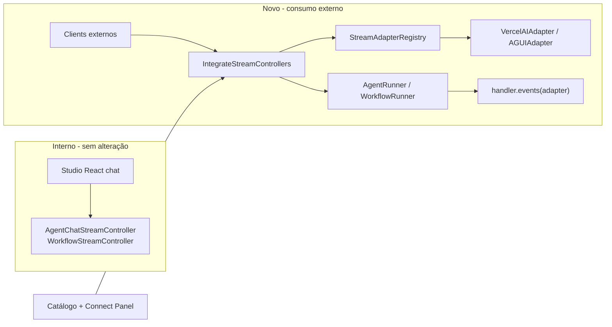

# Stream Adapters — Especificação

## Overview

Expor agentes e workflows criados no Studio para **consumo por clients externos** (React + Vercel AI SDK, AG-UI, outros) via endpoints de streaming dedicados, com rotas e controllers prontos no package Laravel — configuráveis via `config/neuronai-studio.php` (prefix, middleware, protocols habilitados).

O neuron-ai já fornece adapters de wire-protocol (`VercelAIAdapter`, `AGUIAdapter`) integrados via `$handler->events($adapter)`. Esta feature os expõe como API HTTP sem alterar o chat/playground interno do Studio.

**Princípio central:** separação total **interno vs externo**. Os endpoints, controllers e SSE do playground (`AgentChatStreamController`, `WorkflowStreamController`, `fetchSse.js`, SessionAdapters) permanecem intocados. Não há codegen — o app host instala o package e configura rotas/middleware.

## Contexto técnico

| Peça | Localização |
|------|-------------|
| `StreamAdapterInterface` | `neuron-ai` — `transform()`, `getHeaders()`, `start()`, `end()` |
| `VercelAIAdapter` | Vercel AI SDK Data Stream Protocol |
| `AGUIAdapter` | AG-UI Protocol |
| Integração runtime | `$handler->events($adapter)` em `WorkflowHandler` / `AgentHandler` |
| SSE interno Studio | `event: token`, `tool_call`, `tool_result` — **não muda** |

Referência neuron: [stream-adapters examples](https://github.com/neuron-core/neuron-ai/tree/3.x/examples/stream-adapters).

## Arquitetura



## Config proposta

```php
'stream_adapters' => [
    'enabled' => env('NEURONAI_STUDIO_INTEGRATE_ENABLED', true),
    'route_prefix' => env('NEURONAI_STUDIO_INTEGRATE_PREFIX', 'api/neuronai'),
    'middleware' => ['api'], // host sobrescreve: ['api', 'auth:sanctum']
    'protocols' => [
        'vercel' => ['enabled' => true],
        'agui' => ['enabled' => true],
    ],
],
```

Rotas registradas automaticamente no `NeuronAIStudioServiceProvider` quando `enabled=true`. Middleware **separado** do Studio UI (`web` + gate).

### Rotas (exemplos)

| Método | Rota | Propósito |
|--------|------|-----------|
| POST | `{prefix}/agents/{agent}/stream/vercel` | Agent stream — Vercel AI SDK |
| POST | `{prefix}/agents/{agent}/stream/agui` | Agent stream — AG-UI |
| POST | `{prefix}/workflows/{workflow}/stream/vercel` | Workflow stream — Vercel AI SDK |
| POST | `{prefix}/workflows/{workflow}/stream/agui` | Workflow stream — AG-UI |
| POST | `{prefix}/workflows/traces/{trace}/resume/vercel` | Resume Human node — Vercel |
| POST | `{prefix}/workflows/traces/{trace}/resume/agui` | Resume Human node — AG-UI |

## Requirements

| ID | Requirement | Priority |
|----|-------------|----------|
| SA-01 | `StreamAdapterRegistry` lista protocols available (`vercel`, `agui`) e roadmap (demais) com metadados (label, framework-alvo, headers, docs URL) | P0 |
| SA-02 | Config `stream_adapters` (enabled, route_prefix, middleware, protocols) publicada em `config/neuronai-studio.php` | P0 |
| SA-03 | Rotas de integração registradas condicionalmente no service provider; ausentes quando `enabled=false` | P0 |
| SA-04 | Middleware configurável aplicado às rotas de integração (independente do middleware do Studio UI) | P0 |
| SA-05 | `AgentIntegrateStreamController` — POST agent stream via `handler->events($adapter)` para `vercel` e `agui` | P0 |
| SA-06 | `WorkflowIntegrateStreamController` — POST workflow stream via adapter para `vercel` e `agui`; mapeia eventos step/tool/trace para protocolo externo | P0 |
| SA-07 | `AgentRunner::streamHandler()` expõe handler com adapter (só endpoints externos; controller interno intocado) | P0 |
| SA-08 | Endpoints internos (`agents.chat.stream`, `workflows.trace.stream`) permanecem inalterados — zero regressão | P0 |
| SA-09 | Catálogo Studio `/stream-adapters` — lista available vs roadmap, protocolo, frameworks, headers | P0 |
| SA-10 | Connect Panel por agente/workflow — URL do endpoint (baseada em `route_prefix`) + snippets client (`useChat`, AG-UI) com copy | P0 |
| SA-11 | Testes: rotas condicionais, middleware, formato vercel (`text-delta`, header `x-vercel-ai-ui-message-stream`), formato agui (`RUN_STARTED`/`RUN_FINISHED`) | P0 |
| SA-12 | Resume workflow Human node em endpoints externos (`traces/{trace}/resume/{protocol}`) — **primeira entrega** | P0 |
| SA-13 | Testes de resume: workflow pausa em Human node, client externo retoma via `resume/{protocol}` e completa execução | P0 |
| SA-14 | Token SSE dentro de nós agent/llm em workflow externo (paridade com `workflow-token-streaming`) | P2 |

## Protocolos

### Prioridade 1 — implementar

| Protocol | Adapter neuron | Framework-alvo | Entrega Laravel |
|----------|----------------|----------------|-----------------|
| **vercel** | `VercelAIAdapter` | Vercel AI SDK (`useChat`, `ai/react`) | Rota + controller no package |
| **agui** | `AGUIAdapter` | AG-UI clients | Rota + controller no package |
| **laravel** | — (não é wire-protocol) | App host Laravel | Rotas/controllers auto-registrados via config |

### Roadmap — catálogo only (não implementar nesta feature)

| Protocol | Framework-alvo | Notas |
|----------|----------------|-------|
| `openai-sse` | OpenAI-compatible clients | Chat Completions SSE |
| `anthropic-sse` | Anthropic Messages API | Messages SSE |
| `langchain` | LangChain / LangServe | — |
| `copilotkit` | CopilotKit | — |
| `websocket` | Laravel Reverb / Echo | Broadcast em tempo real |
| `inertia` | Inertia.js streaming | — |
| `ndjson` | Clients genéricos | NDJSON / plain JSON stream |

## Escopo excluído

- **Codegen / export** de controllers para app host — rotas prontas no package substituem
- **Alteração do playground** ou workflow test harness para alternar protocolo
- **Preview SSE cru** nos componentes internos de teste
- **Refatoração** de `AgentChatStreamController` / `WorkflowStreamController` para usar adapters
- **Mudanças** em `fetchSse.js`, `AgentSessionAdapter`, `WorkflowSessionAdapter`, `StudioChat.jsx`

## Dependências

| Feature | Relação |
|---------|---------|
| `workflow-token-streaming` | SA-14 — tokens em nós agent/llm durante workflow externo; endpoints funcionam sem ela (step boundaries only) |
| `studio-test-harness` | Nenhuma alteração; harness continua no SSE interno |
| neuron-ai `StreamAdapterInterface` | Dependência `neuron-core/neuron-ai` |

## Acceptance Criteria

- Com `stream_adapters.enabled=true`, `POST {prefix}/agents/{id}/stream/vercel` retorna stream compatível com `useChat` do Vercel AI SDK.
- Com `stream_adapters.enabled=true`, `POST {prefix}/agents/{id}/stream/agui` emite eventos `RUN_STARTED` → `TEXT_MESSAGE_*` → `RUN_FINISHED`.
- Com `stream_adapters.enabled=false`, rotas de integração não existem (`404` ou não registradas).
- Playground e workflow test harness funcionam identicamente ao estado atual (regressão zero).
- Catálogo lista `vercel` e `agui` como available; demais protocols como roadmap.
- Com `stream_adapters.enabled=true`, workflow com nó Human pausa no stream externo; `POST {prefix}/workflows/traces/{trace}/resume/{protocol}` retoma e completa a execução.
- Connect Panel exibe URLs de stream **e resume** para workflows com snippet copiável.
- Host app configura `middleware` (ex: `auth:sanctum`) sem afetar rotas do Studio UI.

## Documentation

| Arquivo | O que adicionar |
|---------|-----------------|
| `guides/integration/stream-adapters.md` | Overview, config, rotas, exemplos Vercel + AG-UI |
| `guides/integration/vercel-ai-sdk.md` | `useChat` apontando para endpoint do package |
| `guides/integration/ag-ui.md` | Client AG-UI + resume Human node |
| `reference/configuration.md` | Seção `stream_adapters` |
| `getting-started/installation.md` | Habilitar endpoints de integração no host |
| `guides/agents/playground-and-threads.md` | Nota: playground usa SSE interno; integração externa é separada |

## Fases de implementação (referência)

| Fase | Escopo |
|------|--------|
| **1** | Registry, config, rotas, controllers agent + workflow (vercel + agui), resume Human node, testes |
| **2** | Catálogo + Connect Panel (URLs stream + resume) |
| **3** | Docs |
| **4** | SA-14 quando `workflow-token-streaming` estiver pronto |
