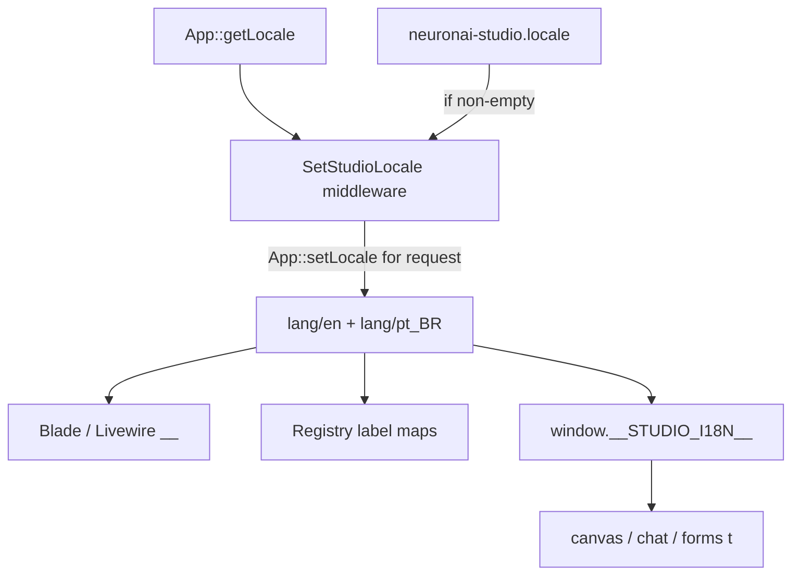

# Studio i18n — Design

**Spec**: [spec.md](./spec.md)  
**Context**: [context.md](./context.md)  
**Status**: Approved  
**Line**: `v2.1.x` (AD-029)

---

## Architecture Overview



---

## Discretion locked

| Topic | Decision |
|-------|----------|
| Namespace | `neuronai-studio` via `loadTranslationsFrom` |
| Locale resolve | Config override if non-empty → else `app()->getLocale()` → fallback catalog `en` |
| Middleware | Apply on Studio `web` routes; set locale for request only |
| Catalog groups | `ui`, `flash`, `nodes`, `registry`, `validation`; P3 adds `commands` |
| Registry labels | Translate at read time by type/slug key (`nodes.{type}`, `registry.providers.{id}`) — keep config English as documentation default, `__()` with key + English fallback where helpful |
| JS | Flat JSON `resources/js/i18n/{en,pt_BR}.json` + `t(key)`; inject from layout |
| Templates | Do not translate instruction bodies; optional later for meta only |
| Publish | Tag `neuronai-studio-lang` → `lang/vendor/neuronai-studio` |

---

## Components

### `SetStudioLocale` middleware

- Read `config('neuronai-studio.locale')`.
- If non-empty string → `App::setLocale($locale)`.
- Else leave host locale unchanged.
- Registered on Studio route middleware stack (after `web`).

### Service provider

- `loadTranslationsFrom(__DIR__.'/../lang', 'neuronai-studio')`.
- Publish lang files under tag `neuronai-studio-lang`.
- Alias middleware `neuronai-studio.locale`.

### Config

```php
'locale' => env('NEURONAI_STUDIO_LOCALE'), // null = follow app
```

### Catalog key conventions

- `ui.nav.*`, `ui.actions.*`, `ui.empty.*`, `ui.breadcrumbs.*`
- `flash.*`
- `nodes.{type}` / `nodes.{type}_description`
- `registry.providers.{key}`, `registry.tools.{key}`, `registry.mcp.{key}`, `registry.rag.{key}`
- `commands.*` (P3)

### JS injection (P2)

Layout sets:

```html
<script>
  window.__STUDIO_I18N__ = { locale: "...", messages: {...} };
</script>
```

Helper reads `window.__STUDIO_I18N__.messages[key] ?? key`.

---

## Testing

- `tests/I18n/StudioLocaleTest.php` — resolver + sample `__()` for en/pt_BR
- Optional Livewire/HTML assertion for nav title under pt_BR

---

## Risks

- Large mechanical string extraction — slice by surface
- Config label drift — prefer type-id keys over mirroring English sentences as keys
- JS dist must be rebuilt for P2
