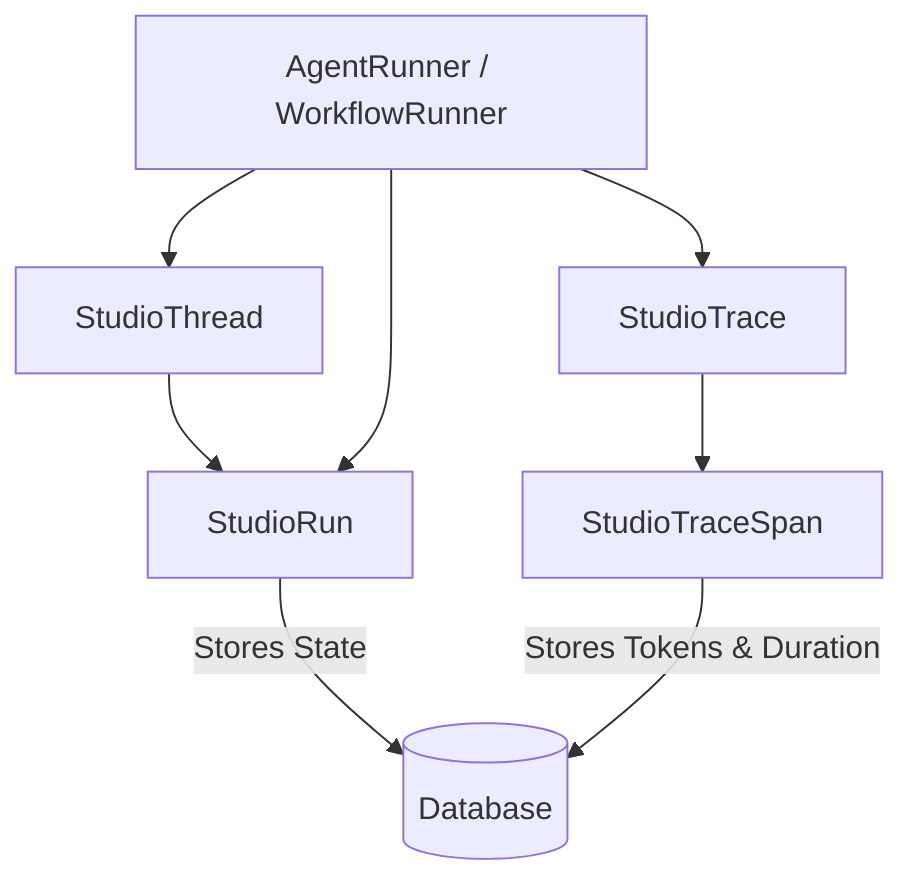

# Unified Runs and Traces Design

**Spec**: `.specs/features/unified-runs-and-traces/spec.md`
**Status**: Draft

---

## Architecture Overview

A arquitetura move-se de um modelo assimétrico para um modelo centralizado baseado em Threads e Runs.

O `StudioRun` atuará como o container de estado (substituindo a dependência de `InMemoryPersistence` para Agents e o antigo `WorkflowCheckpoint`). O `StudioTrace` servirá exclusivamente para telemetria/observabilidade, populando o Neuron Debugger.

---

## Code Reuse Analysis

### Existing Components to Leverage

| Component | Location | How to Use |
| -------------------- | ------------------- | ------------------------- |
| `StudioChatMessage` | `src/Models/` | Será vinculado à nova tabela de Threads (por FK) em vez de usar uma string `thread_id` arbitrária. |
| `WorkflowRunner` | `src/Runtime/` | Aproveitaremos o loop de execução, apenas trocando `WorkflowTrace` por `StudioRun` e disparando eventos APM para `StudioTraceSpan`. |
| `AgentRunner` | `src/Runtime/` | Substituiremos a lógica de salvar o `WorkflowInterrupt` via `InMemoryPersistence` para salvar no banco associado ao `StudioRun`. |

---

## Components

### 1. Model: `StudioThread`
- **Purpose**: Agrupa execuções num contexto conversacional.
- **Location**: `src/Models/StudioThread.php`
- **Interfaces**:
  - Pertence a um Agent ou Workflow (`entity_type`, `entity_id`).
  - `messages()`: HasMany `StudioChatMessage`.
  - `runs()`: HasMany `StudioRun`.

### 2. Model: `StudioRun`
- **Purpose**: Máquina de estado persistente.
- **Location**: `src/Models/StudioRun.php`
- **Interfaces**:
  - `status`, `input`, `output`, `checkpoint_state`.
  - `prompt_tokens`, `completion_tokens`, `total_tokens`.
  - `thread()`: BelongsTo `StudioThread`.
  - `traces()`: HasMany `StudioTrace`.

### 3. Models: `StudioTrace` & `StudioTraceSpan`
- **Purpose**: Observabilidade (Duração, I/O snapshot, Tokens consumidos na etapa).
- **Location**: `src/Models/StudioTrace.php` e `src/Models/StudioTraceSpan.php`

### 4. Controller: `Integration\RunResumeController`
- **Purpose**: Endpoint unificado para retomar agentes ou workflows.
- **Location**: `src/Http/Controllers/Integration/RunResumeController.php`
- **Interfaces**:
  - `POST /api/neuronai/threads/{thread}/runs/{run}/resume/{protocol}`

---

## Data Models

### Database Migrations
Precisaremos de uma migration centralizada: `create_studio_runs_and_traces_tables`.
Dropar as antigas: `workflow_traces`, `workflow_trace_steps`, `workflow_checkpoints`.

---

## Error Handling Strategy

| Error Scenario | Handling | User Impact |
| -------------- | ------------- | ---------------- |
| Provider omitting tokens | Usar valor default (0) | Traces salvos sem quebrar o fluxo. Apenas 0 tokens exibidos. |
| Run state não encontrado | Retornar 404 claro no endpoint de resume | O cliente saberá que a sessão expirou ou não existe. |

---

## Tech Decisions (only non-obvious ones)

| Decision | Choice | Rationale |
| ----------------- | --------------- | ------------- |
| Tabelas unificadas | Prefixo `studio_` configurável | Mantém a flexibilidade do pacote e agnóstico de Agent vs Workflow. |
| Migration Strategy | Dropar legado | O pacote não foi a público; manter tabelas fantasmas criaria dívida técnica. |
