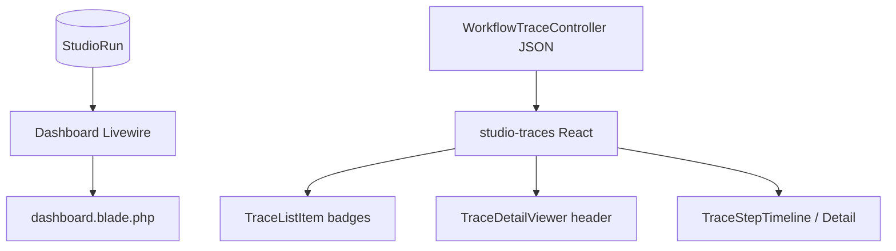

# Usage Analytics Design

**Spec**: [.specs/features/usage-analytics/spec.md](./spec.md)  
**Context**: [.specs/features/m5-analytics-billing/context.md](../m5-analytics-billing/context.md)  
**Depends on**: [cost-estimation/design.md](../cost-estimation/design.md) (tokens work without cost; cost cards need CE)  
**Status**: Approved

---

## Architecture Overview

Minimal Studio surface: extend existing Livewire Dashboard + React Debugger. No new nav item, no charts. Reuse denormalized run totals from CE (and same “exclude children” rule as export for window cards).



---

## Discretion locked

| Topic | Decision |
| ----- | -------- |
| Dashboard window | **Last 30 days** (fixed label in UI: “Last 30 days”) |
| Cost when zero/unpriced | Show `0.00` + currency code |
| Token badge on list | Compact text e.g. `1.2k tok` (format helper) |
| LLM step tokens | Show on timeline chip when `total_tokens > 0` **or** type=`llm` (show `0`) |
| Recent runs table | P3: add Tokens column (include in MVP if trivial — **include**) |
| Cost on Debugger detail | P2 — **include** estimated_cost in header when CE columns exist |

---

## Code Reuse Analysis

| Component | Location | How to Use |
| --------- | -------- | ---------- |
| `Dashboard` Livewire | `src/Http/Livewire/Dashboard.php` | Add aggregations for window |
| Dashboard blade | `resources/views/livewire/dashboard.blade.php` | Extra stat cards + tokens column |
| Trace JSON | `WorkflowTraceController` | Add `estimated_cost` (+ currency) to summaries |
| Trace UI | `resources/js/studio-traces/*` | Badges only |
| `UsageQuery` (UE) | Optional reuse for Dashboard aggregates | Prefer thin local query or shared `UsageQuery::aggregate` to avoid drift |

**Chosen:** Dashboard calls `UsageQuery::aggregate(now()->subDays(30), now(), …)` for totals (same exclude-children rule). If UE not yet merged in a branch, inline equivalent Eloquent in Dashboard then switch — task order CE → UE → UA makes UsageQuery available.

---

## Components

### 1. Dashboard Livewire

Pass to view:

- Existing counts + `recentTraces`
- `usageWindowLabel` = `Last 30 days`
- `usageTotals`: prompt/completion/total tokens, estimated_cost, currency
- Recent runs already loaded — ensure `total_tokens` / `estimated_cost` available on models

### 2. Dashboard blade

- Two new stat cards (or one combined): **Tokens (30d)** and **Est. cost (30d)**
- Recent table: columns Tokens (+ optional Cost). Keep status badge.

### 3. Debugger API deltas

`WorkflowTraceController` list/detail JSON:

- Run level: existing tokens + `estimated_cost`, `currency`
- Span level: existing tokens + `provider`, `model`, `estimated_cost` when present

### 4. Debugger UI

| File | Change |
| ---- | ------ |
| `TraceListItem.jsx` | Badge / secondary line: total tokens |
| `TraceDetailViewer.jsx` | Header: prompt · completion · total · est. cost |
| `TraceStepTimeline.jsx` | Chip for llm spans with tokens |
| `TraceStepDetail.jsx` | Show provider/model/tokens/cost for llm |

Formatting: small util `formatTokens(n)` / `formatCost(decimal, currency)` in `studio-traces` (no new dependency).

### 5. Frontend build

Rebuild Studio traces bundle as existing package script requires (follow repo Vite targets for `studio-traces`).

---

## Data / query

```php
UsageQuery::aggregate(
    from: now()->subDays(30)->startOfDay(),
    to: now(),
    entityType: null,
    entityId: null,
    groupBy: null,
    model: null,
);
```

Same double-count guard: exclude `parent_run_id IS NOT NULL`.

---

## Error Handling

- Empty studio / no runs → zeros on cards
- Missing cost column during partial migrate → defensive `(float) ($run->estimated_cost ?? 0)` 

---

## Testing Strategy

- Livewire/feature: seed top-level runs → Dashboard view has expected totals (child runs not double-counted)
- JS not heavily unit-tested in repo — optional smoke; rely on JSON contract tests for controller fields
- Controller test: JSON includes estimated_cost

---

## Requirement mapping

| ID | Design coverage |
| -- | --------------- |
| UA-01 | Dashboard cards 30d via UsageQuery |
| UA-02 | Debugger list/detail/timeline badges |
| UA-03 | Cost on detail header |
| UA-04 | Recent runs Tokens (+ cost) column |

---

## Documentation

- `docs/guides/dashboard.md` — usage cards
- `docs/guides/analytics/usage.md` — minimal surface + link to export API
- `docs/guides/workflows/runtime-and-traces.md` — Debugger badges
