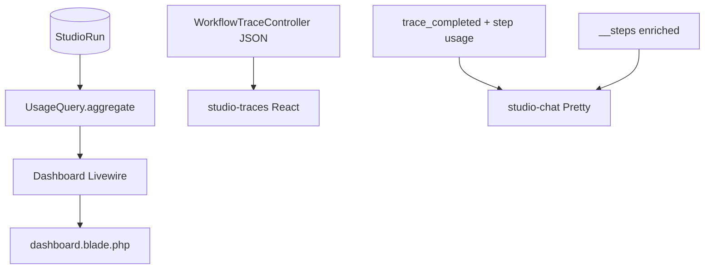

# Usage Analytics Design

**Spec**: [.specs/features/usage-analytics/spec.md](./spec.md)  
**Context**: [.specs/features/m5-analytics-billing/context.md](../m5-analytics-billing/context.md)  
**Depends on**: [cost-estimation/design.md](../cost-estimation/design.md) (done)  
**Status**: Approved (expanded 2026-07-16 — Test Pretty)

---

## Architecture Overview

Minimal Studio surface: Livewire Dashboard + React Debugger + Test harness Pretty. No new nav item, no charts. Reuse denormalized run totals from CE. Window aggregates exclude nested child runs.



---

## Discretion locked

| Topic | Decision |
| ----- | -------- |
| Dashboard window | **Last 30 days** (fixed label) |
| Cost when zero/unpriced | Show `0.00` + currency code |
| Token badge on list | Compact text e.g. `1.2k tok` |
| LLM step tokens (Debugger) | Show when `type=llm` (including `0`) |
| Recent runs table | Include Tokens + Est. cost columns |
| Cost on Debugger detail | Include in header |
| Dashboard aggregate helper | Extract **`UsageQuery::aggregate` only** (partial UE-T2); full export API stays debt |
| Test Pretty run-level | Completed header meta: total tokens + est. cost + currency |
| Test Pretty step-level | Agent/llm content rows: tokens (+ cost if > 0) beside `durationMs` |
| Step usage source | Enrich `__steps` / `step_completed` payload after agent/llm nodes; agent → child run totals; llm → parent llm span |
| Agent playground | Enrich `done` SSE with run usage; show on Completed meta |
| Format helpers | Shared `resources/js/lib/formatUsage.js` used by studio-traces **and** studio-chat |
| Frontend build | Rebuild `chat` + `forms` + `canvas` bundles (no separate traces entry) |

---

## Code Reuse Analysis

| Component | Location | How to Use |
| --------- | -------- | ---------- |
| `Dashboard` Livewire | `src/Http/Livewire/Dashboard.php` | Call `UsageQuery::aggregate` |
| Dashboard blade | `resources/views/livewire/dashboard.blade.php` | Stat cards + Tokens/Cost columns |
| Trace JSON | `src/Http/Controllers/WorkflowTraceController.php` | Add cost/currency + span provider/model/cost |
| Trace UI | `resources/js/studio-traces/*` | Badges; pass tokens through sheet/page mappers |
| Pretty thread | `resources/js/studio-chat/WorkflowThread.jsx`, `utils/workflowOutput.js`, `MessageList.jsx` | Chips |
| SSE | `WorkflowStreamController`, `AgentChatStreamController` | Attach usage on complete |
| Step loop | `GraphExecutionLoop` / executors | Attach node usage onto `__steps` |
| `UsageQuery` | `src/Usage/UsageQuery.php` (**new**, aggregate only) | Dashboard + future UE |

---

## Components

### 1. `UsageQuery` (partial UE-T2)

```php
UsageQuery::aggregate(
    from: Carbon,
    to: Carbon,
    ?entityType: null,
    ?entityId: null,
): array{
  prompt_tokens, completion_tokens, total_tokens,
  estimated_cost, currency, run_count
}
```

- Filter: `started_at` in window, **`parent_run_id` IS NULL**.
- Currency from `config('neuronai-studio.usage.currency')`.
- Defer `group_by` / `runDetail` until full UE.

### 2. Dashboard Livewire + blade

- Pass `usageWindowLabel`, `usageTotals`, currency.
- Cards: **Tokens (30d)**, **Est. cost (30d)** beside existing four.
- Recent table: Tokens + Est. cost.

### 3. Debugger API + UI

`WorkflowTraceController` list/detail:

- Run: existing tokens + `estimated_cost`, `currency`
- Spans: tokens + `provider`, `model`, `estimated_cost`

UI: `TraceListItem`, `TraceDetailViewer`, `TraceStepTimeline`, `TraceStepDetail`; fix `TraceDetailSheet` / Livewire page mappers that currently **drop** token fields.

### 4. Test Pretty (UA-05)

**Backend**

1. After agent/llm node execution, attach to the `__steps` entry (and `step_completed` SSE data when emitted):

| Node | Usage source |
| ---- | ------------ |
| `llm` | Latest llm span on parent run/trace for that inference |
| `agent` | Child `StudioRun` created by `AgentRunner` (`parent_run_id` = workflow run) |

Fields: `prompt_tokens`, `completion_tokens`, `total_tokens`, `estimated_cost`.

2. `trace_completed` SSE payload adds run-level:

```json
{
  "trace_id": "...",
  "status": "completed",
  "output": { "...": "...", "__steps": [/* enriched */] },
  "prompt_tokens": 0,
  "completion_tokens": 0,
  "total_tokens": 0,
  "estimated_cost": "0.000000",
  "currency": "USD"
}
```

(Values from finalized `StudioRun` after `UsageRecorder::finalizeRun`.)

3. Agent playground: `done` (or equivalent complete event) includes the same run-level usage fields from the agent `StudioRun`.

**Frontend**

| File | Change |
| ---- | ------ |
| `workflowOutput.js` | Propagate usage fields into Pretty thread entries |
| `WorkflowThread.jsx` | Chip next to duration (`1.2k tok` / `$0.00`) |
| `MessageList.jsx` | Completed header: run-level usage from `message.meta.usage` |
| `StudioChat.jsx` | On `trace_completed` / agent `done`, store `meta.usage` |

### 5. Format helpers

`resources/js/lib/formatUsage.js`:

- `formatTokens(n)` → `1.2k tok` / `0 tok`
- `formatCost(decimal, currency)` → `USD 0.00`

### 6. Frontend build

`npm run build` (targets: chat, forms, canvas) + publish assets per package convention.

---

## Error Handling

- Empty studio → Dashboard zeros.
- Missing usage on step → omit chip (duration still shows).
- Defensive `(float) ($run->estimated_cost ?? 0)` during partial migrate.

---

## Testing Strategy

- `UsageQueryTest`: empty window; children excluded; sums match.
- `WorkflowTraceControllerTest`: JSON cost/provider fields.
- `DashboardUsageTest`: cards/HTML or Livewire assert.
- Feature/stream test: `trace_completed` includes usage; `__steps` agent/llm entries carry tokens when FakeAIProvider sets Usage.
- JS: no heavy unit suite — rely on build + manual Pretty smoke.

---

## Requirement mapping

| ID | Design coverage |
| -- | --------------- |
| UA-01 | Dashboard cards 30d via UsageQuery |
| UA-02 | Debugger list/detail/timeline badges |
| UA-03 | Cost on Debugger detail header |
| UA-04 | Recent runs Tokens + cost |
| UA-05 | Pretty Completed + agent/llm step chips |

---

## Documentation

- `docs/guides/dashboard.md`
- `docs/guides/analytics/usage.md`
- `docs/guides/workflows/runtime-and-traces.md`
- `docs/guides/agents/playground-and-threads.md`
