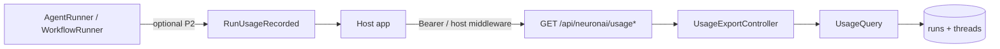

# Usage Export API Design

**Spec**: [.specs/features/usage-export-api/spec.md](./spec.md)  
**Context**: [.specs/features/m5-analytics-billing/context.md](../m5-analytics-billing/context.md)  
**Depends on**: [cost-estimation/design.md](../cost-estimation/design.md)  
**Status**: Approved

---

## Architecture Overview

Host-facing metering API reuses the M4 integration route group (prefix + middleware). A small query service aggregates denormalized token/cost columns on `StudioRun` (after CE parent rollup, workflow runs are billable without joining nested children for window totals).



---

## Discretion locked

| Topic | Decision |
| ----- | -------- |
| Routes | `GET usage`, `GET usage/runs/{run}` under integration prefix |
| Enable flag | `usage.export.enabled` (default `true` when stream_adapters style; gate independently of stream protocols) |
| Events | `usage.events.enabled` default `false`; event `RunUsageRecorded` on terminal run |
| group_by | Support `model` and `entity` in MVP |
| Per-run spans | Include compact `spans` array (llm only) in run detail — cheap, helps reconciliation |
| Empty window | HTTP 200 + zero totals |
| Auth | Host middleware only — package does not add Sanctum |

---

## Code Reuse Analysis

| Component | Location | How to Use |
| --------- | -------- | ---------- |
| `routes/integration.php` | package routes | Append usage routes in same group **or** second gated group sharing prefix/middleware |
| `stream_adapters.route_prefix` / `middleware` | config | Reuse for export (document that usage rides the same host gate) |
| `StudioRun` / `StudioThread` | models | Aggregate + morph filters |
| CE denormalized columns | runs/spans | Sum `prompt_tokens`, `completion_tokens`, `total_tokens`, `estimated_cost` |

**Note:** Export registration should not require `stream_adapters.enabled`. If stream adapters are off but export is on, still register a route group with the **same** prefix/middleware values from `stream_adapters.*` (or duplicate keys under `usage.export.route_prefix` that default to the stream_adapters values).  

**Chosen:** `usage.export` uses:

```php
'route_prefix' => env(..., null), // null ⇒ fall back to stream_adapters.route_prefix
'middleware' => null,             // null ⇒ fall back to stream_adapters.middleware
'enabled' => env('NEURONAI_STUDIO_USAGE_EXPORT_ENABLED', true),
```

Service provider loads usage routes when `usage.export.enabled` regardless of stream_adapters flag.

---

## Components

### 1. Config extensions (same `usage` tree as CE)

```php
'usage' => [
    // … currency, pricing from CE …
    'export' => [
        'enabled' => env('NEURONAI_STUDIO_USAGE_EXPORT_ENABLED', true),
        'route_prefix' => env('NEURONAI_STUDIO_USAGE_EXPORT_PREFIX'), // nullable → fallback
        'middleware' => null, // or env-parsed array; null → fallback
    ],
    'events' => [
        'enabled' => env('NEURONAI_STUDIO_USAGE_EVENTS_ENABLED', false),
    ],
],
```

### 2. `UsageQuery`

- **Location**: `src/Usage/UsageQuery.php`
- **Interfaces**:
  - `aggregate(Carbon $from, Carbon $to, ?string $entityType, ?string $entityId, ?string $groupBy, ?string $model): array`
  - `runDetail(string $runId): ?array`
- **Aggregate rules**:
  - Base: `StudioRun` where `started_at` in `[from, to]` (inclusive day bounds OK if date-only).
  - **Exclude child runs** (`parent_run_id IS NOT NULL`) from window totals to avoid double-counting after parent rollup.
  - Filter entity via `whereHas('thread', … entity_type/entity_id)`. Map query `entity_type=agent|workflow` → FQCN.
  - `group_by=entity`: group by thread entity.
  - `group_by=model`: aggregate from **llm spans** joined through run (only top-level runs’ own spans + …). Because cost rolled to parent but spans stay on children, **model breakdown must query spans** whose run is either top-level in window **or** child of top-level in window. Simpler approach: for `group_by=model`, aggregate llm spans with `started_at` in window (span time), ignore run parent filter. Document this.
- **runDetail**: load run + thread entity + llm spans (provider, model, tokens, estimated_cost). Include `parent_run_id` and `is_child` for clarity.

### 3. `UsageExportController`

- **Location**: `src/Http/Controllers/Integration/UsageExportController.php`
- **Methods**:
  - `index(Request): JsonResponse` — validate `from`, `to` (required), optional filters
  - `showRun(string $run): JsonResponse`
- **Validation**: `from`/`to` present, `from <= to`, else 422.

### 4. Routes

```php
// routes/usage.php (new) — loaded when usage.export.enabled
Route::prefix(...)->middleware(...)->name('neuronai-studio.usage.')->group(function () {
    Route::get('usage', [UsageExportController::class, 'index'])->name('aggregate');
    Route::get('usage/runs/{run}', [UsageExportController::class, 'showRun'])->name('runs.show');
});
```

### 5. Event (P2)

- **Class**: `DigitalElvis\NeuronAIStudio\Events\RunUsageRecorded`
- **Payload**: run id, thread id, entity_type/id, status, tokens, estimated_cost, currency, finished_at
- **Dispatch**: AgentRunner / WorkflowRunner on terminal status when `usage.events.enabled`
- Child nested runs: fire event too (host can ignore `parent_run_id != null` if using parent only)

---

## Response shapes

### `GET /usage?from=&to=`

```json
{
  "currency": "USD",
  "from": "2026-07-01T00:00:00+00:00",
  "to": "2026-07-15T23:59:59+00:00",
  "totals": {
    "prompt_tokens": 1200,
    "completion_tokens": 400,
    "total_tokens": 1600,
    "estimated_cost": "0.012500",
    "run_count": 12
  },
  "breakdown": []
}
```

With `group_by=model`, `breakdown` entries: `{ "provider", "model", "prompt_tokens", "completion_tokens", "total_tokens", "estimated_cost" }`.

### `GET /usage/runs/{run}`

```json
{
  "id": "…",
  "thread_id": "…",
  "parent_run_id": null,
  "entity": { "type": "workflow", "id": 1, "name": "…" },
  "status": "completed",
  "prompt_tokens": 100,
  "completion_tokens": 50,
  "total_tokens": 150,
  "estimated_cost": "0.001200",
  "currency": "USD",
  "started_at": "…",
  "finished_at": "…",
  "spans": [
    {
      "id": "…",
      "provider": "openai",
      "model": "gpt-4o-mini",
      "prompt_tokens": 100,
      "completion_tokens": 50,
      "total_tokens": 150,
      "estimated_cost": "0.001200"
    }
  ]
}
```

For parent workflow runs, `spans` listed are **own** llm spans only; totals include children (document). Optional later: `?include_child_spans=1`.

---

## Error Handling

| Case | Response |
| ---- | -------- |
| Invalid dates / from > to | 422 JSON errors |
| Run missing | 404 |
| Export disabled | routes absent → 404 |
| Unpriced models | cost `0` in totals |

---

## Testing Strategy

- Feature tests with `usage.export.enabled`, acting as API (middleware `api` or none in Orchestra).
- Aggregate excludes children; parent totals match seed.
- `group_by=model` from spans.
- Events faked when enabled.

---

## Requirement mapping

| ID | Design coverage |
| -- | --------------- |
| UE-01 | UsageQuery + route `usage` |
| UE-02 | `usage/runs/{run}` + spans |
| UE-03 | `RunUsageRecorded` + config flag |
| UE-04 | `model` query filter on aggregate (span-scoped) |

---

## Documentation

- `docs/guides/analytics/export-api.md`
- `docs/reference/configuration.md` — export/events
- `docs/getting-started/installation.md` — enable + middleware note
