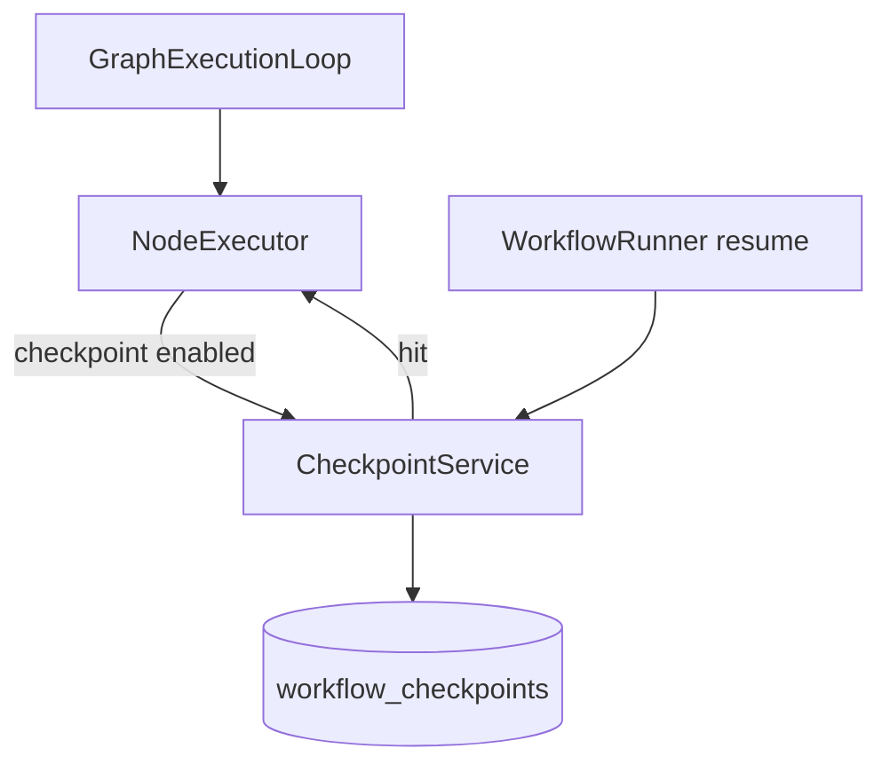

# Checkpoints e Persistência em Workflows — Design

## Visão de arquitetura



## Componentes backend

| Componente | Caminho |
|------------|---------|
| `CheckpointService` | `src/Runtime/Checkpoint/CheckpointService.php` |
| `WorkflowCheckpoint` model | `src/Models/WorkflowCheckpoint.php` |
| `NodeExecutorInterface` | wrapper `CheckpointingExecutor` decorator |
| `EloquentPersistence` | `src/Runtime/Persistence/EloquentPersistence.php` |
| `WorkflowRunner` | consultar checkpoint antes de `runFromNode` |

### Chave de checkpoint

```
sha256(trace_id | node_id | loop_iteration | input_hash)
```

### Decorator pattern

```php
if ($config['checkpoint'] ?? false) {
    if ($cached = $this->checkpoints->get($key)) {
        $state->merge($cached);
        return $cached['handle'];
    }
    $handle = $this->inner->execute(...);
    $this->checkpoints->put($key, $state->snapshot(), $handle);
}
```

## Frontend

Trace detail: ícone cache em `resources/js/studio-forms/WorkflowTrace/` (se existir) ou blade.

## Migrações

```php
Schema::create('neuronai_studio_workflow_checkpoints', function (Blueprint $table) {
    $table->id();
    $table->foreignId('workflow_trace_id')->constrained(...);
    $table->string('node_id');
    $table->unsignedInteger('iteration')->default(0);
    $table->string('input_hash', 64);
    $table->json('state_payload');
    $table->string('handle')->nullable();
    $table->timestamps();
    $table->unique(['workflow_trace_id', 'node_id', 'iteration']);
});
```

## API

Sem endpoints novos — comportamento interno no resume. Opcional `DELETE /traces/{id}/checkpoints` para debug.

## Codegen

Nós exportados usam `$this->checkpoint('key', fn() => ...)` do Neuron Node base.

## Integração NeuronAI (neuron-workflow-architect)

- `$this->checkpoint()` em nodes
- `InMemoryPersistence` vs `EloquentPersistence` para native runs
- Parallel branches: checkpoint por branch

## Plano de documentação

| Arquivo | Outline |
|---------|---------|
| `guides/workflows/runtime-and-traces.md` | `## Checkpoints` |
| `reference/database-schema.md` | Tabela checkpoints |

## Dependências

- `workflow-cyclic-graphs` — iteration scope
- `workflow-tool-approval` / Human HITL — resume paths
- `workflow-parallel-execution` — branch-scoped checkpoints
