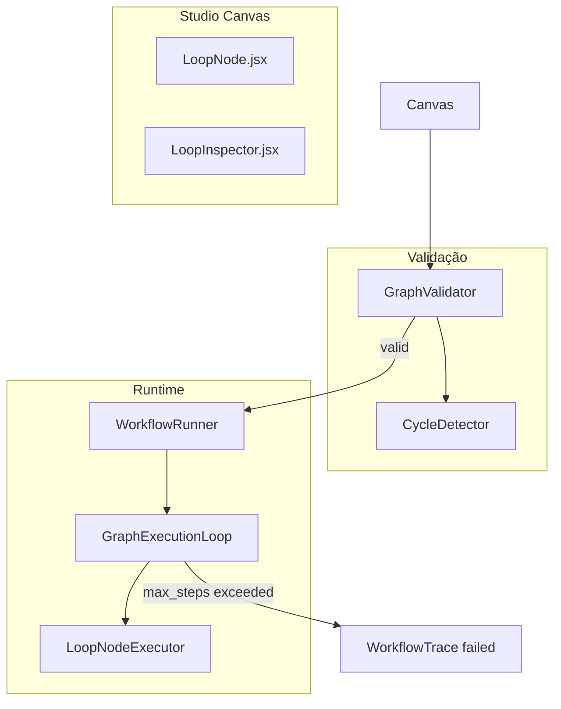

# Grafos Cíclicos em Workflows — Design

## Visão de arquitetura



O nó `loop` atua como **guardião do ciclo**: incrementa contador, roteia por handle `continue` (volta ao corpo) ou `exit` (sai do ciclo). O `GraphValidator` usa DFS para detectar ciclos; back-edges são permitidos apenas quando existe configuração explícita de `max_steps` no workflow ou no nó loop envolvido.

## Componentes backend (PHP)

| Componente | Caminho | Responsabilidade |
|------------|---------|------------------|
| `LoopNodeExecutor` | `src/Runtime/NodeExecutors/LoopNodeExecutor.php` | Lê `max_steps`, incrementa `__loop_iterations.{nodeId}`, retorna handle `continue` ou `exit` |
| `GraphExecutionLoop` | `src/Runtime/GraphExecutionLoop.php` | Guardrail global opcional; emite `loop_iteration` em steps |
| `GraphValidator` | `src/Runtime/GraphValidator.php` | `detectCycles()`, relaxa regra `canReachStop` para subgrafos com loop |
| `CycleDetector` | `src/Runtime/CycleDetector.php` | DFS com classificação back-edge / cross-edge |
| `LoopNodeCodeGenerator` | `src/Codegen/NodeCodeGenerators/LoopNodeCodeGenerator.php` | Export Neuron com contador e branch |
| Config | `config/neuronai-studio.php` | `node_types.loop`, `loop.default_max_steps` |

### LoopNodeExecutor (comportamento)

```php
// Pseudocódigo
$iterations = (int) $state->get("__loop_iterations.{$nodeId}", 0) + 1;
$maxSteps = (int) ($data['max_steps'] ?? config('neuronai-studio.loop.default_max_steps', 10));
$state->set("__loop_iterations.{$nodeId}", $iterations);

if ($iterations >= $maxSteps) {
    return 'exit'; // ou throw MaxLoopIterationsException se sem handle exit
}
return $data['condition_met'] ? 'exit' : 'continue'; // condition via state_key opcional
```

### GraphValidator — regras de ciclo

1. Sem nó `loop` e com back-edge → erro: `Cyclic graph requires a loop node with max_steps.`
2. Com nó `loop` e `max_steps` > 0 → permitir ciclos contidos no subgrafo alcançável a partir do `continue` do loop.
3. Manter regra existente: exatamente um `start`, ≥1 `stop`, tipos registrados.

## Componentes frontend

| Componente | Caminho |
|------------|---------|
| `LoopNode.jsx` | `resources/js/studio-canvas/nodes/LoopNode.jsx` |
| Inspector do loop | `resources/js/studio-canvas/inspectors/LoopInspector.jsx` |
| Validação client-side | `resources/js/studio-canvas/utils/graphValidation.js` |
| Palette | `resources/js/studio-canvas/nodePalette.js` — categoria `logic` |

Handles React Flow: `continue` (entrada do corpo), `exit` (saída), `default` (entrada do loop).

## Migrações de banco

Nenhuma migração obrigatória — configuração vive no JSON `graph` do `WorkflowDefinition`. Opcional: coluna `graph_meta.max_loop_steps` em `neuronai_studio_workflow_definitions` para override global por workflow.

## API / eventos SSE

| Evento | Payload | Quando |
|--------|---------|--------|
| `loop_iteration` | `{ node_id, iteration, max_steps }` | A cada passagem pelo nó loop |
| `step_started` / `step_completed` | existentes | Incluir `iteration` quando aplicável |
| `trace_failed` | `{ message: 'Max loop iterations exceeded' }` | Estouro de guardrail |

Endpoints existentes permanecem: `POST /workflows/{workflow}/run/stream`, resume stream.

## Impacto em codegen

- `NativeWorkflowExporter` registra `LoopNodeCodeGenerator` em `NodeCodeGeneratorRegistry`.
- `GraphTranspiler` mapeia handles `continue`/`exit` para eventos tipados (ex.: `LoopContinueEvent`, `LoopExitEvent`).
- Template lead-qualification-loop versionado em `config/neuronai-studio.php` → `templates`.

Padrão Neuron (neuron-workflow-architect): loop implementado como nó que retorna evento diferente por iteração, com guardrail explícito — não `while` infinito no export.

## Integração NeuronAI

- **Workflow**: nó customizado com `__invoke` retornando eventos distintos por handle; alinhado ao padrão event-driven do framework.
- **Guardrails**: equivalente conceitual a limitar iterações em agentic loops; `max_steps` é o contrato Studio ↔ runtime.
- **Checkpoints** (futuro `workflow-checkpoints-persistence`): iterações dentro de loop podem reutilizar checkpoint por `nodeId` + `iteration`.

## Plano de documentação

| Arquivo | Seções a adicionar |
|---------|-------------------|
| `guides/workflows/node-types/flow-nodes.md` | `## Nó Loop` — propriedades, handles, diagrama |
| `guides/workflows/state-and-conditions.md` | `## Iterações de loop` — chaves de estado |
| `guides/workflows/overview.md` | `## Grafos cíclicos` — DAG vs cíclico controlado |
| `guides/workflows/runtime-and-traces.md` | `## Eventos loop_iteration` |
| `guides/templates.md` | `## Lead Qualification (loop)` |
| `reference/configuration.md` | `### Loop defaults` |
| `extending/custom-node-types.md` | `### Nós com guardrails` |

## Dependências

- **Nenhuma** feature upstream obrigatória — fundação para `autonomous-multimodal-agents`.
- **Desbloqueia**: `autonomous-multimodal-agents` (re-parse multimodal), `workflow-checkpoints-persistence` (resume em loop).
- **Relacionado**: `studio-test-harness` (testar loops via chat), `workflow-code-bridge` (export/import de grafos cíclicos).
