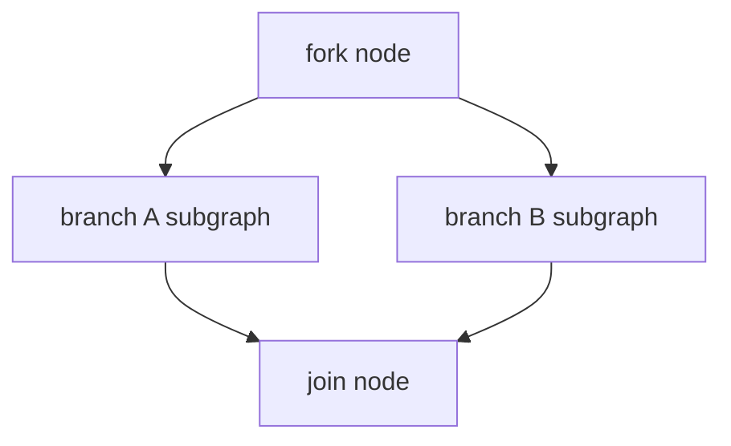

# Execução Paralela em Workflows — Design

## Visão de arquitetura



Runtime interpretado simula `ParallelEvent` do Neuron: executor interno `ParallelBranchRunner` roda subgrafos com estado isolado por branch, merge no join.

## Componentes backend

| Componente | Caminho |
|------------|---------|
| `ForkNodeExecutor` | `src/Runtime/NodeExecutors/ForkNodeExecutor.php` |
| `JoinNodeExecutor` | `src/Runtime/NodeExecutors/JoinNodeExecutor.php` |
| `ParallelBranchRunner` | `src/Runtime/ParallelBranchRunner.php` |
| `BranchInterruptHandler` | `src/Runtime/BranchInterruptHandler.php` |
| `GraphValidator` | regras fork/join pairing |
| `ForkNodeCodeGenerator` | `src/Codegen/NodeCodeGenerators/ForkNodeCodeGenerator.php` |
| `JoinNodeCodeGenerator` | `src/Codegen/NodeCodeGenerators/JoinNodeCodeGenerator.php` |

### Fork executor (interpretado)

```php
$branches = $data['branches']; // ['extract' => 'node_id_a', 'describe' => 'node_id_b']
$results = $this->branchRunner->runAll($branches, $state, $graphContext);
$state->set('__parallel_pending', $results);
return 'default'; // edge para join após subgrafos
```

## Frontend

| Componente | Caminho |
|------------|---------|
| `ForkNode.jsx` / `JoinNode.jsx` | `resources/js/studio-canvas/nodes/` |
| Inspectors | branch editor, merge key |

## Migrações

Nenhuma — config no graph JSON. Trace steps podem incluir `branch_id`.

## API / SSE

| Evento | Payload |
|--------|---------|
| `branch_started` | `{ fork_id, branch_id }` |
| `branch_completed` | `{ fork_id, branch_id, duration_ms }` |
| `parallel_interrupt` | `{ fork_id, branch_id, reason }` |

## Codegen

- `GraphTranspiler` gera `Events/*ParallelEvent.php`
- Fork node returns `new XParallelEvent([...])`
- Join node `__invoke(XParallelEvent $e, ...)`

Alinhado a neuron-workflow-architect seção **Parallel Execution**.

## Integração NeuronAI

- `ParallelEvent`, `AsyncExecutor`, `WorkflowInterrupt::isParallelInterrupt()`
- Checkpoints por branch node
- Resume: `$workflow->init($interrupt->getRequest())->run()`

## Plano de documentação

| Arquivo | Outline |
|---------|---------|
| `guides/workflows/node-types/logic-nodes.md` | `## Fork` / `## Join` |
| `guides/workflows/runtime-and-traces.md` | `## Execução paralela` |
| `guides/workflows/human-in-the-loop.md` | `## Branches paralelas` |

## Dependências

- `workflow-cyclic-graphs` — ortogonal; cuidado validação grafo
- `workflow-checkpoints-persistence` — recomendada para resume eficiente
- `workflow-tool-approval` — approval em branch

## Decisão em aberto

Runtime **interpretado** vs delegar 100% ao Neuron native `Workflow` para paralelo — preferir native export path quando `class_path` setado; interpretado para Studio graphs sem export.
