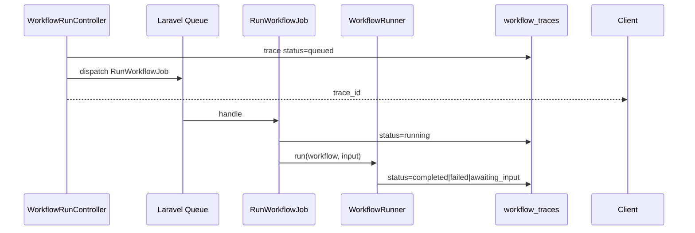

# Queue Runner para Workflows — Design

## Visão de arquitetura



## Componentes backend

| Componente | Caminho |
|------------|---------|
| `RunWorkflowJob` | `src/Jobs/RunWorkflowJob.php` |
| `ResumeWorkflowJob` | `src/Jobs/ResumeWorkflowJob.php` |
| `WorkflowRunController` | `src/Http/Controllers/WorkflowRunController.php` |
| `WorkflowRunner` | método `dispatch(WorkflowDefinition, input)` |
| Routes | `routes/studio.php` |

### RunWorkflowJob

```php
class RunWorkflowJob implements ShouldQueue
{
    public function __construct(
        public int $traceId,
        public int $workflowId,
        public array $input,
    ) {
        $this->onQueue(config('neuronai-studio.queue'));
        if ($connection = config('neuronai-studio.queue_connection')) {
            $this->onConnection($connection);
        }
    }

    public function handle(WorkflowRunner $runner): void
    {
        $trace = WorkflowTrace::findOrFail($this->traceId);
        $workflow = WorkflowDefinition::findOrFail($this->workflowId);
        $trace->update(['status' => 'running']);
        $runner->run($workflow, $this->input, emitter: null); // ou broadcast
    }
}
```

## Frontend

Test harness permanece síncrono (SSE). Opcional: toggle "Run in background" no Playground.

## Migrações

`workflow_traces.status` aceita `queued`. Coluna `job_id` opcional.

## API

| Método | Path | Propósito |
|--------|------|-----------|
| POST | `/workflows/{id}/run` | Enfileira, retorna trace_id |
| GET | `/workflows/traces/{id}` | Status polling |
| POST | `/workflows/traces/{id}/resume` | Enfileira resume |

SSE stream existente permanece para modo síncrono.

## Codegen

Sem impacto — jobs são runtime Studio.

## Integração NeuronAI

Jobs executam mesmo `WorkflowRunner` que interpreta grafos ou native `Workflow` class.

## Plano de documentação

| Arquivo | Outline |
|---------|---------|
| `guides/workflows/runtime-and-traces.md` | `## Queue runner` |
| `guides/export-and-production.md` | `### Workers` |
| `reference/configuration.md` | `### Queue` |

## Dependências

- `autonomous-multimodal-agents` — runs longos beneficiam queue
- `workflow-checkpoints-persistence` — resume jobs
- Todas features que estendem duração do run

## Decisão em aberto

Emitter SSE em job: usar Laravel broadcasting / polling apenas na v1; não bloquear job tentando SSE.
