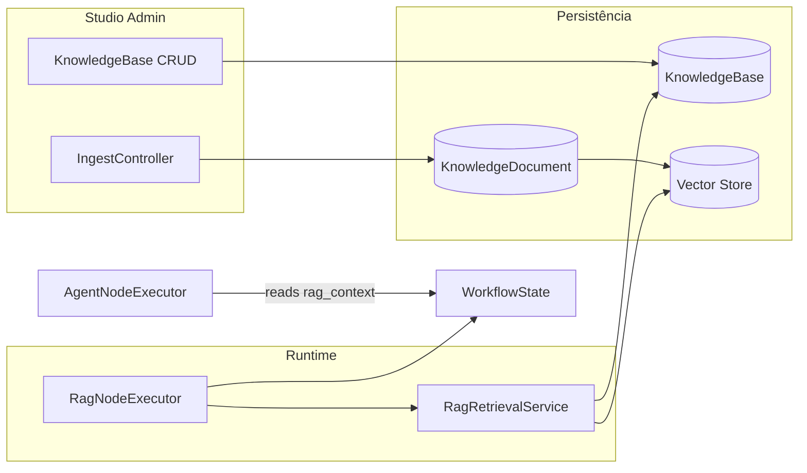

# RAG em Workflows — Design

> **Status de implementação:** **Fatia 1** (backend) entregue — models, migrations, `EmbeddingsFactory`, `VectorStoreFactory`, `RagRetrievalService`, `DocumentIngestService`, `RagNodeExecutor` real e dot-notation no `StateTemplateInterpolator`. **Fatia 2** (Studio UI) entregue — CRUD Livewire de knowledge bases, ingest (upload + texto) via `WithFileUploads`, `RagFields` inspector no canvas com binding `knowledge_base_id`/query/top_k/threshold/output_key + debug search (`KnowledgeBaseSearchController`), exposição de KBs ao canvas. Suíte 213 verde (10 testes novos). **Fatia 3** (`RagNodeCodeGenerator`, docs `docs/`) ainda **não implementada** — marcada como _planejado_ abaixo.

## Visão de arquitetura



## Componentes backend (PHP)

| Componente | Caminho | Status |
|------------|---------|--------|
| `KnowledgeBase` model | `src/Models/KnowledgeBase.php` | ✅ Fatia 1 |
| `KnowledgeDocument` model | `src/Models/KnowledgeDocument.php` | ✅ Fatia 1 |
| `RagRetrievalService` | `src/Runtime/Rag/RagRetrievalService.php` | ✅ Fatia 1 |
| `DocumentIngestService` | `src/Runtime/Rag/DocumentIngestService.php` | ✅ Fatia 1 |
| `RagNodeExecutor` | `src/Runtime/NodeExecutors/RagNodeExecutor.php` — stub substituído | ✅ Fatia 1 |
| `EmbeddingsFactory` | `src/Runtime/Rag/EmbeddingsFactory.php` | ✅ Fatia 1 |
| `VectorStoreFactory` | `src/Runtime/Rag/VectorStoreFactory.php` | ✅ Fatia 1 |
| `KnowledgeBases\Index` (Livewire) | `src/Http/Livewire/KnowledgeBases/Index.php` | ✅ Fatia 2 |
| `KnowledgeBases\Edit` (Livewire, ingest via `WithFileUploads`) | `src/Http/Livewire/KnowledgeBases/Edit.php` | ✅ Fatia 2 |
| `KnowledgeBaseSearchController` (debug search JSON p/ canvas) | `src/Http/Controllers/KnowledgeBaseSearchController.php` | ✅ Fatia 2 |

> **Nota de convenção:** o Studio faz CRUD via componentes Livewire (padrão agents/tools/mcp), não controllers REST. Ingest é tratado no próprio `KnowledgeBases\Edit` (upload de arquivo → `DocumentIngestService::ingestFile`; texto colado → `ingestText`). Só o debug search do canvas usa um controller fino (React precisa de endpoint HTTP).

### RagNodeExecutor ✅ Fatia 1

Implementado em `src/Runtime/NodeExecutors/RagNodeExecutor.php`. Requer `knowledge_base_id` (lança `RuntimeException` se ausente). O `query` faz fallback para `state.input` quando vazio e é interpolado. Além de `query`/`results`/`knowledge_base_id`, o executor também grava `context` (chunks concatenados via `toContext()`), `chunk_count` e `top_score`. Emite um step `rag_query` quando o state é `BuilderWorkflowState`.

```php
$outputKey = $data['output_key'] ?? 'rag_context';
$rawQuery = $data['query'] ?? '';
if ($rawQuery === '') {
    $rawQuery = (string) $state->get('input', '');
}
$query = StateTemplateInterpolator::interpolate($rawQuery, $state);

if (empty($data['knowledge_base_id'])) {
    throw new RuntimeException('RAG node requires a knowledge_base_id.');
}
$kb = KnowledgeBase::findOrFail($data['knowledge_base_id']);

$results = $this->retrieval->search($kb, $query, [
    'top_k' => $data['top_k'] ?? null,
    'threshold' => $data['threshold'] ?? null,
]);
$context = $this->retrieval->toContext($results);
$topScore = $results !== [] ? (float) $results[0]['score'] : 0.0;

$state->set($outputKey, [
    'query' => $query,
    'results' => $results,
    'context' => $context,
    'knowledge_base_id' => $kb->getKey(),
    'chunk_count' => count($results),
    'top_score' => $topScore,
]);
// BuilderWorkflowState → emitStep('rag_query', {...})
```

> **Consumo downstream:** o agent lê o contexto recuperado via interpolação com dot-notation, ex. `{{ rag_context.context }}` no prompt/query — habilitado pelo aprimoramento do `StateTemplateInterpolator` (ver abaixo).

### StateTemplateInterpolator (dot-notation) ✅ Fatia 1

`StateTemplateInterpolator::interpolate()` agora aceita dot-notation e espaços em volta do placeholder (ex. `{{ rag_context.context }}`) resolvendo via `WorkflowStateValue::get`. Compatível com placeholders simples existentes (`{{ input }}`).

### KnowledgeBase (campos principais)

- `name`, `slug`, `description`
- `embeddings_provider`, `embeddings_model`
- `vector_store_driver`, `vector_store_config` (JSON)
- `retrieval_defaults` (top_k, threshold)
- `metadata`, `source`, `class_path` (paridade AgentDefinition)

## Componentes frontend ✅ Fatia 2

O CRUD de knowledge bases é Blade + Livewire (não React), seguindo o padrão de MCP servers. Apenas o inspector do nó `rag` no canvas é React.

| Componente | Caminho | Status |
|------------|---------|--------|
| KB index (lista + filtro + delete) | `resources/views/livewire/knowledge-bases/index.blade.php` | ✅ Fatia 2 |
| KB edit (metadata + ingest + docs + preview) | `resources/views/livewire/knowledge-bases/edit.blade.php` | ✅ Fatia 2 |
| Rag inspector (binding KB/query/top_k/threshold/output_key + preview) | `resources/js/studio-canvas/inspector/shared/RagFields.jsx` | ✅ Fatia 2 |
| Rag config no `NodeConfigForm` | `resources/js/studio-canvas/inspector/NodeConfigForm.jsx` (bloco `rag`) | ✅ Fatia 2 |
| Nav link + header action | `layouts/app.blade.php`, `partials/header-actions/new-knowledge-base.blade.php` | ✅ Fatia 2 |

> O nó `rag` no canvas reusa `WorkflowNode` (label via `node_types` config); não foi necessário um `RagNode.jsx` dedicado. KBs são expostas ao canvas via `knowledgeBasesForCanvas` no `Workflows\Editor` + `knowledgeBases`/`ragSearchUrlTemplate` no config do editor.

## Migrações ✅ Fatia 1

As tabelas usam nomes **sem prefixo** (`knowledge_bases` / `knowledge_documents`), seguindo a convenção das migrations existentes `agent_definitions` / `workflow_definitions` (que não aplicam `table_prefix`).

```php
// knowledge_bases
Schema::create('knowledge_bases', ...);
// name, slug (unique), description, embeddings_provider, embeddings_model,
// vector_store_driver, vector_store_config, retrieval_defaults, metadata, source, class_path

// knowledge_documents
Schema::create('knowledge_documents', ...);
// knowledge_base_id (fk cascade), name, source_type, storage_key, mime,
// chunk_count, status, error, metadata
```

## API ✅ Fatia 2

Rotas sob o prefixo/middleware do Studio (`neuronai-studio.knowledge-bases.*`):

| Método | Path | Propósito | Status |
|--------|------|-----------|--------|
| GET | `/knowledge-bases` | Lista (Livewire `Index`) | ✅ |
| GET | `/knowledge-bases/create` | Criar (Livewire `Edit`) | ✅ |
| GET | `/knowledge-bases/{knowledgeBase}/edit` | Editar + ingest + preview (Livewire `Edit`) | ✅ |
| POST | `/knowledge-bases/{knowledgeBase}/search` | Debug search JSON (canvas inspector) | ✅ |

> Ingest/upload/lista de documentos são ações Livewire dentro do `Edit` (`ingestUpload`, `ingestManualText`, `deleteDocument`, `runSearch`), não rotas REST dedicadas. `top_k`/`threshold`/`storage_path` seguem defaults do `config('neuronai-studio.rag')`.

O executor já emite step `rag_query` (query, knowledge_base_id, chunk_count, top_score) no harness via SSE. Broadcast dedicado permanece fora de escopo.

## Impacto em codegen ⏳ Fatia 3 (planejado)

- `RagNodeCodeGenerator` — referenciar classe `RAG` exportada ou inline `RetrievalNode` pattern. _(planejado)_
- `NativeWorkflowExporter` — opcional export de `KnowledgeBase` companion class. _(planejado)_
- `config/neuronai-studio.php` — ✅ Fatia 1: seção `rag` adicionada (default_vector_store `file`, `storage_path`, `vector_stores`, default embeddings `openai`/`text-embedding-3-small`, providers `embeddings`, `retrieval` top_k/threshold, `chunk` max_words/overlap_words).

## Integração NeuronAI (neuron-rag-specialist)

- `RAG` class com `embeddings()`, `vectorStore()`, retrieval via `retrieve()` / vector search.
- Vector stores: Pinecone, Chroma, etc. via `VectorStoreFactory`.
- Document loaders para PDF/texto no ingest.
- Modo retrieval-only: usar APIs de search sem `chat()` — alimentar agent downstream com contexto concatenado.

## Plano de documentação ⏳ Fatia 3 (planejado)

_Arquivos em `docs/` ainda não escritos._

| Arquivo | Outline |
|---------|---------|
| `guides/workflows/node-types/ai-nodes.md` | `## Nó RAG` — binding KB, query template, output |
| `guides/agents/overview.md` | `## Knowledge Bases` |
| `guides/workflows/overview.md` | `## Padrão RAG → Agent` |
| `guides/workflows/runtime-and-traces.md` | `## Metadados RAG em traces` |
| `reference/database-schema.md` | Tabelas KB |
| `reference/configuration.md` | `rag.vector_stores`, embeddings |
| `getting-started/quickstart-first-workflow.md` | Tutorial RAG |

## Dependências

| Feature | Tipo |
|---------|------|
| `autonomous-multimodal-agents` | Recomendada — agent consome `rag_context` |
| `workflow-cyclic-graphs` | Opcional — re-query em loop |
| `studio-test-harness` | Existente — test + inspector |
