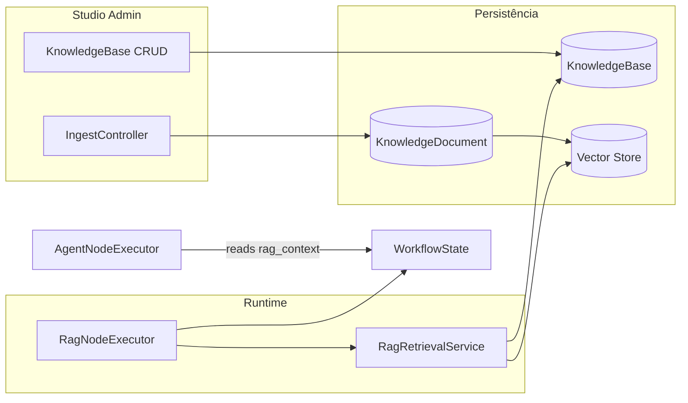

# RAG em Workflows — Design

## Visão de arquitetura



## Componentes backend (PHP)

| Componente | Caminho |
|------------|---------|
| `KnowledgeBase` model | `src/Models/KnowledgeBase.php` |
| `KnowledgeDocument` model | `src/Models/KnowledgeDocument.php` |
| `RagRetrievalService` | `src/Runtime/Rag/RagRetrievalService.php` |
| `DocumentIngestService` | `src/Runtime/Rag/DocumentIngestService.php` |
| `RagNodeExecutor` | `src/Runtime/NodeExecutors/RagNodeExecutor.php` — substituir stub |
| `KnowledgeBaseController` | `src/Http/Controllers/KnowledgeBaseController.php` |
| `KnowledgeIngestController` | `src/Http/Controllers/KnowledgeIngestController.php` |
| `VectorStoreFactory` | `src/Runtime/Rag/VectorStoreFactory.php` |
| `EmbeddingsFactory` | `src/Runtime/Rag/EmbeddingsFactory.php` |

### RagNodeExecutor

```php
$kb = KnowledgeBase::findOrFail($data['knowledge_base_id']);
$query = StateTemplateInterpolator::interpolate($data['query'] ?? '', $state);
$results = $this->retrieval->search($kb, $query, [
    'top_k' => $data['top_k'] ?? 5,
    'threshold' => $data['threshold'] ?? null,
]);
$state->set($outputKey, [
    'query' => $query,
    'results' => $results,
    'knowledge_base_id' => $kb->id,
]);
```

### KnowledgeBase (campos principais)

- `name`, `slug`, `description`
- `embeddings_provider`, `embeddings_model`
- `vector_store_driver`, `vector_store_config` (JSON)
- `retrieval_defaults` (top_k, threshold)
- `metadata`, `source`, `class_path` (paridade AgentDefinition)

## Componentes frontend

| Componente | Caminho |
|------------|---------|
| Knowledge bases index | `resources/js/studio-forms/KnowledgeBases/` |
| Rag inspector | `resources/js/studio-canvas/inspectors/RagInspector.jsx` |
| Rag node | `resources/js/studio-canvas/nodes/RagNode.jsx` |
| Ingest UI | upload + status na KB edit page |

## Migrações

```php
// knowledge_bases
Schema::create('neuronai_studio_knowledge_bases', ...);

// knowledge_documents  
Schema::create('neuronai_studio_knowledge_documents', ...);
// knowledge_base_id, storage_key, mime, chunk_count, status, error
```

## API

| Método | Path | Propósito |
|--------|------|-----------|
| GET/POST | `/knowledge-bases` | CRUD |
| POST | `/knowledge-bases/{id}/ingest` | Upload + chunk + embed |
| GET | `/knowledge-bases/{id}/documents` | Lista documentos |
| POST | `/knowledge-bases/{id}/search` | Debug search (inspector) |

SSE workflow: `step_completed` inclui `rag_meta: { chunk_count, top_score }`.

## Impacto em codegen

- `RagNodeCodeGenerator` — referenciar classe `RAG` exportada ou inline `RetrievalNode` pattern.
- `NativeWorkflowExporter` — opcional export de `KnowledgeBase` companion class.
- `config/neuronai-studio.php` — drivers vector store permitidos.

## Integração NeuronAI (neuron-rag-specialist)

- `RAG` class com `embeddings()`, `vectorStore()`, retrieval via `retrieve()` / vector search.
- Vector stores: Pinecone, Chroma, etc. via `VectorStoreFactory`.
- Document loaders para PDF/texto no ingest.
- Modo retrieval-only: usar APIs de search sem `chat()` — alimentar agent downstream com contexto concatenado.

## Plano de documentação

| Arquivo | Outline |
|---------|---------|
| `guides/workflows/node-types/ai-nodes.md` | `## Nó RAG` — binding KB, query template, output |
| `guides/agents/overview.md` | `## Knowledge Bases` |
| `guides/workflows/overview.md` | `## Padrão RAG → Agent` |
| `guides/workflows/runtime-and-traces.md` | `## Metadados RAG em traces` |
| `reference/database-schema.md` | Tabelas KB |
| `reference/configuration.md` | `rag.vector_stores`, embeddings |
| `getting-started/quickstart-first-workflow.md` | Tutorial RAG |

## Dependências

| Feature | Tipo |
|---------|------|
| `autonomous-multimodal-agents` | Recomendada — agent consome `rag_context` |
| `workflow-cyclic-graphs` | Opcional — re-query em loop |
| `studio-test-harness` | Existente — test + inspector |
