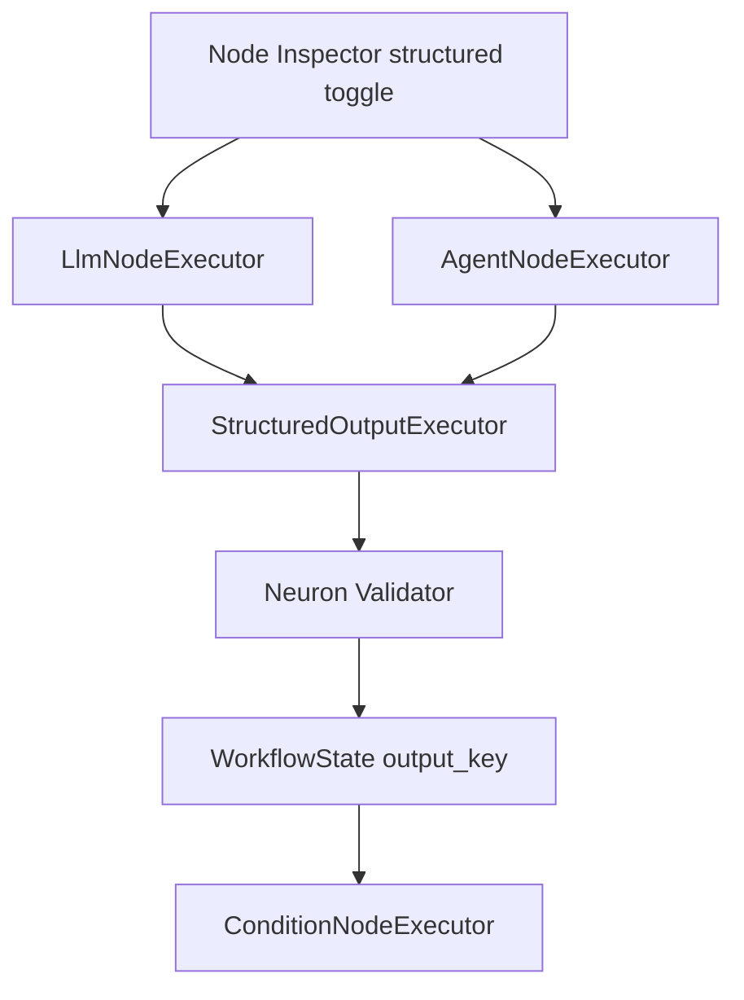

# Structured Output em Workflows — Design

## Visão de arquitetura



## Componentes backend

| Componente | Caminho |
|------------|---------|
| `StructuredOutputResolver` | `src/Runtime/StructuredOutput/StructuredOutputResolver.php` |
| `LlmNodeExecutor` | estender com branch structured |
| `AgentNodeExecutor` | idem via `Agent::structured()` |
| `ConditionNodeExecutor` | `data_get($state, $dotKey)` |
| `OutputClassRegistry` | `src/Registry/OutputClassRegistry.php` |
| `LlmNodeCodeGenerator` / `AgentNodeCodeGenerator` | emitir `::structured(OutputClass::class)` |

### Execução

```php
if ($data['structured'] ?? false) {
    $class = $this->resolver->resolve($data['output_class']);
    $result = $agent->structured($userMessage, $class);
    $state->set($outputKey, $result->toArray()); // ou objeto serializável
} else {
    // chat() existente
}
```

## Frontend

| Componente | Caminho |
|------------|---------|
| `StructuredOutputFields.jsx` | `resources/js/studio-canvas/inspectors/shared/StructuredOutputFields.jsx` |
| Integração LLM/Agent inspectors | toggles + class picker |

## Migrações

Opcional: `neuronai_studio_output_classes` para metadados UI; classes PHP permanecem em `export_path`.

## API / SSE

`step_completed` payload: `structured: true`, `output_schema: 'LeadProfile'`, `validation_errors: []`.

## Codegen

- Gerar `LeadProfile.php` em `Output/` quando criada no Studio.
- `AgentNodeCodeGenerator` adiciona import e chamada structured.

## Integração NeuronAI (neuron-structured-output)

- `SchemaProperty`, rules `NotBlank`, `Email`, etc.
- `Validator` pós-resposta LLM.
- Condition routing alinhado a campos do DTO.

## Plano de documentação

| Arquivo | Seções |
|---------|--------|
| `guides/workflows/node-types/ai-nodes.md` | `### Structured output` |
| `guides/workflows/state-and-conditions.md` | `### Condições em objetos` |
| `guides/agents/creating-agents.md` | `### Output classes` |

## Dependências

- `autonomous-multimodal-agents` — recomendada (extração em loop)
- `workflow-cyclic-graphs` — re-parse até validação structured passar
