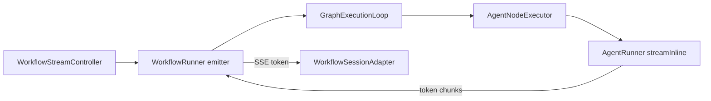

# Token Streaming em Workflows — Design

## Visão de arquitetura



## Componentes backend

| Componente | Caminho | Mudança |
|------------|---------|---------|
| `AgentRunner::streamInline` | `src/Runtime/AgentRunner.php` | Já existe para agent chat; expor para workflow |
| `AgentNodeExecutor` | detectar `$state->emitter` e usar stream | |
| `LlmNodeExecutor` | `ProviderRegistry` stream API | |
| `BuilderWorkflowState` | `getEmitter(): ?callable` | |
| `GraphExecutionLoop` | passar emitter para executors via state | |

### Emissão de token

```php
foreach ($handler->events() as $chunk) {
    if ($chunk instanceof TextChunk) {
        $emitter('token', [
            'node_id' => $nodeId,
            'trace_id' => $traceId,
            'delta' => $chunk->content,
        ]);
    }
}
```

## Frontend

| Componente | Caminho |
|------------|---------|
| `WorkflowSessionAdapter.js` | handler `token` → append message |
| `fetchSse.js` | já suporta eventos arbitrários |

## Migrações

Nenhuma.

## API / SSE

| Evento | Quando |
|--------|--------|
| `token` | Cada delta de LLM/agent durante step |
| `step_started` | Antes do stream |
| `step_completed` | Após stream + state update |

Ordem garantida por nó: started → N×token → completed.

## Codegen

Export usa `chat()` blocking por padrão; comentário opt-in para `stream()` em produção.

## Integração NeuronAI

- `Agent::stream()` + `StreamChunk` (neuron-agent-builder)
- VercelAIAdapter opcional para apps host — fora do Studio bundle

## Plano de documentação

| Arquivo | Seções |
|---------|--------|
| `guides/workflows/runtime-and-traces.md` | `## Streaming de tokens` |
| `guides/workflows/node-types/ai-nodes.md` | `### Streaming` |

## Dependências

- `studio-test-harness` — consumidor SSE
- `autonomous-multimodal-agents` — UX em loops longos
