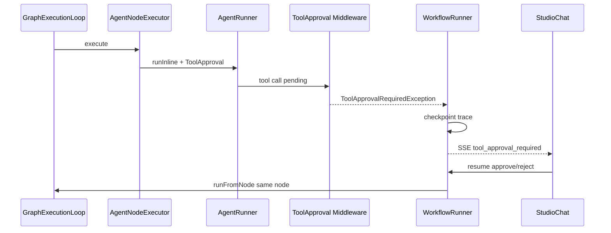

# Tool Approval em Workflows — Design

## Visão de arquitetura



## Componentes backend

| Componente | Caminho |
|------------|---------|
| `ToolApprovalRequiredException` | `src/Runtime/Exceptions/ToolApprovalRequiredException.php` |
| `AgentRunner` | aplicar `new ToolApproval()` no `DynamicAgent` |
| `WorkflowRunner::pauseForToolApproval` | paralelo a `pauseForHumanInput` |
| `WorkflowTraceResumeController` | aceitar `approval` no body |
| `AgentNodeExecutor` | handles `default` / `rejected` |

### Checkpoint payload

```php
[
    'status' => 'awaiting_tool_approval',
    'checkpoint' => [
        'node_id' => $nodeId,
        'pending_tool' => ['name' => '...', 'arguments' => [...]],
        'state_snapshot' => $state->all(),
    ],
]
```

## Frontend

| Componente | Caminho |
|------------|---------|
| `ToolApprovalCard.jsx` | `resources/js/studio-chat/ToolApprovalCard.jsx` |
| `WorkflowSessionAdapter.resume` | enviar `{ approval: 'approve' }` |

## Migrações

Estender `workflow_traces.status` enum ou string check — valores: `awaiting_tool_approval`.

## API / SSE

| Evento | Payload |
|--------|---------|
| `tool_approval_required` | `{ trace_id, node_id, tool, arguments, message }` |
| `tool_approval_resolved` | `{ approved: bool }` |

Resume: `POST /workflows/runs/{run}/resume/stream` body `{ approval, message? }`.

## Codegen

`AgentNodeCodeGenerator` adiciona:

```php
return $agent->withMiddleware(new ToolApproval());
```

## Integração NeuronAI (neuron-agent-builder)

- `NeuronAI\Agent\Middleware\ToolApproval`
- Padrão HITL do neuron-workflow-architect: `interrupt()` / resume handler

## Plano de documentação

| Arquivo | Outline |
|---------|---------|
| `guides/workflows/human-in-the-loop.md` | `## Tool approval` |
| `guides/workflows/node-types/ai-nodes.md` | `### Aprovação de ferramentas` |
| `guides/workflows/runtime-and-traces.md` | `## awaiting_tool_approval` |

## Dependências

- `autonomous-multimodal-agents` — agent nodes com tools
- `studio-test-harness` — resume via chat
- `workflow-checkpoints-persistence` — opcional, evita re-run pré-approval
