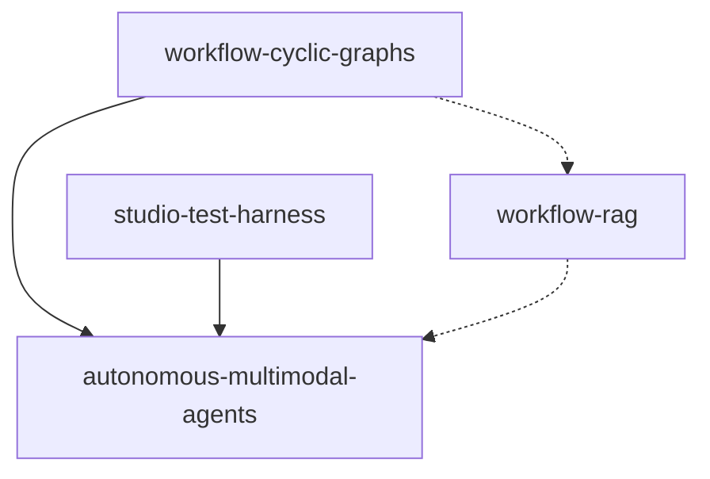

# Roadmap — NeuronAI Studio

**North star:** Agentes multimodais autônomos com grafos de workflow cíclicos.

**Última atualização:** 2026-06-30

---

## Milestones

### M1 — Fundação autônoma (P0) `planned`

Grafos cíclicos + agentes multimodais + RAG real. Entrega o padrão end-to-end para loops com agent, attachments e knowledge base.

| Ordem | Feature | Status | Spec |
|-------|---------|--------|------|
| 1 | `workflow-cyclic-graphs` | planned | [spec](../features/workflow-cyclic-graphs/spec.md) |
| 2 | `autonomous-multimodal-agents` | planned | [spec](../features/autonomous-multimodal-agents/spec.md) |
| 3 | `workflow-rag` | planned | [spec](../features/workflow-rag/spec.md) |

**Critério de conclusão M1:** Template autonomous-lead-qualification executável no test harness com loop, agent com tools, anexo PDF/imagem, e opcionalmente nó RAG upstream.

### M2 — Capacidades de agente no workflow (P1) `planned`

Structured output, aprovação de tools e streaming de tokens no harness.

| Ordem | Feature | Status | Spec |
|-------|---------|--------|------|
| 4 | `workflow-structured-output` | planned | [spec](../features/workflow-structured-output/spec.md) |
| 5 | `workflow-tool-approval` | planned | [spec](../features/workflow-tool-approval/spec.md) |
| 6 | `workflow-token-streaming` | planned | [spec](../features/workflow-token-streaming/spec.md) |

### M3 — Escala e resiliência (P2) `planned`

Paralelismo, checkpoints generalizados e execução assíncrona.

| Ordem | Feature | Status | Spec |
|-------|---------|--------|------|
| 7 | `workflow-parallel-execution` | planned | [spec](../features/workflow-parallel-execution/spec.md) |
| 8 | `workflow-checkpoints-persistence` | planned | [spec](../features/workflow-checkpoints-persistence/spec.md) |
| 9 | `workflow-queue-runner` | planned | [spec](../features/workflow-queue-runner/spec.md) |

---

## Features concluídas

| Feature | Status |
|---------|--------|
| `studio-test-harness` | ✅ done |
| `workflow-json-io` | ✅ done |
| `workflow-code-bridge` | ✅ done |

---

## Grafo de dependências (P0)

---

## Documentation index

Mapeamento feature → arquivos `docs/` a criar/atualizar na implementação.

### P0

| Feature | Documentos |
|---------|------------|
| `workflow-cyclic-graphs` | `guides/workflows/node-types/flow-nodes.md`, `guides/workflows/state-and-conditions.md`, `guides/workflows/overview.md`, `guides/workflows/runtime-and-traces.md`, `guides/templates.md`, `reference/configuration.md`, `extending/custom-node-types.md` |
| `autonomous-multimodal-agents` | `guides/workflows/overview.md`, `guides/workflows/node-types/ai-nodes.md`, `guides/agents/attachments.md`, `guides/agents/playground-and-threads.md`, `guides/workflows/runtime-and-traces.md`, `guides/templates.md`, `getting-started/quickstart-first-workflow.md`, `reference/configuration.md` |
| `workflow-rag` | `guides/workflows/node-types/ai-nodes.md`, `guides/agents/overview.md`, `guides/workflows/overview.md`, `guides/workflows/runtime-and-traces.md`, `reference/database-schema.md`, `reference/configuration.md`, `extending/custom-node-types.md`, `getting-started/quickstart-first-workflow.md` |

### P1

| Feature | Documentos |
|---------|------------|
| `workflow-structured-output` | `guides/workflows/node-types/ai-nodes.md`, `guides/workflows/state-and-conditions.md`, `guides/agents/creating-agents.md`, `reference/configuration.md`, `extending/custom-node-types.md` |
| `workflow-tool-approval` | `guides/workflows/human-in-the-loop.md`, `guides/workflows/node-types/ai-nodes.md`, `guides/agents/creating-agents.md`, `guides/workflows/runtime-and-traces.md`, `guides/security-and-access.md` |
| `workflow-token-streaming` | `guides/workflows/runtime-and-traces.md`, `guides/agents/playground-and-threads.md`, `guides/workflows/node-types/ai-nodes.md`, `reference/frontend-bundles.md` |

### P2

| Feature | Documentos |
|---------|------------|
| `workflow-parallel-execution` | `guides/workflows/node-types/logic-nodes.md`, `guides/workflows/overview.md`, `guides/workflows/runtime-and-traces.md`, `guides/workflows/human-in-the-loop.md`, `extending/custom-node-types.md` |
| `workflow-checkpoints-persistence` | `guides/workflows/runtime-and-traces.md`, `guides/workflows/human-in-the-loop.md`, `reference/database-schema.md`, `reference/configuration.md`, `extending/custom-node-types.md` |
| `workflow-queue-runner` | `guides/workflows/runtime-and-traces.md`, `guides/export-and-production.md`, `reference/configuration.md`, `reference/artisan-commands.md`, `getting-started/installation.md` |

---

## Decisões em aberto (ver [STATE.md](STATE.md))

- Runtime interpretado vs native Neuron para execução paralela
- SSE/broadcast vs polling para queue runner v1
- Escopo de autonomia multi-turn **dentro** de um único nó agent vs entre iterações do loop
