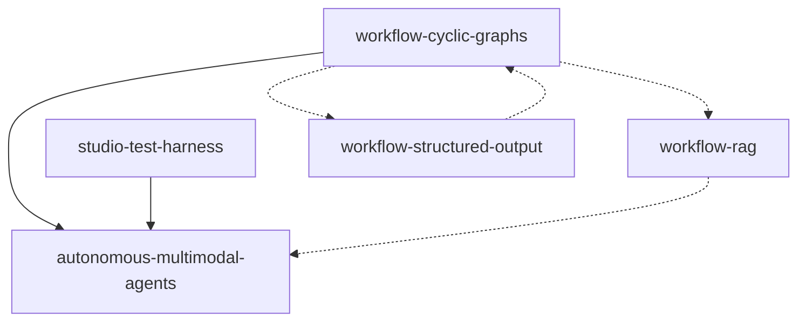

# Roadmap — NeuronAI Studio

**North star:** Agentes multimodais autônomos com grafos de workflow cíclicos.

**Development line:** `v0.4.x` (M5 remainder — UE + UA; CE shipped in `v0.4.0`)  
**Latest published:** `v0.4.0` on Packagist / `main`  
**Última atualização:** 2026-07-16  
**Etapa atual:** Linha `v0.4.x`. `cost-estimation` ✅ in `v0.4.0`. `usage-export-api` + `usage-analytics` → **débito** (UA specs ampliadas para Test Pretty; AD-016).

---

## Milestones

### M1 — Fundação autônoma (P0) `done`

Grafos cíclicos + agentes multimodais + RAG real. Entrega o padrão end-to-end para loops com agent, attachments e knowledge base.

| Ordem | Feature | Status | Spec |
|-------|---------|--------|------|
| 1 | `workflow-cyclic-graphs` | **done** (P0+P1) | [spec](../features/workflow-cyclic-graphs/spec.md) · [design](../features/workflow-cyclic-graphs/design.md) · [tasks](../features/workflow-cyclic-graphs/tasks.md) |
| 2 | `autonomous-multimodal-agents` | **done** | [spec](../features/autonomous-multimodal-agents/spec.md) · [design](../features/autonomous-multimodal-agents/design.md) |
| 3 | `workflow-rag` | **done** | [spec](../features/workflow-rag/spec.md) · [design](../features/workflow-rag/design.md) |
| 3b | `rag-knowledge-base-tool` | **done** | [spec](../features/rag-knowledge-base-tool/spec.md) · [design](../features/rag-knowledge-base-tool/design.md) |

**Critério de conclusão M1:** Template `autonomous-lead-qualification` executável no test harness com loop, agent com tools, anexo PDF/imagem, e opcionalmente nó RAG upstream.

### M2 — Capacidades de agente no workflow (P1) `done`

Structured output, aprovação de tools e streaming de tokens no harness.

| Ordem | Feature | Status | Spec |
|-------|---------|--------|------|
| 4 | `workflow-structured-output` | **done** (T1–T17; T12 parcial) | [spec](../features/workflow-structured-output/spec.md) · [tasks](../features/workflow-structured-output/tasks.md) |
| 5 | `workflow-tool-approval` | **done** (slices 1–3: backend, resume/API, UI+codegen+docs) | [spec](../features/workflow-tool-approval/spec.md) · [tasks](../features/workflow-tool-approval/tasks.md) |
| 6 | `workflow-token-streaming` | **done** (slices 1–2: backend token SSE, toggle canvas + docs) | [spec](../features/workflow-token-streaming/spec.md) · [tasks](../features/workflow-token-streaming/tasks.md) |

### M3 — Escala e resiliência (P2) `done`

Paralelismo, checkpoints generalizados e execução assíncrona.

| Ordem | Feature | Status | Spec |
|-------|---------|--------|------|
| 7 | `workflow-parallel-execution` | **done** (PE-01..09; runtime interpretado, PE-08 preview parcial) | [spec](../features/workflow-parallel-execution/spec.md) · [design](../features/workflow-parallel-execution/design.md) · [tasks](../features/workflow-parallel-execution/tasks.md) |
| 8 | `workflow-checkpoints-persistence` | **done** (CP-01..08) | [spec](../features/workflow-checkpoints-persistence/spec.md) · [design](../features/workflow-checkpoints-persistence/design.md) · [tasks](../features/workflow-checkpoints-persistence/tasks.md) |
| 9 | `workflow-queue-runner` | **done** | [spec](../features/workflow-queue-runner/spec.md) · [tasks](../features/workflow-queue-runner/tasks.md) |

### M4 — Integração externa (P1) `done`

Expor agentes e workflows para clients externos (Vercel AI SDK, AG-UI) via endpoints de streaming no package, sem alterar o harness interno.

| Ordem | Feature | Status | Spec |
|-------|---------|--------|------|
| 10 | `stream-adapters` | **done** (SA-T1..SA-T13) | [spec](../features/stream-adapters/spec.md) · [tasks](../features/stream-adapters/tasks.md) |
| 11 | `unified-runs-and-traces` | **done** (T1–T7) | [spec](../features/unified-runs-and-traces/spec.md) · [tasks](../features/unified-runs-and-traces/tasks.md) |

**Critério de conclusão M4:** Host app consome agente via `useChat` (Vercel) e workflow via client AG-UI usando rotas configuráveis do package; workflow com Human node pausa e retoma via endpoint `resume/{protocol}`; catálogo e Connect Panel documentam URLs e snippets.

**Publicação:** `v0.4.0` inclui CE + Laravel 13. Linha ativa: `v0.4.x`. Linha `v0.3.x` encerrada após release.

### M5 — Analítica e Faturamento (P1) `partial`

Uso de tokens/spans já persistidos (`TelemetryTracker`, `StudioTraceSpan`) para **metering no host** (prioridade) e superfície mínima no Studio (Dashboard + badges Debugger).

**Escopo decidido (2026-07-15):** host-first — `cost-estimation` + `usage-export-api` são P1 do milstone; `usage-analytics` é mínimo (Dashboard + Debugger + **Test Pretty**), sem página Usage/BI. Index: [m5-analytics-billing/tasks.md](../features/m5-analytics-billing/tasks.md).

**Débito (2026-07-15):** CE shipped; UE + UA permanecem no roadmap com specs/design/tasks prontos, mas **não entram na fila de Execute agora** — retomada sob demanda.

**UA expandido (2026-07-16, AD-016):** Specs/tasks do UA passam a incluir chips de tokens/custo no Test Pretty (`studio-chat`); Dashboard usa `UsageQuery::aggregate` sem esperar o HTTP completo de UE.

| Ordem | Feature | Status | Spec |
|-------|---------|--------|------|
| 12 | `cost-estimation` | **done** | [spec](../features/cost-estimation/spec.md) · [design](../features/cost-estimation/design.md) · [tasks](../features/cost-estimation/tasks.md) |
| 13 | `usage-export-api` | **debt** (tasked, not now) | [spec](../features/usage-export-api/spec.md) · [design](../features/usage-export-api/design.md) · [tasks](../features/usage-export-api/tasks.md) |
| 14 | `usage-analytics` | **debt** (UA-T1…T11; Pretty+Dashboard+Debugger) | [spec](../features/usage-analytics/spec.md) · [design](../features/usage-analytics/design.md) · [tasks](../features/usage-analytics/tasks.md) |

**Critério de conclusão M5:** Custo estimado configurável por modelo; API agregada + por-run para o host; Dashboard com totais 30d; Debugger com badges; Test Pretty com chips de usage. (API HTTP + UA UI ainda em débito.)

---

## Próximas tarefas (ordem de execução)

1. ~~Governança — branch protection / rulesets alinhados ao CI consolidado~~ ✅
2. ~~Abrir linha `v0.3.x` e sincronizar `main` com tag `v0.3.1`~~ ✅
3. ~~Especificar M5 (Discuss → Spec)~~ ✅ — context + 3 specs
4. ~~Design M5~~ ✅ — CE / UE / UA design.md
5. ~~Tasks M5~~ ✅ — CE 13 + UE 7 + UA 11 (Pretty expansion AD-016)
6. Execute M5 — ~~`cost-estimation`~~ ✅; `usage-export-api` + `usage-analytics` → **débito** (não executar agora).
7. Aplicar ruleset da development line em `v0.4.x` (script `apply-branch-rules.sh`).
8. PRs de feature M5 debt → `v0.4.x`.

---

## Features concluídas

| Feature | Status | Version |
|---------|--------|---------|
| `studio-test-harness` | ✅ done | 0.1.x |
| `workflow-json-io` | ✅ done | 0.1.x |
| `workflow-code-bridge` | ✅ done | 0.1.x |
| Multimodal attachments (AMA partial) | ✅ done | 0.1.2 |
| `workflow-cyclic-graphs` (P0+P1) | ✅ done | 0.2.x → 0.3.0 |
| `autonomous-multimodal-agents` (core) | ✅ done | 0.2.x → 0.3.0 |
| `workflow-structured-output` | ✅ done | 0.2.x → 0.3.0 |
| `workflow-queue-runner` | ✅ done | 0.2.x → 0.3.0 |
| `workflow-rag` | ✅ done | 0.2.x → 0.3.0 |
| `rag-knowledge-base-tool` | ✅ done | 0.2.x → 0.3.0 |
| `workflow-tool-approval` | ✅ done | 0.2.x → 0.3.0 |
| `workflow-token-streaming` | ✅ done | 0.2.x → 0.3.0 |
| `workflow-checkpoints-persistence` | ✅ done | 0.2.x → 0.3.0 |
| `workflow-parallel-execution` | ✅ done | 0.2.x → 0.3.0 |
| `stream-adapters` | ✅ done | 0.2.x → 0.3.0 |
| `unified-runs-and-traces` | ✅ done | 0.2.x → 0.3.0 |

---

## Grafo de dependências (P0)

---

## Documentation index

Mapeamento feature → arquivos `docs/` a criar/atualizar na implementação.

### P0

| Feature | Documentos |
|---------|------------|
| `workflow-cyclic-graphs` | `guides/workflows/node-types/flow-nodes.md`, `guides/workflows/state-and-conditions.md`, `guides/workflows/overview.md`, `guides/workflows/runtime-and-traces.md`, `guides/templates.md`, `reference/configuration.md`, `extending/custom-node-types.md` |
| `autonomous-multimodal-agents` | `guides/workflows/overview.md`, `guides/workflows/node-types/ai-nodes.md`, `guides/agents/attachments.md`, `guides/agents/playground-and-threads.md`, `guides/workflows/runtime-and-traces.md`, `guides/templates.md`, `getting-started/quickstart-first-workflow.md`, `reference/configuration.md` |
| `workflow-rag` | `guides/workflows/node-types/ai-nodes.md`, `guides/agents/overview.md`, `guides/workflows/overview.md`, `guides/workflows/runtime-and-traces.md`, `reference/database-schema.md`, `reference/configuration.md`, `extending/custom-node-types.md`, `getting-started/quickstart-first-workflow.md` |

### P1

| Feature | Documentos |
|---------|------------|
| `workflow-structured-output` | `guides/workflows/node-types/ai-nodes.md`, `guides/workflows/state-and-conditions.md`, `guides/agents/creating-agents.md`, `reference/configuration.md`, `extending/custom-node-types.md` |
| `workflow-tool-approval` | `guides/workflows/human-in-the-loop.md`, `guides/workflows/node-types/ai-nodes.md`, `guides/agents/creating-agents.md`, `guides/workflows/runtime-and-traces.md`, `guides/security-and-access.md` |
| `workflow-token-streaming` | `guides/workflows/runtime-and-traces.md`, `guides/agents/playground-and-threads.md`, `guides/workflows/node-types/ai-nodes.md`, `reference/frontend-bundles.md` |

### P2

| Feature | Documentos |
|---------|------------|
| `workflow-parallel-execution` | `guides/workflows/node-types/logic-nodes.md`, `guides/workflows/overview.md`, `guides/workflows/runtime-and-traces.md`, `guides/workflows/human-in-the-loop.md`, `extending/custom-node-types.md` |
| `workflow-checkpoints-persistence` | `guides/workflows/runtime-and-traces.md`, `guides/workflows/human-in-the-loop.md`, `reference/database-schema.md`, `reference/configuration.md`, `extending/custom-node-types.md` |
| `workflow-queue-runner` | `guides/workflows/runtime-and-traces.md`, `guides/export-and-production.md`, `reference/configuration.md`, `reference/artisan-commands.md`, `getting-started/installation.md` |

### M4

| Feature | Documentos |
|---------|------------|
| `stream-adapters` | `guides/integration/stream-adapters.md`, `guides/integration/vercel-ai-sdk.md`, `guides/integration/ag-ui.md`, `reference/configuration.md`, `getting-started/installation.md`, `guides/agents/playground-and-threads.md` |
| `unified-runs-and-traces` | `guides/workflows/runtime-and-traces.md`, `reference/database-schema.md` |

### M5

| Feature | Documentos |
|---------|------------|
| `cost-estimation` | `guides/analytics/costs.md`, `reference/configuration.md`, `reference/database-schema.md` |
| `usage-export-api` | `guides/analytics/export-api.md`, `reference/configuration.md`, `getting-started/installation.md` |
| `usage-analytics` | `guides/analytics/usage.md`, `guides/dashboard.md`, `guides/workflows/runtime-and-traces.md`, `guides/agents/playground-and-threads.md` |

---

## Decisões em aberto (ver [STATE.md](STATE.md))

- SSE/broadcast vs polling para queue runner v1 (polling v1 implementado; SSE deferido)
- Escopo de autonomia multi-turn **dentro** de um único nó agent vs entre iterações do loop
