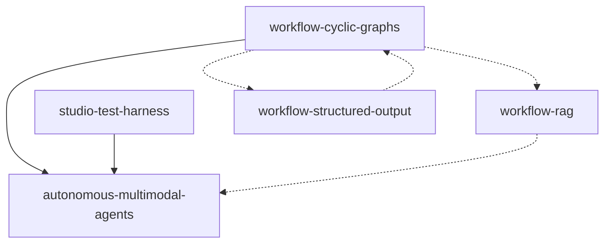

# Roadmap — NeuronAI Studio

**North star:** Agentes multimodais autônomos com grafos de workflow cíclicos.

**Development line (features):** `v0.8.x` (M8 — performance / memory / context; Specify next)  
**Patch line:** `v0.8.x`  
**Latest published:** `v0.8.0` on Packagist / `main`  
**Última atualização:** 2026-07-20  
**Etapa atual:** M7 ✅ (`v0.8.0`). **M8 (AD-021):** desempenho de agentes/workflows — memória, engenharia de contexto, qualidade de runtime. Specify em seguida. LangSmith removido; OTel genérico em P3.

---

## Milestones

### M1 — Fundação autônoma (P0) `done`

Grafos cíclicos + agentes multimodais + RAG real. Entrega o padrão end-to-end para loops com agent, attachments e knowledge base.

| Ordem | Feature | Status | Spec |
|-------|---------|--------|------|
| 1 | `workflow-cyclic-graphs` | **done** (P0+P1) | [spec](../features/workflow-cyclic-graphs/spec.md) · [design](../features/workflow-cyclic-graphs/design.md) · [tasks](../features/workflow-cyclic-graphs/tasks.md) |
| 2 | `autonomous-multimodal-agents` | **done** | [spec](../features/autonomous-multimodal-agents/spec.md) · [design](../features/autonomous-multimodal-agents/design.md) |
| 3 | `workflow-rag` | **done** | [spec](../features/workflow-rag/spec.md) · [design](../features/workflow-rag/design.md) |
| 3b | `rag-knowledge-base-tool` | **done** | [spec](../features/rag-knowledge-base-tool/spec.md) · [design](../features/rag-knowledge-base-tool/design.md) |

**Critério de conclusão M1:** Template `autonomous-lead-qualification` executável no test harness com loop, agent com tools, anexo PDF/imagem, e opcionalmente nó RAG upstream.

### M2 — Capacidades de agente no workflow (P1) `done`

Structured output, aprovação de tools e streaming de tokens no harness.

| Ordem | Feature | Status | Spec |
|-------|---------|--------|------|
| 4 | `workflow-structured-output` | **done** (T1–T17; T12 parcial) | [spec](../features/workflow-structured-output/spec.md) · [tasks](../features/workflow-structured-output/tasks.md) |
| 5 | `workflow-tool-approval` | **done** (slices 1–3: backend, resume/API, UI+codegen+docs) | [spec](../features/workflow-tool-approval/spec.md) · [tasks](../features/workflow-tool-approval/tasks.md) |
| 6 | `workflow-token-streaming` | **done** (slices 1–2: backend token SSE, toggle canvas + docs) | [spec](../features/workflow-token-streaming/spec.md) · [tasks](../features/workflow-token-streaming/tasks.md) |

### M3 — Escala e resiliência (P2) `done`

Paralelismo, checkpoints generalizados e execução assíncrona.

| Ordem | Feature | Status | Spec |
|-------|---------|--------|------|
| 7 | `workflow-parallel-execution` | **done** (PE-01..09; runtime interpretado, PE-08 preview parcial) | [spec](../features/workflow-parallel-execution/spec.md) · [design](../features/workflow-parallel-execution/design.md) · [tasks](../features/workflow-parallel-execution/tasks.md) |
| 8 | `workflow-checkpoints-persistence` | **done** (CP-01..08) | [spec](../features/workflow-checkpoints-persistence/spec.md) · [design](../features/workflow-checkpoints-persistence/design.md) · [tasks](../features/workflow-checkpoints-persistence/tasks.md) |
| 9 | `workflow-queue-runner` | **done** | [spec](../features/workflow-queue-runner/spec.md) · [tasks](../features/workflow-queue-runner/tasks.md) |

### M4 — Integração externa (P1) `done`

Expor agentes e workflows para clients externos (Vercel AI SDK, AG-UI) via endpoints de streaming no package, sem alterar o harness interno.

| Ordem | Feature | Status | Spec |
|-------|---------|--------|------|
| 10 | `stream-adapters` | **done** (SA-T1..SA-T13) | [spec](../features/stream-adapters/spec.md) · [tasks](../features/stream-adapters/tasks.md) |
| 11 | `unified-runs-and-traces` | **done** (T1–T7) | [spec](../features/unified-runs-and-traces/spec.md) · [tasks](../features/unified-runs-and-traces/tasks.md) |

**Critério de conclusão M4:** Host app consome agente via `useChat` (Vercel) e workflow via client AG-UI usando rotas configuráveis do package; workflow com Human node pausa e retoma via endpoint `resume/{protocol}`; catálogo e Connect Panel documentam URLs e snippets.

**Publicação:** `v0.4.0` = CE + Laravel 13. `v0.5.0` = UA. `v0.6.0` = UE. Linhas `v0.3.x`–`v0.5.x` encerradas para features.

### M5 — Analítica e Faturamento (P1) `done`

Uso de tokens/spans já persistidos (`TelemetryTracker`, `StudioTraceSpan`) para **metering no host** (prioridade) e superfície mínima no Studio (Dashboard + badges Debugger).

| Ordem | Feature | Status | Spec |
|-------|---------|--------|------|
| 12 | `cost-estimation` | **done** (`v0.4.0`) | [spec](../features/cost-estimation/spec.md) · [design](../features/cost-estimation/design.md) · [tasks](../features/cost-estimation/tasks.md) |
| 13 | `usage-export-api` | **done** (`v0.6.0`) | [spec](../features/usage-export-api/spec.md) · [design](../features/usage-export-api/design.md) · [tasks](../features/usage-export-api/tasks.md) |
| 14 | `usage-analytics` | **done** (`v0.5.0`; UA-T1…T11) | [spec](../features/usage-analytics/spec.md) · [design](../features/usage-analytics/design.md) · [tasks](../features/usage-analytics/tasks.md) |

**Critério de conclusão M5:** Custo estimado configurável por modelo; API agregada + por-run para o host; Dashboard com totais 30d; Debugger com badges; Test Pretty com chips de usage.

### M6 — Runtime / Agent (P1) `done`

Desempenho e flexibilidade de agentes e fluxos: knobs do tool-loop, progresso live em runs async, fork/join concorrente no runtime interpretado.

**Escopo (AD-019):** host/Studio runtime — sem billing avançado. Index: [m6-runtime-agent/tasks.md](../features/m6-runtime-agent/tasks.md). Context: [context.md](../features/m6-runtime-agent/context.md).

**Ordem Execute:** ATC → ARP → IPC (emitter de ARP estabiliza canal usado por IPC).

| Ordem | Feature | Status | Spec |
|-------|---------|--------|------|
| 15 | `agent-tool-controls` | **done** | [spec](../features/agent-tool-controls/spec.md) · [design](../features/agent-tool-controls/design.md) · [tasks](../features/agent-tool-controls/tasks.md) |
| 16 | `async-run-progress` | **done** | [spec](../features/async-run-progress/spec.md) · [design](../features/async-run-progress/design.md) · [tasks](../features/async-run-progress/tasks.md) |
| 17 | `interpreted-parallel-concurrency` | **done** | [spec](../features/interpreted-parallel-concurrency/spec.md) · [design](../features/interpreted-parallel-concurrency/design.md) · [tasks](../features/interpreted-parallel-concurrency/tasks.md) |

**Critério de conclusão M6:** Agent/nó configuram `tool_max_runs` / `parallel_tool_calls` com tools mid-stream; run async tem SSE de progresso (sem Echo); fork I/O-bound concorrente mais rápido que sequencial com resume parcial intacto. **Publicado em `v0.7.0`.**

### M7 — Observabilidade externa (P1) `done`

Monitoring externo **env-first** (playbook Langflow): native Debugger permanece; Inspector (Neuron) + Langfuse como exportadores opt-in. Sem UI de secrets; sem LangSmith no MVP.

**Escopo (AD-020):** Context: [external-observability/context.md](../features/external-observability/context.md). Spec: [spec.md](../features/external-observability/spec.md). Design: [design.md](../features/external-observability/design.md). Tasks: [tasks.md](../features/external-observability/tasks.md).

| Ordem | Feature | Status | Spec |
|-------|---------|--------|------|
| 18 | `external-observability` | **done** (OBS-01…05; OBS-06 P3 deferred) | [spec](../features/external-observability/spec.md) · [design](../features/external-observability/design.md) · [tasks](../features/external-observability/tasks.md) |

**Critério de conclusão M7:** Com `INSPECTOR_INGESTION_KEY`, runs do Studio aparecem no Inspector (gap EventBus corrigido); com `LANGFUSE_*` + pacote, traces exportam sem quebrar runs; `NEURONAI_STUDIO_NATIVE_TRACING=false` desliga Debugger DB; docs permitem setup em &lt; 5 min. **Publicado em `v0.8.0`.**

### M8 — Performance, memory & context (P1) `planning`

Foco total em **desempenho de agentes e workflows**: melhor uso de recursos/modelo, memória durável e controlável, engenharia de contexto (o que entra no prompt, budgets, truncamento/sumarização). Observabilidade adicional (OTel genérico, OBS-06) fica em débitos P3 — **sem** integração LangSmith dedicada (AD-021).

**Escopo (AD-021):** Context: [m8-performance-memory-context/context.md](../features/m8-performance-memory-context/context.md). Feature specs TBD após Discuss/Specify.

| Ordem | Feature (working titles) | Status | Spec |
|-------|--------------------------|--------|------|
| TBD | Agent memory controls | **planning** | — |
| TBD | Context engineering / budgets | **planning** | — |
| TBD | Runtime quality (incl. tool approval in parallel branches) | **planning** | — |

**Critério de conclusão M8 (rascunho):** Agentes long-running mantêm memória útil sob budget de contexto; Studio expõe controles claros de history/window; gaps de runtime que desperdiçam tokens ou quebram autonomia em paralelo estão fechados ou documentados. Critérios mensuráveis na Specify.

---

## Próximas tarefas (ordem de execução)

1. ~~Sync pós-`v0.6.0` + AD-019 + abrir `v0.7.x`~~ ✅
2. ~~Especificar / design / tasks / Execute M6~~ ✅
3. ~~Release `v0.7.0` (M6 estável) + abrir linha `v0.8.x` (AD-020)~~ ✅
4. ~~Design + tasks `external-observability` (OBS-01…05)~~ ✅
5. ~~Execute M7 + merge + release `v0.8.0`~~ ✅
6. ~~AD-021: M8 north star; drop LangSmith; OTel → P3~~ ✅
7. Discuss + Specify M8 (memory / context / runtime) → design → tasks → Execute

---

## Features concluídas

| Feature | Status | Version |
|---------|--------|---------|
| `studio-test-harness` | ✅ done | 0.1.x |
| `workflow-json-io` | ✅ done | 0.1.x |
| `workflow-code-bridge` | ✅ done | 0.1.x |
| Multimodal attachments (AMA partial) | ✅ done | 0.1.2 |
| `workflow-cyclic-graphs` (P0+P1) | ✅ done | 0.2.x → 0.3.0 |
| `autonomous-multimodal-agents` (core) | ✅ done | 0.2.x → 0.3.0 |
| `workflow-structured-output` | ✅ done | 0.2.x → 0.3.0 |
| `workflow-queue-runner` | ✅ done | 0.2.x → 0.3.0 |
| `workflow-rag` | ✅ done | 0.2.x → 0.3.0 |
| `rag-knowledge-base-tool` | ✅ done | 0.2.x → 0.3.0 |
| `workflow-tool-approval` | ✅ done | 0.2.x → 0.3.0 |
| `workflow-token-streaming` | ✅ done | 0.2.x → 0.3.0 |
| `workflow-checkpoints-persistence` | ✅ done | 0.2.x → 0.3.0 |
| `workflow-parallel-execution` | ✅ done | 0.2.x → 0.3.0 |
| `stream-adapters` | ✅ done | 0.2.x → 0.3.0 |
| `unified-runs-and-traces` | ✅ done | 0.2.x → 0.3.0 |
| `cost-estimation` | ✅ done | 0.4.0 |
| `usage-analytics` | ✅ done | 0.5.0 |
| `usage-export-api` | ✅ done | 0.6.0 |
| `agent-tool-controls` | ✅ done | 0.7.x |
| `async-run-progress` | ✅ done | 0.7.x |
| `interpreted-parallel-concurrency` | ✅ done | 0.7.x |
| `external-observability` | ✅ done | 0.8.0 |

---

## Grafo de dependências (P0)

---

## Documentation index

Mapeamento feature → arquivos `docs/` a criar/atualizar na implementação.

### P0

| Feature | Documentos |
|---------|------------|
| `workflow-cyclic-graphs` | `guides/workflows/node-types/flow-nodes.md`, `guides/workflows/state-and-conditions.md`, `guides/workflows/overview.md`, `guides/workflows/runtime-and-traces.md`, `guides/templates.md`, `reference/configuration.md`, `extending/custom-node-types.md` |
| `autonomous-multimodal-agents` | `guides/workflows/overview.md`, `guides/workflows/node-types/ai-nodes.md`, `guides/agents/attachments.md`, `guides/agents/playground-and-threads.md`, `guides/workflows/runtime-and-traces.md`, `guides/templates.md`, `getting-started/quickstart-first-workflow.md`, `reference/configuration.md` |
| `workflow-rag` | `guides/workflows/node-types/ai-nodes.md`, `guides/agents/overview.md`, `guides/workflows/overview.md`, `guides/workflows/runtime-and-traces.md`, `reference/database-schema.md`, `reference/configuration.md`, `extending/custom-node-types.md`, `getting-started/quickstart-first-workflow.md` |

### P1

| Feature | Documentos |
|---------|------------|
| `workflow-structured-output` | `guides/workflows/node-types/ai-nodes.md`, `guides/workflows/state-and-conditions.md`, `guides/agents/creating-agents.md`, `reference/configuration.md`, `extending/custom-node-types.md` |
| `workflow-tool-approval` | `guides/workflows/human-in-the-loop.md`, `guides/workflows/node-types/ai-nodes.md`, `guides/agents/creating-agents.md`, `guides/workflows/runtime-and-traces.md`, `guides/security-and-access.md` |
| `workflow-token-streaming` | `guides/workflows/runtime-and-traces.md`, `guides/agents/playground-and-threads.md`, `guides/workflows/node-types/ai-nodes.md`, `reference/frontend-bundles.md` |

### P2

| Feature | Documentos |
|---------|------------|
| `workflow-parallel-execution` | `guides/workflows/node-types/logic-nodes.md`, `guides/workflows/overview.md`, `guides/workflows/runtime-and-traces.md`, `guides/workflows/human-in-the-loop.md`, `extending/custom-node-types.md` |
| `workflow-checkpoints-persistence` | `guides/workflows/runtime-and-traces.md`, `guides/workflows/human-in-the-loop.md`, `reference/database-schema.md`, `reference/configuration.md`, `extending/custom-node-types.md` |
| `workflow-queue-runner` | `guides/workflows/runtime-and-traces.md`, `guides/export-and-production.md`, `reference/configuration.md`, `reference/artisan-commands.md`, `getting-started/installation.md` |

### M4

| Feature | Documentos |
|---------|------------|
| `stream-adapters` | `guides/integration/stream-adapters.md`, `guides/integration/vercel-ai-sdk.md`, `guides/integration/ag-ui.md`, `reference/configuration.md`, `getting-started/installation.md`, `guides/agents/playground-and-threads.md` |
| `unified-runs-and-traces` | `guides/workflows/runtime-and-traces.md`, `reference/database-schema.md` |

### M5

| Feature | Documentos |
|---------|------------|
| `cost-estimation` | `guides/analytics/costs.md`, `reference/configuration.md`, `reference/database-schema.md` |
| `usage-export-api` | `guides/analytics/export-api.md`, `reference/configuration.md`, `getting-started/installation.md` |
| `usage-analytics` | `guides/analytics/usage.md`, `guides/dashboard.md`, `guides/workflows/runtime-and-traces.md`, `guides/agents/playground-and-threads.md` |

### M6

| Feature | Documentos |
|---------|------------|
| `agent-tool-controls` | `guides/agents/creating-agents.md`, `guides/workflows/node-types/ai-nodes.md`, `guides/workflows/runtime-and-traces.md`, `reference/configuration.md` |
| `async-run-progress` | `guides/workflows/runtime-and-traces.md`, `guides/export-and-production.md`, `reference/configuration.md` |
| `interpreted-parallel-concurrency` | `guides/workflows/node-types/logic-nodes.md`, `guides/workflows/runtime-and-traces.md`, `reference/configuration.md` |

### M7

| Feature | Documentos |
|---------|------------|
| `external-observability` | `guides/observability/native-tracing.md`, `guides/observability/inspector.md`, `guides/observability/langfuse.md`, `guides/workflows/runtime-and-traces.md`, `reference/configuration.md`, `reference/artisan-commands.md`, `getting-started/installation.md` |

### M8 (TBD after Specify)

| Feature | Documentos (expected) |
|---------|------------------------|
| Agent memory / context engineering | `guides/agents/creating-agents.md`, `guides/agents/playground-and-threads.md`, `guides/workflows/runtime-and-traces.md`, `guides/workflows/node-types/ai-nodes.md`, `reference/configuration.md` |

---

## Decisões em aberto (ver [STATE.md](STATE.md))

- ~~SSE/broadcast vs polling para queue runner~~ → **resolvido (AD-019):** buffer + SSE tail; Echo deferred
- ~~Multi-turn dentro do nó agent~~ → **resolvido (AD-019):** Neuron já faz; Studio expõe `tool_max_runs` / `parallel_tool_calls` + live tool SSE
- ~~Monitoring externo (Inspector / Langfuse)~~ → **resolvido (AD-020):** M7 env-first
- ~~LangSmith dedicado~~ → **descartado (AD-021);** OTel genérico = P3 when-needed
- M8 feature split (memory vs context vs runtime) — Specify
- Tool approval dentro de parallel branches (candidato M8)
- Transporte `ShouldBroadcast` / Echo para progresso async (P3)
- Nó `invoke` / hook allowlisted (P2 — fora do core M8)
