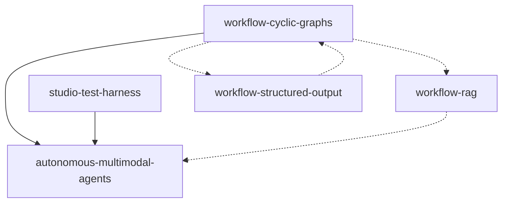

# Roadmap — NeuronAI Studio

**North star:** Agentes multimodais autônomos com grafos de workflow cíclicos.

**Development line:** `v0.2.x` (target release `v0.2.1+`)  
**Latest published:** `v0.2.0` on `main`  
**Última atualização:** 2026-07-03  
**Etapa atual:** M1/M2/M3 concluídos. **M4 (`stream-adapters`) em andamento** — spec + tasks (SA-T1..SA-T13) prontos, implementação por iniciar.

---

## Milestones

### M1 — Fundação autônoma (P0) `done`

Grafos cíclicos + agentes multimodais + RAG real. Entrega o padrão end-to-end para loops com agent, attachments e knowledge base.

| Ordem | Feature | Status | Spec |
|-------|---------|--------|------|
| 1 | `workflow-cyclic-graphs` | **done** (P0+P1) | [spec](../features/workflow-cyclic-graphs/spec.md) · [design](../features/workflow-cyclic-graphs/design.md) · [tasks](../features/workflow-cyclic-graphs/tasks.md) |
| 2 | `autonomous-multimodal-agents` | **done** | [spec](../features/autonomous-multimodal-agents/spec.md) · [design](../features/autonomous-multimodal-agents/design.md) |
| 3 | `workflow-rag` | **done** | [spec](../features/workflow-rag/spec.md) · [design](../features/workflow-rag/design.md) |
| 3b | `rag-knowledge-base-tool` | **done** | [spec](../features/rag-knowledge-base-tool/spec.md) · [design](../features/rag-knowledge-base-tool/design.md) |

**Critério de conclusão M1:** Template `autonomous-lead-qualification` executável no test harness com loop, agent com tools, anexo PDF/imagem, e opcionalmente nó RAG upstream.

**Etapa atual:** M1 concluído — publicar `v0.2.0`. M2 Features 5 (`workflow-tool-approval`) e 6 (`workflow-token-streaming`) concluídas.

### M2 — Capacidades de agente no workflow (P1) `in progress`

Structured output, aprovação de tools e streaming de tokens no harness.

| Ordem | Feature | Status | Spec |
|-------|---------|--------|------|
| 4 | `workflow-structured-output` | **done** (T1–T17; T12 parcial) | [spec](../features/workflow-structured-output/spec.md) · [tasks](../features/workflow-structured-output/tasks.md) |
| 5 | `workflow-tool-approval` | **done** (slices 1–3: backend, resume/API, UI+codegen+docs) | [spec](../features/workflow-tool-approval/spec.md) · [tasks](../features/workflow-tool-approval/tasks.md) |
| 6 | `workflow-token-streaming` | **done** (slices 1–2: backend token SSE, toggle canvas + docs) | [spec](../features/workflow-token-streaming/spec.md) · [tasks](../features/workflow-token-streaming/tasks.md) |

**Etapa atual (v0.2.x):** Features 5 (`workflow-tool-approval`) e 6 (`workflow-token-streaming`) **concluídas**. Próximo foco: M3/M4.  
**Concluído (Feature 4):** T1–T17 — registry, resolver, dot notation, `AgentRunner::structuredInline`, executors LLM/agent, erros de validação no trace, canvas inspector, round-trip, codegen e docs.  
**Feature 5 — slice 1 entregue (T1–T6):** `ToolApprovalRequiredException`, config `require_tool_approval` (AgentDefinition + override no nó), `ToolApproval` middleware no `AgentRunner`, `WorkflowRunner::pauseForToolApproval` → status `awaiting_tool_approval` + SSE `tool_approval_required`, 5 testes backend.  
**Feature 5 — slice 2 entregue (TA-05, TA-07):** interrupt serializado no checkpoint + `AgentRunner::resumeInlineApproval`, resume `approve|reject` via `WorkflowRunner::resumeToolApproval` + SSE `tool_approval_resolved`, handle `rejected` opcional no nó agent, controllers sync/async + `ResumeWorkflowJob` aceitam `approval`, 2 testes novos (suíte 233 verde).  
**Feature 5 — slice 3 entregue (TA-06, TA-08, docs):** `ToolApprovalCard` inline (sem modal) + `WorkflowSessionAdapter.resumeApproval` + `StudioChat` (`consumeAssistantStream`); `AgentNodeCodeGenerator` aplica `require_tool_approval`/`ToolApproval` no export; docs (HITL, ai-nodes, creating-agents, runtime-and-traces, security); rebuild `studio-chat.bundle.js`; 2 testes codegen (suíte 235 verde).  
**Feature 6 — slice 1 entregue (TS-01–04, TS-06, TS-08):** `AgentRunner::streamInline`, streaming em `AgentNodeExecutor`/`LlmNodeExecutor` via `data.stream` → SSE `token` `{node_id, delta}` entre step boundaries; fallback blocking para structured/tool-approval; `WorkflowStreamController` + `StudioChat` já propagam/agregam `token` (sem mudança); `WorkflowTokenStreamingTest` (5 testes, suíte 240 verde); docs runtime-and-traces + ai-nodes.  
**Feature 6 — slice 2 entregue (TS-07 + docs):** `StreamToggleField` no inspector canvas (agent/llm, desabilita quando structured), default `stream: true` em novos nós agent/llm no harness, rebuild `workflow-canvas.bundle.js`, docs frontend-bundles (token handling) + playground-and-threads (parity).  
**Próximos passos:** M3/M4.  
**Nota:** T12 parcial — hint dot notation (`lead.tier`) só no condition; loop sem inspector aguarda polish M1.

### M3 — Escala e resiliência (P2) `done`

Paralelismo, checkpoints generalizados e execução assíncrona.

| Ordem | Feature | Status | Spec |
|-------|---------|--------|------|
| 7 | `workflow-parallel-execution` | **done** (PE-01..09; runtime interpretado, PE-08 preview parcial) | [spec](../features/workflow-parallel-execution/spec.md) · [design](../features/workflow-parallel-execution/design.md) · [tasks](../features/workflow-parallel-execution/tasks.md) |
| 8 | `workflow-checkpoints-persistence` | **done** (CP-01..08) | [spec](../features/workflow-checkpoints-persistence/spec.md) · [design](../features/workflow-checkpoints-persistence/design.md) · [tasks](../features/workflow-checkpoints-persistence/tasks.md) |
| 9 | `workflow-queue-runner` | **done** | [spec](../features/workflow-queue-runner/spec.md) · [tasks](../features/workflow-queue-runner/tasks.md) |

**Etapa atual (v0.2.x):** M3 concluído — Features 7 (`workflow-parallel-execution`), 8 (`workflow-checkpoints-persistence`) e 9 (`workflow-queue-runner`) **done**. Próximo foco: M4 (`stream-adapters`).
**Feature 8 — entregue (CP-01..08):** `CheckpointService` + tabela `workflow_checkpoints` + model, `CheckpointingExecutor` (decorator opt-in em agent/llm/rag/tool com invalidação por `input_hash` e escopo por iteração de loop), `EloquentPersistence` para interrupts de workflows nativos, config `checkpoints.enabled/ttl` + comando `checkpoints:purge`, 10 testes.
**Feature 7 — entregue (PE-01..09):** `ForkNodeExecutor`/`JoinNodeExecutor`/`ParallelBranchRunner` (runtime interpretado, estado isolado por branch), `ParallelBranchInterruptException` + resume parcial no `WorkflowRunner`, `GraphValidator` fork/join pairing, codegen `ParallelEvent` subclass, canvas fork/join + inspector + rebuild bundle, SSE `branch_started`/`branch_completed`/`parallel_interrupt`, 4 testes novos.
**M3 — template pack + fix (2026-07-03):** templates de referência `parallel-support-triage` (intermediate) e `parallel-triage-hitl` (advanced) + agente `support-triage-composer` (caso real de triagem de suporte com providers reais, fork/join + checkpoints + HITL em branch); fix `Editor::resolveSlug` (auto-save do canvas não regrava slug quando o nome não muda → evita `UNIQUE workflow_definitions.slug`); docs `guides/templates.md`; suíte 258 verde.

### M4 — Integração externa (P1) `in progress`

Expor agentes e workflows para clients externos (Vercel AI SDK, AG-UI) via endpoints de streaming no package, sem alterar o harness interno.

| Ordem | Feature | Status | Spec |
|-------|---------|--------|------|
| 10 | `stream-adapters` | in progress (tasks SA-T1..SA-T13 definidas) | [spec](../features/stream-adapters/spec.md) · [tasks](../features/stream-adapters/tasks.md) |

**Critério de conclusão M4:** Host app consome agente via `useChat` (Vercel) e workflow via client AG-UI usando rotas configuráveis do package; workflow com Human node pausa e retoma via endpoint `resume/{protocol}`; catálogo e Connect Panel documentam URLs e snippets.

**Plano de tasks (ver [tasks.md](../features/stream-adapters/tasks.md)):**
- **Fase 1 — backend + resume + testes:** SA-T1 (config), SA-T2 (`StreamAdapterRegistry`), SA-T3 (rotas condicionais + middleware), SA-T4 (`AgentRunner::streamHandler`), SA-T5 (`AgentIntegrateStreamController`), SA-T6 (ponte workflow interpretado → adapter), SA-T7 (`WorkflowIntegrateStreamController`), SA-T8 (resume Human node externo), SA-T9 (formato vercel/agui + regressão zero).
- **Fase 2 — UI:** SA-T10 (catálogo `/stream-adapters`), SA-T11 (Connect Panel URLs stream+resume + snippets).
- **Fase 3 — docs:** SA-T12 (guides integration + configuration + installation).
- **Fase 4 — P2:** SA-T13 (SA-14 — tokens em nós agent/llm no workflow externo).

**Decisões em aberto (resolver na Fase 1, registrar AD):**
- Ponte workflow interpretado → adapter: converter eventos SSE do Studio (`token`/`tool_call`/`tool_result`) em chunks Neuron (`TextChunk`/`ToolCallChunk`/`ToolResultChunk`) e alimentar `$adapter->transform()` (Opção A, recomendada) vs emitir linhas de protocolo direto (Opção B).
- Mapeamento de interrupt (Human node) para evento terminal do protocolo + `trace_id` p/ resume externo.

**Dependências:** SA-14 (tokens em workflow externo) opcionalmente aguarda `workflow-token-streaming` (✅ done — pode ser puxada na Fase 1).

---

## Próximas tarefas (ordem de execução)

Fila derivada do estado real (ver [STATE.md](STATE.md)).

### Sprint atual — publicar `v0.2.0`

1. ~~`workflow-rag` Fatia 3~~ ✅
2. ~~AMA-09 docs~~ ✅
3. ~~PR `v0.2.x` → `main` + tag `v0.2.0`~~ ✅
4. Governança — branch protection para `v0.2.x` no GitHub

### Próximo — completar M2

5. `workflow-tool-approval` (Feature 5)
6. `workflow-token-streaming` (Feature 6)

### Depois — M3 e M4

7. ~~`workflow-parallel-execution` (Feature 7)~~ ✅
8. ~~`workflow-checkpoints-persistence` (Feature 8)~~ ✅
9. `stream-adapters` (Feature 10) — **M4 em andamento**

### M4 em execução — `stream-adapters` (ver [tasks.md](../features/stream-adapters/tasks.md))

1. SA-T1 → SA-T2 → SA-T3 (config + `StreamAdapterRegistry` + rotas condicionais/middleware)
2. SA-T4 → SA-T5 (agent stream vercel/agui end-to-end)
3. SA-T6 → SA-T7 → SA-T8 (ponte workflow interpretado→adapter + workflow stream + resume Human node)
4. SA-T9 (formato vercel/agui + regressão zero — em paralelo)
5. SA-T10 → SA-T11 (catálogo + Connect Panel)
6. SA-T12 (docs) · SA-T13 (SA-14, P2)

---

## Features concluídas

| Feature | Status | Version |
|---------|--------|---------|
| `studio-test-harness` | ✅ done | 0.1.x |
| `workflow-json-io` | ✅ done | 0.1.x |
| `workflow-code-bridge` | ✅ done | 0.1.x |
| Multimodal attachments (AMA partial) | ✅ done | 0.1.2 |
| `workflow-cyclic-graphs` (P0+P1) | ✅ done | 0.2.x |
| `autonomous-multimodal-agents` (core) | ✅ done | 0.2.x |
| `workflow-structured-output` | ✅ done | 0.2.x |
| `workflow-queue-runner` | ✅ done | 0.2.x |
| `workflow-rag` | ✅ done | 0.2.x |
| `rag-knowledge-base-tool` | ✅ done | 0.2.x |
| `workflow-tool-approval` | ✅ done | 0.2.x |
| `workflow-token-streaming` | ✅ done | 0.2.x |
| `workflow-checkpoints-persistence` | ✅ done | 0.2.x |
| `workflow-parallel-execution` | ✅ done | 0.2.x |

---

## Grafo de dependências (P0)

---

## Documentation index

Mapeamento feature → arquivos `docs/` a criar/atualizar na implementação.

### P0

| Feature | Documentos |
|---------|------------|
| `workflow-cyclic-graphs` | `guides/workflows/node-types/flow-nodes.md`, `guides/workflows/state-and-conditions.md`, `guides/workflows/overview.md`, `guides/workflows/runtime-and-traces.md`, `guides/templates.md`, `reference/configuration.md`, `extending/custom-node-types.md` |
| `autonomous-multimodal-agents` | `guides/workflows/overview.md`, `guides/workflows/node-types/ai-nodes.md`, `guides/agents/attachments.md`, `guides/agents/playground-and-threads.md`, `guides/workflows/runtime-and-traces.md`, `guides/templates.md`, `getting-started/quickstart-first-workflow.md`, `reference/configuration.md` |
| `workflow-rag` | `guides/workflows/node-types/ai-nodes.md`, `guides/agents/overview.md`, `guides/workflows/overview.md`, `guides/workflows/runtime-and-traces.md`, `reference/database-schema.md`, `reference/configuration.md`, `extending/custom-node-types.md`, `getting-started/quickstart-first-workflow.md` |

### P1

| Feature | Documentos |
|---------|------------|
| `workflow-structured-output` | `guides/workflows/node-types/ai-nodes.md`, `guides/workflows/state-and-conditions.md`, `guides/agents/creating-agents.md`, `reference/configuration.md`, `extending/custom-node-types.md` |
| `workflow-tool-approval` | `guides/workflows/human-in-the-loop.md`, `guides/workflows/node-types/ai-nodes.md`, `guides/agents/creating-agents.md`, `guides/workflows/runtime-and-traces.md`, `guides/security-and-access.md` |
| `workflow-token-streaming` | `guides/workflows/runtime-and-traces.md`, `guides/agents/playground-and-threads.md`, `guides/workflows/node-types/ai-nodes.md`, `reference/frontend-bundles.md` |

### P2

| Feature | Documentos |
|---------|------------|
| `workflow-parallel-execution` | `guides/workflows/node-types/logic-nodes.md`, `guides/workflows/overview.md`, `guides/workflows/runtime-and-traces.md`, `guides/workflows/human-in-the-loop.md`, `extending/custom-node-types.md` |
| `workflow-checkpoints-persistence` | `guides/workflows/runtime-and-traces.md`, `guides/workflows/human-in-the-loop.md`, `reference/database-schema.md`, `reference/configuration.md`, `extending/custom-node-types.md` |
| `workflow-queue-runner` | `guides/workflows/runtime-and-traces.md`, `guides/export-and-production.md`, `reference/configuration.md`, `reference/artisan-commands.md`, `getting-started/installation.md` |

### M4

| Feature | Documentos |
|---------|------------|
| `stream-adapters` | `guides/integration/stream-adapters.md`, `guides/integration/vercel-ai-sdk.md`, `guides/integration/ag-ui.md`, `reference/configuration.md`, `getting-started/installation.md`, `guides/agents/playground-and-threads.md` |

---

## Decisões em aberto (ver [STATE.md](STATE.md))

- ~~Runtime interpretado vs native Neuron para execução paralela~~ → **resolvido (AD-007):** runtime interpretado (branches sequenciais, estado isolado); codegen nativo emite `ParallelEvent` para export
- SSE/broadcast vs polling para queue runner v1
- Escopo de autonomia multi-turn **dentro** de um único nó agent vs entre iterações do loop
- **[M4]** Ponte workflow interpretado → adapter: converter eventos SSE do Studio em chunks Neuron e alimentar `$adapter->transform()` (Opção A, recomendada) vs emitir protocolo direto (Opção B) — decidir e registrar AD na Fase 1 (SA-T6)
- **[M4]** Mapeamento de interrupt (Human node/`parallel_interrupt`) para evento terminal do protocolo externo + `trace_id` p/ resume via `resume/{protocol}`
