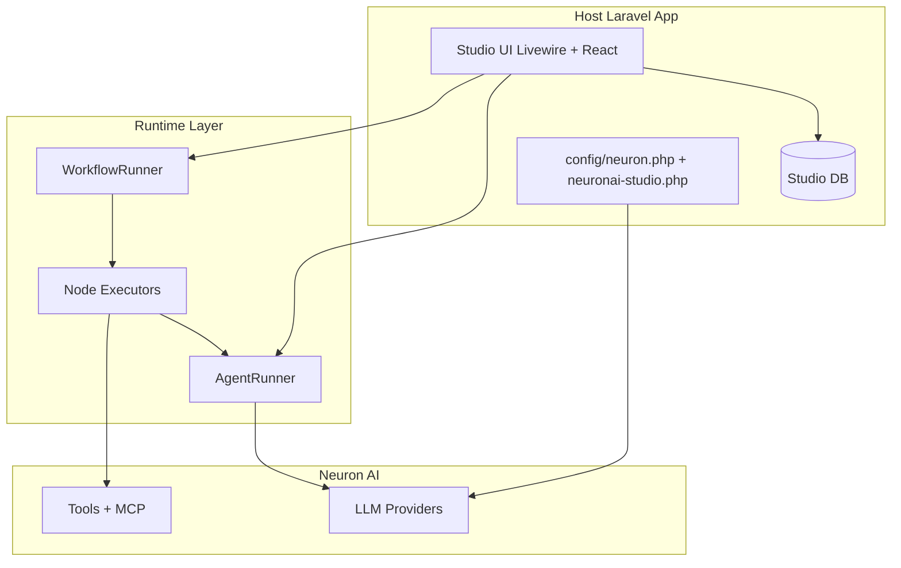

# NeuronAI Studio

**NeuronAI Studio** is a visual AI agent builder for Laravel. Design agents, compose workflow graphs, test them in a browser-based studio, and export production-ready PHP classes powered by [Neuron AI](https://neuron-ai.dev).

Think of it as three layers working together:

| Layer | Purpose |
|-------|---------|
| **Studio UI** | Create and edit agents, tools, MCP servers, and workflows visually |
| **Runtime** | Execute agents and workflows from the UI with streaming, traces, and human-in-the-loop |
| **Export** | Generate Neuron `Agent` and `Workflow` PHP classes for your production codebase |

## Requirements

- PHP 8.2+
- Laravel 11, 12, or 13
- [neuron-core/neuron-laravel](https://github.com/neuron-core/neuron-laravel) ^1.0

## Architecture



The studio stores definitions in your database. At runtime, `AgentRunner` and `WorkflowRunner` hydrate Neuron AI providers and tools on the fly. When you are ready for production, exporters generate typed PHP classes under `app/Neuron`.

<!-- SCREENSHOT: dashboard-overview -->
> **Screenshot pending:** Dashboard overview with stats cards and recent workflow traces.
>
> Asset path: `docs/assets/screenshots/dashboard-overview.png`
> Capture: `/neuronai-studio` — dark theme, 1440×900


## Feature map

| Feature | Guide |
|---------|-------|
| Install & configure | [Installation](getting-started/installation.md) |
| Create your first agent | [Quickstart: First Agent](getting-started/quickstart-first-agent.md) |
| Build a workflow graph | [Quickstart: First Workflow](getting-started/quickstart-first-workflow.md) |
| Dashboard overview | [Dashboard](guides/dashboard.md) |
| Agent CRUD & playground | [Agents](guides/agents/overview.md) |
| Custom & webhook tools | [Tools](guides/tools/overview.md) |
| Knowledge bases & RAG | [Knowledge Bases](guides/knowledge-bases/overview.md) |
| MCP server connectors | [MCP Servers](guides/mcp-servers/overview.md) |
| Visual workflow editor | [Workflows](guides/workflows/overview.md) |
| Pre-built templates | [Templates](guides/templates.md) |
| Export to PHP | [Export & Production](guides/export-and-production.md) |
| Auth & security | [Security & Access](guides/security-and-access.md) |
| Cost estimation | [Cost Estimation](guides/analytics/costs.md) |
| Full config reference | [Configuration](reference/configuration.md) |
| Extend with custom nodes | [Custom Node Types](extending/custom-node-types.md) |

## Quick install

```bash
composer require digitalelvis/neuronai-studio neuron-core/neuron-laravel
php artisan neuron:install
php artisan neuronai-studio:install
```

Open `/neuronai-studio` (prefix configurable via `NEURONAI_STUDIO_ROUTE_PREFIX`).

See [Installation](getting-started/installation.md) for the full setup guide.

## Contributing

We welcome contributions! See [CONTRIBUTING.md](../CONTRIBUTING.md) in the repository root for development setup, branch conventions, and documentation guidelines.

## License

MIT — see [LICENSE](../LICENSE).
