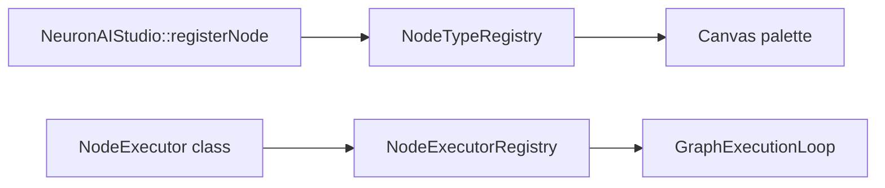

# Custom Node Types

Extend NeuronAI Studio with custom workflow node types by registering executors programmatically.

## Overview

Node types consist of:

1. **Metadata** — label, icon, category (canvas palette)
2. **Executor** — PHP class that runs the node at workflow runtime



## Register a node type

In your `AppServiceProvider::boot()`:

```php
use DigitalElvis\NeuronAIStudio\Facades\NeuronAIStudio;
use App\Neuron\Nodes\SendEmailExecutor;

NeuronAIStudio::registerNode('send_email', SendEmailExecutor::class, [
    'label' => 'Send Email',
    'icon' => 'mail',
    'category' => 'integration',
]);
```

Also register the executor in `NodeExecutorRegistry` if not auto-wired:

```php
use DigitalElvis\NeuronAIStudio\Runtime\NodeExecutors\NodeExecutorRegistry;

$this->app->make(NodeExecutorRegistry::class)
    ->register('send_email', $this->app->make(SendEmailExecutor::class));
```

## Implement an executor

Extend the base executor pattern used by built-in nodes:

```php
namespace App\Neuron\Nodes;

use DigitalElvis\NeuronAIStudio\Runtime\NodeExecutors\NodeExecutor;

class SendEmailExecutor extends NodeExecutor
{
    public function execute(array $nodeData, $state, $context): array
    {
        $to = $nodeData['to'] ?? '';
        $subject = $nodeData['subject'] ?? '';

        // Your logic here — send email, call API, etc.

        $state->set($nodeData['output_key'] ?? 'email_sent', true);

        return ['handle' => 'default'];
    }
}
```

### Structured output in custom executors

To validate LLM responses against a typed output class in a custom AI node, inject `StructuredOutputResolver` and `AgentRunner`, then branch on the `structured` flag in node config:

```php
use DigitalElvis\NeuronAIStudio\Runtime\AgentRunner;
use DigitalElvis\NeuronAIStudio\Runtime\StructuredOutput\StructuredOutputResolver;

if ($nodeData['structured'] ?? false) {
    $class = $this->outputResolver->resolve((string) ($nodeData['output_class'] ?? ''));
    $result = $this->agentRunner->structuredInline($config, $userMessage, $class);
    $state->set($outputKey, $result->structured);
} else {
    // plain text path
}
```

Register output classes under `structured_output_scan_paths` so they appear in the canvas picker, or accept a fully qualified class name in node JSON. See [AI Nodes — Structured output](../guides/workflows/node-types/ai-nodes.md#structured-output).

## Canvas configuration

Custom node fields appear in the inspector when you extend the React inspector components. For server-only nodes, users can edit raw JSON in the graph data until UI support is added.

## Built-in node types

See the registered types in `NeuronAIStudioServiceProvider::registerNodeTypes()`:

- start, stop, agent, llm, condition, set_state, loop, tool, rag, delay, mcp, human, fork, join

Use these as reference implementations in `src/Runtime/NodeExecutors/`.

### The fork/join pattern

Parallel execution is implemented as a **pair** of cooperating nodes plus a helper runner —
a useful template if you build fan-out/fan-in nodes:

- `ForkNodeExecutor` reads its branch edges (each non-`default` source handle is a branch),
  runs each branch subgraph through `ParallelBranchRunner` in an isolated `BuilderWorkflowState`
  up to the paired join node, and stores the collected `{ branchId: result }` map on the state.
- `JoinNodeExecutor` writes that map to its `output_key`.
- `GraphValidator::validateParallel()` enforces the pairing (a fork must reach a join on its
  `default` handle and declare at least one branch; a join must have a paired fork).
- A branch that pauses raises `ParallelBranchInterruptException`, which `WorkflowRunner` turns
  into a `kind: parallel` checkpoint so only the interrupted branch resumes.

Key idea: keep branch state **isolated** and merge only at the join, so branches remain
independent and order-insensitive.

### Checkpointable nodes (decorator)

`CheckpointingExecutor` wraps Agent/LLM/RAG/Tool executors so a node with `data.checkpoint: true`
caches its state change in `neuronai_studio_workflow_checkpoints` and is skipped on resume. It is
a plain decorator over `NodeExecutorInterface` — you can wrap your own executor the same way when
registering it, injecting `CheckpointService`. The checkpoint key is
`sha256(trace_id | node_id | iteration | input_hash)` and the input hash excludes volatile
internal keys, so changing relevant upstream state invalidates the cache.

### Nodes with guardrails

The **Loop** node is the canonical example of a guardrailed node type:

- `max_steps` per node prevents unbounded cycles
- `loop.global_max_steps` caps total executions
- `GraphValidator` requires authorized back-edges to pass through a Loop node

When adding custom nodes that can repeat or recurse, follow the same pattern: explicit limits, validation at save time, and a dedicated exception at runtime.

## Configuration

Add metadata to `config/neuronai-studio.php` under `node_types` for config-driven registration, or use the facade for dynamic registration.

## See also

- [Node Types](../guides/workflows/node-types/flow-nodes.md)
- [Contributing to Studio UI](contributing-to-studio-ui.md)
