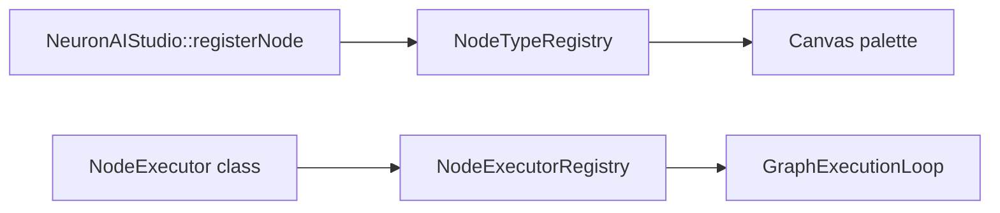

# Custom Node Types

Extend NeuronAI Studio with custom workflow node types by registering executors programmatically.

## Overview

Node types consist of:

1. **Metadata** — label, icon, category (canvas palette)
2. **Executor** — PHP class that runs the node at workflow runtime



## Register a node type

In your `AppServiceProvider::boot()`:

```php
use DigitalElvis\NeuronAIStudio\Facades\NeuronAIStudio;
use App\Neuron\Nodes\SendEmailExecutor;

NeuronAIStudio::registerNode('send_email', SendEmailExecutor::class, [
    'label' => 'Send Email',
    'icon' => 'mail',
    'category' => 'integration',
]);
```

Also register the executor in `NodeExecutorRegistry` if not auto-wired:

```php
use DigitalElvis\NeuronAIStudio\Runtime\NodeExecutors\NodeExecutorRegistry;

$this->app->make(NodeExecutorRegistry::class)
    ->register('send_email', $this->app->make(SendEmailExecutor::class));
```

## Implement an executor

Extend the base executor pattern used by built-in nodes:

```php
namespace App\Neuron\Nodes;

use DigitalElvis\NeuronAIStudio\Runtime\NodeExecutors\NodeExecutor;

class SendEmailExecutor extends NodeExecutor
{
    public function execute(array $nodeData, $state, $context): array
    {
        $to = $nodeData['to'] ?? '';
        $subject = $nodeData['subject'] ?? '';

        // Your logic here — send email, call API, etc.

        $state->set($nodeData['output_key'] ?? 'email_sent', true);

        return ['handle' => 'default'];
    }
}
```

## Canvas configuration

Custom node fields appear in the inspector when you extend the React inspector components. For server-only nodes, users can edit raw JSON in the graph data until UI support is added.

## Built-in node types

See the registered types in `NeuronAIStudioServiceProvider::registerNodeTypes()`:

- start, stop, agent, llm, condition, set_state, tool, rag, delay, mcp, human

Use these as reference implementations in `src/Runtime/NodeExecutors/`.

## Configuration

Add metadata to `config/neuronai-studio.php` under `node_types` for config-driven registration, or use the facade for dynamic registration.

## See also

- [Node Types](../guides/workflows/node-types/flow-nodes.md)
- [Contributing to Studio UI](contributing-to-studio-ui.md)
