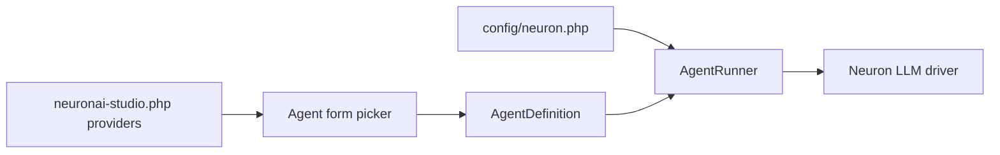

# Custom Providers

Add or customize LLM providers available in the agent editor and LLM workflow nodes.

## Provider registry

Providers are defined in `config/neuronai-studio.php`:

```php
'providers' => [
    'openai' => [
        'label' => 'OpenAI',
        'models' => ['gpt-4o', 'gpt-4o-mini', 'gpt-4-turbo'],
    ],
    'anthropic' => [
        'label' => 'Anthropic',
        'models' => ['claude-sonnet-4-20250514'],
    ],
    'my_provider' => [
        'label' => 'My Custom Provider',
        'models' => ['my-model-v1'],
    ],
],
```

The studio UI reads this list for the provider/model picker. Credentials are **not** configured here.

## Credentials via Neuron Laravel

API keys and provider drivers come from `config/neuron.php` (Neuron Laravel):

```env
OPENAI_KEY=sk-...
ANTHROPIC_KEY=sk-ant-...
NEURON_AI_PROVIDER=openai
```

Ensure your custom provider key matches a driver registered in Neuron Laravel.

## Default provider/model

```env
NEURONAI_STUDIO_DEFAULT_PROVIDER=openai
NEURONAI_STUDIO_DEFAULT_MODEL=gpt-4o-mini
```

## Programmatic registration

Extend `ProviderRegistry` at boot time if you need dynamic provider lists:

```php
use DigitalElvis\NeuronAIStudio\Registry\ProviderRegistry;

$this->app->make(ProviderRegistry::class)->register('my_provider', [
    'label' => 'My Provider',
    'models' => ['model-a', 'model-b'],
]);
```

## Provider flow



## See also

- [Configuration Reference](../reference/configuration.md)
- [Creating Agents](../guides/agents/creating-agents.md)
