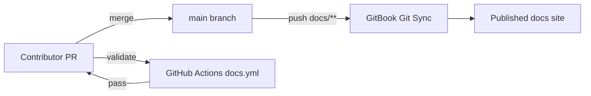

# GitBook Setup

NeuronAI Studio documentation is published via [GitBook Git Sync](https://gitbook.com/docs/getting-started/git-sync). This page describes the one-time setup for maintainers.

## Repository structure

```
docs/
├── .gitbook.yaml       # GitBook content configuration
├── SUMMARY.md          # Sidebar navigation
├── README.md           # Landing page (Introduction)
├── getting-started/
├── guides/
├── reference/
├── extending/
└── assets/
```

## One-time setup

### 1. Create a GitBook space

1. Sign in to [GitBook](https://gitbook.com)
2. Create an organization (if needed) and a new space named **NeuronAI Studio**

### 2. Install the GitHub App

1. In GitBook, open your space → **Integrations** → **GitHub**
2. Install the GitBook GitHub App on the repository
3. Grant access to `elvislopesdigital/neuronai-studio` (or your fork)

### 3. Enable Git Sync

| Setting | Value |
|---------|-------|
| Repository | Your GitHub repo |
| Branch | `main` |
| Project directory | `docs` |
| Initial sync direction | **GitHub → GitBook** |

GitBook reads `.gitbook.yaml` inside the `docs/` directory:

```yaml
root: ./

structure:
  readme: README.md
  summary: SUMMARY.md
```

### 4. Verify sync

Push a change to `docs/` on `main`. Within a few minutes, the GitBook space should reflect the update.

## Publishing flow



- **Git Sync** handles publishing on every push to `main` — no deploy token required for basic doc updates
- **GitHub Actions** validates links and `SUMMARY.md` integrity on pull requests

## Redirects

Legacy doc paths are redirected in `.gitbook.yaml`:

```yaml
redirects:
  workflow-state: guides/workflows/state-and-conditions.md
  templates: guides/templates.md
```

## Adding a new page

1. Create the Markdown file under `docs/`
2. Add an entry to `docs/SUMMARY.md`
3. Open a PR — CI validates links
4. Merge to `main` — GitBook syncs automatically

## Documentation badge

Add to the repository README once your space URL is known:

```markdown
[](https://YOUR_ORG.gitbook.io/neuronai-studio)
```

## Optional: release notes via API

For automated release-notes pages, store a `GITBOOK_TOKEN` GitHub secret and call the [GitBook API](https://gitbook.com/docs/api-references) from a `release: published` workflow. Basic doc publishing does not require this.
