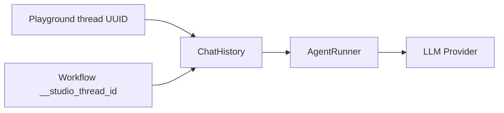

# Quickstart: Conversation Memory

Build a multi-turn assistant that remembers facts within a thread — as a standalone agent or inside a workflow.

## What you will build

1. An agent with persisted chat history (`eloquent` driver + context window)
2. A minimal workflow that reuses the same thread across turns via `__studio_thread_id`

## Prerequisites

- [Installation](installation.md) completed
- LLM provider credentials configured in `.env` (for example `OPENAI_KEY`)
- Optionally: [Quickstart: First Agent](quickstart-first-agent.md) completed

## How memory works



| Surface | Thread scope | Behavior |
|---------|--------------|----------|
| Agent Playground | User-selected UUID per session | Switching threads loads that history; **New thread** starts empty |
| Workflow harness | Stable `__studio_thread_id` per run/trace | Agent nodes in loops reuse the same history across iterations |

## Path A — Agent with memory

### Step 1 — Create the agent

Navigate to **Agents** or visit:

```
/neuronai-studio/agents
```

Click **Create Agent** and fill:

| Field | Example value |
|-------|---------------|
| Name | Memory Assistant |
| Provider | OpenAI |
| Model | gpt-4o-mini |
| Instructions | You are a helpful assistant. Remember facts the user shares in this conversation and recall them when asked. |

### Step 2 — Configure Memory

On the agent form, open **Memory** (stored as `memory_config`):

| Field | Example value |
|-------|---------------|
| Context window | `8000` |
| History driver | `eloquent` |
| Summarization | On |

Save the agent.

Empty fields inherit globals such as `NEURONAI_STUDIO_CHAT_HISTORY_CONTEXT_WINDOW`. See [Creating Agents → Memory](../guides/agents/creating-agents.md#memory).

### Step 3 — Prove recall in the Playground

Open **Playground** for this agent and send:

```
My name is Alex and I work at Acme. Our stack is Laravel 11 and Redis.
```

Then:

```
What do you know about me and my stack?
```

The agent should mention Alex, Acme, Laravel 11, and Redis.

Click **New thread** and ask the same recall question — history is empty for that UUID, so the agent should not know those facts.

## Path B — Workflow with memory

### Step 1 — Install a minimal chat workflow

Navigate to **Templates**:

```
/neuronai-studio/templates
```

Install **Basic Agent Chat** (`basic-agent-chat`), or build Start → Agent → Stop and point the Agent node at **Memory Assistant**.

### Step 2 — Run multi-turn in the Test harness

Open the **Test** panel and send the same two messages as Path A.

The runtime keeps a stable `__studio_thread_id` on the workflow state, so the Agent node loads prior messages on later turns without manual stitching.

### Optional — Memory across loop iterations

For qualification or troubleshooting loops (Agent inside a **Loop**):

1. Install **Autonomous Lead Qualification**, or build Loop → Agent → Condition yourself
2. Send an opening message, then reply on later iterations
3. The same `__studio_thread_id` carries chat history through each visit to the Agent node

See [Autonomous agents in workflows](../guides/workflows/overview.md#autonomous-agents-in-workflows) and [AI Nodes → Attachments and thread memory](../guides/workflows/node-types/ai-nodes.md#attachments-and-thread-memory-in-workflows).

## Optional shortcut — full memory template

Install **Dev Support Memory Loop** (`dev-support-memory-loop`) from Templates for a pre-wired agent + loop with summarization, tools, HITL, and a per-node `context_window` override. Setup and scripts: [Templates → Dev Support Memory Loop](../guides/templates.md#dev-support-memory-loop-m8-memory-reference).

## Verify compaction (optional)

When history exceeds the context window and summarization is on, Studio compacts older turns into a persisted summary instead of silent deletes.

1. On the agent form, temporarily set **Context window** to `400`–`800` (keep summarization on)
2. In Playground, send 3–5 long turns with distinct facts, then ask the agent to recapitulate
3. Expect a summary message with content prefixed `[Studio memory summary]` (`meta.studio_kind = summary`)
4. Restore the window to `8000` when done

Optional cheaper summarizer:

```env
NEURONAI_STUDIO_SUMMARIZER_PROVIDER=openai
NEURONAI_STUDIO_SUMMARIZER_MODEL=gpt-4o-mini
```

When unset, compaction uses the agent's own provider/model.

## Next steps

- [Invoking Agents](../guides/agents/invoking-agents.md) — multi-turn `stream()` with `thread_id` from Laravel
- [Invoking Workflows](../guides/workflows/invoking-workflows.md) — `thread_id` / `__studio_thread_id` from Laravel
- [Creating Agents → Memory](../guides/agents/creating-agents.md#memory) — budgets, driver, node overrides
- [Playground & Threads](../guides/agents/playground-and-threads.md) — thread APIs and context window behavior
- [AI Nodes](../guides/workflows/node-types/ai-nodes.md) — per-node memory overrides on Agent nodes
- [Configuration → Memory / summarization](../reference/configuration.md#memory--summarization) — env defaults
- [Templates](../guides/templates.md) — `dev-support-memory-loop` and related examples
