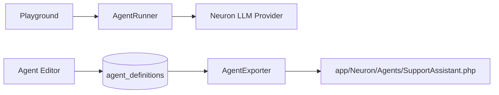

# Quickstart: First Agent

Create, test, and export your first AI agent in under five minutes.

## What you will build

A support assistant agent with a system prompt, connected to an LLM provider, tested in the Playground, and exported as a PHP class.

## Prerequisites

- [Installation](installation.md) completed
- LLM provider credentials configured in `.env` (for example `OPENAI_KEY`)

## Step 1 — Open Agents

Navigate to **Agents** in the sidebar or visit:

```
/neuronai-studio/agents
```

Click **Create Agent**.

## Step 2 — Configure the agent

| Field | Example value |
|-------|---------------|
| Name | Support Assistant |
| Provider | OpenAI |
| Model | gpt-4o-mini |
| Instructions | You are a friendly customer support agent. Answer concisely and ask clarifying questions when needed. |

Save the agent.

## Step 3 — Test in the Playground

From the agent list, open **Playground**. Type a message such as:

```
I can't reset my password. What should I do?
```

The response streams token-by-token. If you bind tools later, tool-call events appear inline in the chat panel.

## Step 4 — Export to PHP (optional)

Generate a production-ready Neuron Agent class:

```bash
php artisan neuronai-studio:export agent {id}
```

Replace `{id}` with your agent's database ID. The file is written to `app/Neuron/Agents/` (configurable).



## Next steps

- [Creating Agents](../guides/agents/creating-agents.md) — tool bindings, MCP servers, advanced config
- [Playground & Threads](../guides/agents/playground-and-threads.md) — persisted conversation threads
- [Tools](../guides/tools/overview.md) — give your agent custom capabilities
- [Export & Production](../guides/export-and-production.md) — deploy exported classes
