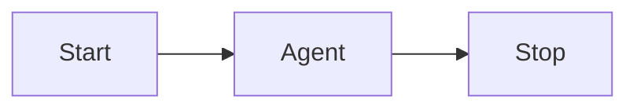

# Quickstart: First Workflow

Run a pre-built workflow template, inspect the execution trace, and understand the studio runtime.

## What you will build

A single-agent chat workflow using the `basic-agent-chat` template — the simplest end-to-end workflow in the studio.

## Prerequisites

- [Installation](installation.md) completed
- At least one agent exists (or use a template that creates one automatically)

## Step 1 — Browse templates

Navigate to **Templates**:

```
/neuronai-studio/templates
```

Filter by **Workflows** and find **Basic Agent Chat**. Click **Use Template**.

The installer creates any required agents, remaps graph references, and opens the workflow editor.

## Step 2 — Inspect the graph

The canvas shows a minimal flow:



Click the **Agent** node to see its configuration: which agent runs, the message template (`{{input}}`), and the output state key.

## Step 3 — Run the test harness

Open the **Test** panel (workflow chat harness). Type a message and send it.

The runtime:

1. Sets `input` in workflow state from your message
2. Executes nodes in graph order
3. Streams step events and tokens via SSE
4. Persists a trace record

## Step 4 — Inspect the trace

After the run completes, open **Traces** for this workflow. Click the latest trace to see:

- Per-step timeline (start → agent → stop)
- Input and output payloads for each step
- Total duration and any errors

## Optional: Autonomous loop with attachments

For the full autonomous agent pattern (loop + tools + multimodal input):

1. Open **Templates** and install **Autonomous Lead Qualification**
2. Open the workflow editor and inspect the **Loop** → **Agent** → **Condition** subgraph
3. In the **Test** panel, attach a PDF or image and send an initial message
4. Watch SSE events: `loop_iteration`, `tool_call`, `tool_result`
5. If the agent needs more data, reply when the workflow pauses at the **Human** node

The agent retains thread memory across iterations via `__studio_thread_id`. See [Autonomous agents in workflows](../guides/workflows/overview.md#autonomous-agents-in-workflows).

## Optional: RAG upstream of an agent

1. Create a **Knowledge Base** under `/neuronai-studio/knowledge-bases` and ingest a document
2. Install the **Support RAG HITL** template (or add a RAG node manually before an Agent node)
3. Confirm the Agent message references `{{ rag_context.context }}`
4. Run the test harness — trace steps include `rag_query` metadata

See [AI Nodes — RAG](../guides/workflows/node-types/ai-nodes.md#rag).

## Next steps

- [Workflow Overview](../guides/workflows/overview.md) — concepts and node types
- [Canvas Editor](../guides/workflows/canvas-editor.md) — build custom graphs
- [State & Conditions](../guides/workflows/state-and-conditions.md) — branch on workflow data
- [Templates](../guides/templates.md) — try `lead-qualification` or `support-rag-hitl`
