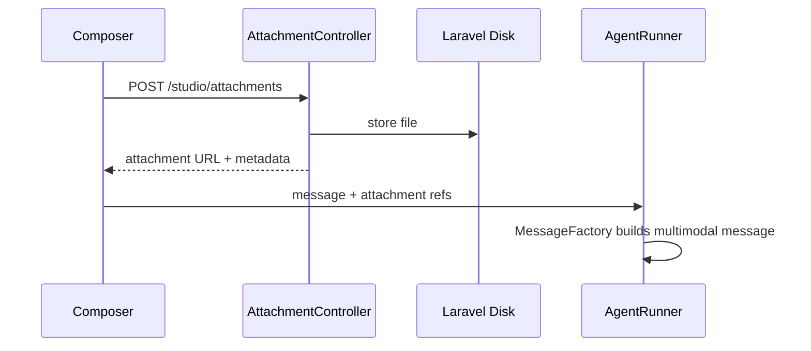

# Attachments

The Playground and workflow test harness support multimodal attachments — images, audio, video, PDFs, and plain text files.

## Supported file types

Configured in `config/neuronai-studio.php` under `attachments.allowed_mimes`:

| Category | MIME types |
|----------|------------|
| Images | `image/jpeg`, `image/png`, `image/gif`, `image/webp` |
| Audio | `audio/mpeg`, `audio/wav`, `audio/ogg` |
| Video | `video/mp4`, `video/webm` |
| Documents | `application/pdf`, `text/plain` |

## Upload flow



<!-- SCREENSHOT: agents-attachments -->
> **Screenshot pending:** Composer with a PDF or image attached.
>
> Asset path: `docs/assets/screenshots/agents-attachments.png`
> Capture: Playground composer with attachment chip visible — dark theme, 1440×900


## Configuration

```php
'attachments' => [
    'disk' => env('NEURONAI_STUDIO_ATTACHMENTS_DISK', 'local'),
    'path' => env('NEURONAI_STUDIO_ATTACHMENTS_PATH', 'neuronai-studio/attachments'),
    'max_size_kb' => (int) env('NEURONAI_STUDIO_ATTACHMENTS_MAX_KB', 10240),
    'allowed_mimes' => [ /* ... */ ],
],
```

| Env variable | Default | Description |
|--------------|---------|-------------|
| `NEURONAI_STUDIO_ATTACHMENTS_DISK` | `local` | Laravel filesystem disk |
| `NEURONAI_STUDIO_ATTACHMENTS_PATH` | `neuronai-studio/attachments` | Storage subdirectory |
| `NEURONAI_STUDIO_ATTACHMENTS_MAX_KB` | `10240` | Max file size (10 MB) |

## Usage tips

- Attach a screenshot when asking an agent to analyze UI issues
- Send PDFs for document Q&A workflows
- Ensure your chosen model supports the attachment modality (vision models for images)

## Related

- [Playground & Threads](playground-and-threads.md)
- [Configuration](../../reference/configuration.md)
