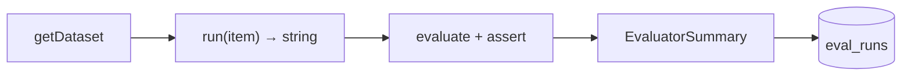
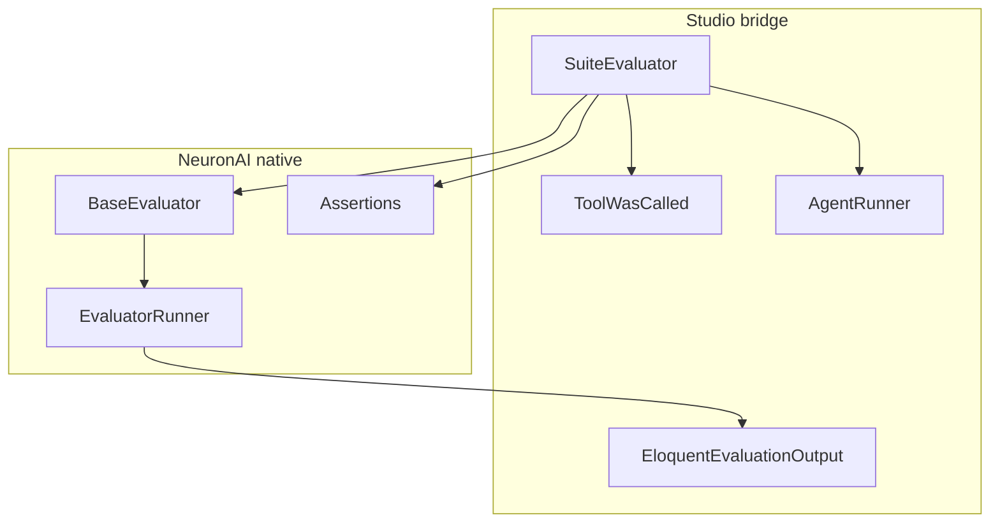

# Agent Evaluations

NeuronAI Studio integrates [NeuronAI Evals](https://docs.neuron-ai.dev/agent/evaluation) to measure agent output quality with dataset-driven test cases, built-in assertions, and optional AI judges.

The Studio adds three bridge classes on top of the native NeuronAI evaluation framework:

| Class | Role |
|-------|------|
| `SuiteEvaluator` | Runs a database-stored eval suite against a Studio agent |
| `ToolWasCalled` | Custom assertion for tool-call validation |
| `EloquentEvaluationOutput` | Persists `EvaluatorSummary` results to the database |

Everything else — `EvaluatorRunner`, assertions, judges, output drivers — uses NeuronAI classes directly.

## Evaluation flow



For each dataset item:

1. `setUp()` — initialize judge agent (once per run)
2. `run(datasetItem)` — execute the agent via `AgentRunner`, return response content
3. `evaluate(output, datasetItem)` — assert against expected results
4. Results are persisted to `eval_runs` and `eval_run_items`

## Two ways to run evals

### 1. Studio UI (declarative suites)

Best for product teams and quick smoke tests without writing PHP.

1. Open an agent → click **Evals**
2. Create a suite with a JSON dataset
3. Click **Run Suite** (optionally enable **Use fake provider** for deterministic CI runs)
4. Review pass/fail per case in the run detail page

Routes:

| Route | Purpose |
|-------|---------|
| `/neuronai-studio/agents/{id}/evals` | List suites for an agent |
| `/neuronai-studio/agents/{id}/evals/create` | Create a new suite |
| `/neuronai-studio/agents/{id}/evals/{suite}/edit` | Edit suite dataset |
| `/neuronai-studio/agents/{id}/evals/{suite}/runs` | Run history |
| `/neuronai-studio/eval-runs/{run}` | Case-by-case results |

<!-- SCREENSHOT: agents-evals-index -->
> **Screenshot pending:** Eval suites list for an agent.
>
> Asset path: `docs/assets/screenshots/agents-evals-index.png`
> Capture: Evals index — dark theme, 1440×900


<!-- SCREENSHOT: agents-evals-run-detail -->
> **Screenshot pending:** Eval run detail with pass/fail cases.
>
> Asset path: `docs/assets/screenshots/agents-evals-run-detail.png`
> Capture: Run detail showing failed case output — dark theme, 1440×900


### 2. PHP evaluators (advanced)

Best for version-controlled test suites, custom logic, and CI pipelines.

Evaluators extend `NeuronAI\Evaluation\BaseEvaluator` directly and use `AgentRunner` to execute Studio agents:

```php
namespace App\Evaluators;

use ElvisLopesDigital\NeuronAIStudio\Models\AgentDefinition;
use ElvisLopesDigital\NeuronAIStudio\Runtime\AgentRunner;
use NeuronAI\Evaluation\Assertions\StringContains;
use NeuronAI\Evaluation\BaseEvaluator;
use NeuronAI\Evaluation\Dataset\JsonDataset;

class SupportAgentEvaluator extends BaseEvaluator
{
    private AgentDefinition $agent;

    public function setUp(): void
    {
        $this->agent = AgentDefinition::where('slug', 'support-assistant')->firstOrFail();
    }

    public function getDataset(): JsonDataset
    {
        return new JsonDataset(__DIR__.'/datasets/support.json');
    }

    public function run(array $datasetItem): mixed
    {
        return app(AgentRunner::class)
            ->run($this->agent, (string) $datasetItem['input'])
            ->content;
    }

    public function evaluate(mixed $output, array $datasetItem): void
    {
        $this->assert(new StringContains($datasetItem['reference']), $output);
    }
}
```

Publish the example stub:

```bash
php artisan vendor:publish --tag=neuronai-studio-evaluator
```

Register the evaluators directory in `composer.json`:

```json
{
    "autoload-dev": {
        "psr-4": {
            "App\\Evaluators\\": "evaluators/"
        }
    }
}
```

Run discovered evaluators:

```bash
php artisan neuronai-studio:evaluations --path=evaluators
```

Equivalent Neuron CLI:

```bash
vendor/bin/neuron evaluation --path=evaluators
```

## Dataset format

Studio suites store a JSON array of test cases. Each item supports these fields:

| Field | Type | Description |
|-------|------|-------------|
| `input` | string | User message sent to the agent |
| `reference` | string | Shorthand for `StringContains` assertion |
| `tool` | string | Assert that a tool with this name was called |
| `_assertions` | array | Advanced assertion rules (see below) |

### Simple case

```json
[
  {
    "input": "What are your support hours?",
    "reference": "9"
  }
]
```

### Multiple assertions

```json
[
  {
    "input": "What are your support hours?",
    "reference": "9h",
    "_assertions": [
      { "type": "contains_any", "values": ["monday", "hours"] }
    ]
  }
]
```

### Tool call validation

```json
[
  {
    "input": "I need to speak with a human",
    "tool": "escalate_to_human"
  }
]
```

### Supported `_assertions` types

| Type | Fields | NeuronAI class |
|------|--------|----------------|
| `contains` | `value` | `StringContains` |
| `contains_any` | `values` | `StringContainsAny` |
| `contains_all` | `values` | `StringContainsAll` |
| `regex`, `matches_regex` | `pattern` | `MatchesRegex` |
| `correctness` | `expected`, `threshold` | `CorrectnessJudge` (requires `judge_config`) |

### AI judge configuration

For `correctness` assertions, set `judge_config` on the eval suite (via database or seeder):

```json
{
  "provider": "openai",
  "model": "gpt-4o-mini",
  "instructions": "You are an expert evaluator for customer support responses."
}
```

AI judges consume additional API calls. Use them for live evals, not CI smoke tests.

## CLI commands

### Run a database suite

```bash
php artisan neuronai-studio:eval support-basic
php artisan neuronai-studio:eval 1
php artisan neuronai-studio:eval support-basic --fake
```

| Option | Description |
|--------|-------------|
| `{suite}` | Suite ID or slug |
| `--fake` | Use `FakeAIProvider` for deterministic output (CI) |

Exit code is non-zero when any case fails.

### Run PHP evaluators

```bash
php artisan neuronai-studio:evaluations
php artisan neuronai-studio:evaluations --path=evaluators --verbose
```

Uses NeuronAI's `EvaluatorDiscovery` and `EvaluatorRunner`. Output drivers are configured in `evaluation.php` at the project root.

## Output configuration

Publish the evaluation config stub:

```bash
php artisan vendor:publish --tag=neuronai-studio-evaluation
```

Creates `evaluation.php` in the project root:

```php
<?php

use NeuronAI\Evaluation\Output\ConsoleOutput;
use NeuronAI\Evaluation\Output\JsonOutput;

return [
    'output' => [
        ConsoleOutput::class => ['verbose' => true],
        JsonOutput::class => ['path' => 'storage/evaluation-results.json'],
    ],
];
```

Studio database runs use `EloquentEvaluationOutput` internally — no config needed for UI-triggered runs.

## CI integration

Use `--fake` for deterministic CI pipelines:

```yaml
# .github/workflows/evals.yml
- name: Run agent evals
  run: php artisan neuronai-studio:eval smoke-tests --fake
```

For PHP evaluators in CI:

```yaml
- run: php artisan neuronai-studio:evaluations --path=evaluators
```

## Architecture



PHP evaluators in `App\Evaluators\` extend `BaseEvaluator` directly — no Studio base class required. Resolve `AgentRunner` via `app(AgentRunner::class)` in `setUp()` or `run()`.

## Related

- [Artisan Commands](../../reference/artisan-commands.md)
- [Database Schema](../../reference/database-schema.md)
- [Publish Tags](../../reference/publish-tags.md)
- [NeuronAI Evals documentation](https://docs.neuron-ai.dev/agent/evaluation)
