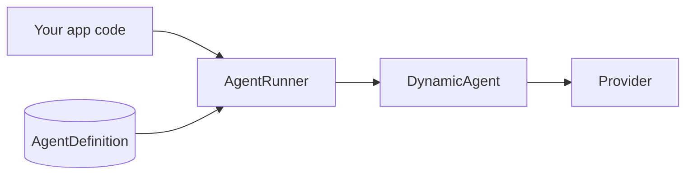

# Invoking Agents from PHP

Create and test agents in Studio, then call them from Laravel controllers, jobs, or services via `AgentRunner`.

Studio definitions live in the database. At runtime, `AgentRunner` hydrates a `DynamicAgent` (provider, tools, memory) and executes the turn.



## Choose an API

| Method | Use when |
|--------|----------|
| `run()` | One-shot sync reply by slug or `AgentDefinition` (no thread, context, or attachments) |
| `stream()` | Chat with memory, context, parameters, attachments; consume token chunks |
| `streamHandler()` | Same payload as `stream()`, for [integrate adapters](../integration/stream-adapters.md) (`vercel` / `agui`) |
| `runInline()` | Sync run from a config snapshot (workflows, codegen nodes, custom orchestration) |
| `streamInline()` | Streaming twin of `runInline()` |
| `structuredInline()` | Typed structured output from a config snapshot |

For HTTP frontends, prefer the integrate stream routes instead of wrapping `stream()` yourself — see [Stream Adapters](../integration/stream-adapters.md).

## Simple sync call

Pass the agent **slug** (or an `AgentDefinition` instance):

```php
use DigitalElvis\NeuronAIStudio\Runtime\AgentRunner;

$result = app(AgentRunner::class)->run('support-assistant', 'I cannot reset my password.');

echo $result->content;
// $result->toolEvents — tool calls from this turn
// $result->runId — Studio run id for traces
```

Unknown slugs throw `ModelNotFoundException`. When you already have the model loaded, pass it directly: `run($agent, $message)`.

`run()` does **not** accept `thread_id`, `context`, or `attachments`. Use `stream()` or `runInline()` for those.

## Multi-turn with memory

Pass `thread_id` (a stable UUID per conversation). The key must be present in the payload — omitting it disables Eloquent chat history for that call.

```php
use Illuminate\Support\Str;
use NeuronAI\Chat\Messages\Chunks\TextChunk;

$threadId = (string) Str::uuid(); // store and reuse across turns

foreach (app(AgentRunner::class)->stream($agent, [
    'message' => 'My name is Alex and I use Laravel 11.',
    'thread_id' => $threadId,
]) as $chunk) {
    if ($chunk instanceof TextChunk) {
        echo $chunk->content;
    }
}

// Later turn — same thread_id loads prior messages
foreach (app(AgentRunner::class)->stream($agent, [
    'message' => 'What stack did I mention?',
    'thread_id' => $threadId,
]) as $chunk) {
    // …
}
```

Memory window, driver, and summarization come from the agent's `memory_config`. See [Creating Agents → Memory](creating-agents.md#memory) and [Quickstart: Conversation Memory](../../getting-started/quickstart-conversation-memory.md).

## With context

`context` is injected into tools that implement `ToolContextAware` and (for backward compatibility) appended to instructions as JSON. Prefer reading sensitive IDs from `ToolContext`, not from the prompt — see [Runtime ToolContext](../tools/runtime-tool-context.md).

```php
foreach (app(AgentRunner::class)->stream($agent, [
    'message' => 'What is my plan?',
    'thread_id' => $threadId,
    'context' => [
        'integration_context' => [
            'account_id' => 68,
            'user_id' => 13,
            'plan_slug' => 'gold',
        ],
    ],
    'parameters' => [
        'temperature' => 0.2,
    ],
]) as $chunk) {
    // …
}
```

Optional payload keys for `stream()` / `streamHandler()`:

| Key | Purpose |
|-----|---------|
| `message` | User text |
| `thread_id` | UUID for persisted history (key must exist) |
| `context` | Runtime snapshot → `tool_context` + instruction augmentation |
| `parameters` | Provider params (`temperature`, `top_p`, `max_tokens`, …) |
| `instructions` | One-off system prompt override |
| `attachments` | Multimodal refs (see below) |

## With attachments

Upload via Studio (`POST` attachments endpoint) or store the file on the configured attachments disk yourself, then pass refs:

```php
foreach (app(AgentRunner::class)->stream($agent, [
    'message' => 'Summarize this document',
    'thread_id' => $threadId,
    'attachments' => [
        [
            'type' => 'document', // image | document | audio | video
            'mime_type' => 'application/pdf',
            'storage_key' => 'neuronai-studio/attachments/notes.pdf',
            'name' => 'notes.pdf',
        ],
    ],
]) as $chunk) {
    // …
}
```

Sync path with a multimodal `UserMessage`:

```php
use DigitalElvis\NeuronAIStudio\Runtime\MessageFactory;

$userMessage = app(MessageFactory::class)->resolveMessageWithAttachments(
    'Summarize this document',
    [
        [
            'type' => 'document',
            'mime_type' => 'application/pdf',
            'storage_key' => 'neuronai-studio/attachments/notes.pdf',
            'name' => 'notes.pdf',
        ],
    ],
);

$result = app(AgentRunner::class)->runInline(
    [
        'provider' => $agent->provider,
        'model' => $agent->model,
        'instructions' => $agent->instructions,
        'tools' => $agent->tools ?? [],
        'tool_context' => [
            'integration_context' => [
                'account_id' => 68,
            ],
        ],
    ],
    $userMessage,
    $agent,
    $threadId,
);

echo $result->content;
```

MIME allowlist and disk settings: [Attachments](attachments.md).

## Exported Neuron agent class

`php artisan neuronai-studio:export agent {id}` writes a plain Neuron `Agent` subclass under `app/Neuron/`. That class does **not** use Studio threads or `AgentRunner` metering — call it with the Neuron API:

```php
use App\Neuron\Agents\SupportAssistantAgent;
use NeuronAI\Chat\Messages\UserMessage;

$agent = SupportAssistantAgent::make();

$response = $agent->chat(new UserMessage('Hello'))->getMessage();

echo $response->getContent();
```

Use exported classes when you want a fixed production agent outside Studio definitions. Keep using `AgentRunner` + `AgentDefinition` when you need Studio memory, traces, playground parity, or DB-driven config.

## HTTP integrate (frontends)

For browser or mobile clients, POST to the integrate stream endpoint instead of calling `AgentRunner` from the client:

```
POST /api/neuronai/agents/{agent}/stream/{protocol}
```

Protocols: `vercel`, `agui`. Vercel body: `message`, `thread_id`, `context`, `attachments`, `parameters`. AG-UI also accepts CopilotKit `RunAgentInput` (`threadId`, `runId`, `messages[]`). Details: [Stream Adapters](../integration/stream-adapters.md), [Vercel AI SDK](../integration/vercel-ai-sdk.md), [AG-UI](../integration/ag-ui.md).

## Related

- [Agents Overview](overview.md)
- [Playground & Threads](playground-and-threads.md)
- [Attachments](attachments.md)
- [Runtime ToolContext](../tools/runtime-tool-context.md)
- [Export & Production](../export-and-production.md)
- [Evaluations](evaluations.md) — another `AgentRunner::run()` call site
